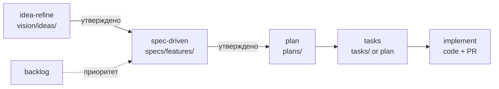

# Система документации ТВОЙ ХОД

Как хранить знания о продукте и превращать их в **спеки → планы → задачи → разработку**.  
Скиллы: **idea-refine** (идеи), **spec-driven-development** (спеки), **planning-and-task-breakdown** (задачи).

---

## 1. Текущая структура (вариант A, с мая 2026)

| Слой | Папка |
|------|--------|
| Foundation | `docs/foundation/` |
| Vision | `docs/vision/ideas/` |
| Specs | `docs/specs/`, `docs/specs/features/` |
| Plans / Tasks | `docs/plans/`, `docs/tasks/` |
| Backlog | `docs/backlog/` |
| Marketing | `docs/marketing/` — посты, трекер, стратегия (вне dev-цикла) |
| Reference | `docs/reference/` |

Карта: [`README.md`](README.md). Трассировка: [`TRACEABILITY.md`](TRACEABILITY.md).

**Остаётся улучшать:** сверка оглавления `SPEC_PRODUCT` (раздел 0) и «Часть II» в evolution-документе через ссылки, не дублирование; нарезка MQ-* для G1; ADR по миграции `mode`.

---

## 2. Варианты структуры

### Вариант A — по слоям зрелости (рекомендуемый)

Документ «поднимается» по цепочке: идея → спека → план → код.

```text
docs/
  README.md                      # карта + быстрый старт
  DOCUMENTATION_SYSTEM.md        # этот файл
  foundation/                    # редко меняется, «истина о продукте»
    SPEC_PRODUCT.md
    TMA_USER_FLOWS.md
    GLOSSARY.md                    # термины: период, подушка, save_kind…
  vision/                        # idea-refine
    ideas/
      <slug>.md
  specs/                         # spec-driven: что строим (acceptance)
    SPEC_<domain>.md             # UI, API, economy…
    features/
      SPEC_<feature-slug>.md     # одна фича = один файл
  plans/                         # как строим (архитектура, порядок)
    PLAN_<feature-slug>.md
  tasks/                         # опционально: выгрузка для трекера
    TASKS_<feature-slug>.md
  decisions/                     # ADR: почему так, не что
    ADR-NNN-<slug>.md
  backlog/
    PRODUCT_BACKLOG.md           # приоритеты; ссылки на spec/plan
  reference/                     # вне dev-цикла
    brandbook/
    investor-deck/
    MONEY_QUEST_DESIGN_AND_GDD_OUTLINE.md
```

**Плюсы:** прозрачный pipeline, агенту понятно «на какой фазе документ».  
**Минусы:** нужна одноразовая раскладка существующих файлов.

---

### Вариант B — по доменам (экономика / UI / API / meta)

```text
docs/domains/economy/   docs/domains/ui/   docs/domains/api/
```

**Плюсы:** удобно команде «владельцам» домена.  
**Минусы:** одна фича режет несколько папок; сложнее idea → spec → tasks.

**Когда брать:** если команда >3 человек и стабильные владельцы доменов.

---

### Вариант C — минимальный (оставить как есть + шаблоны)

Только добавить `docs/templates/` и правила ссылок; не переносить файлы.

**Плюсы:** дёшево.  
**Минусы:** дублирование и путаница останутся.

---

## 3. Миграция (выполнено)

| Было | Стало |
|------|--------|
| `docs/SPEC_PRODUCT.md` | `docs/foundation/SPEC_PRODUCT.md` (+ редирект в корне) |
| `docs/ideas/*.md` | `docs/vision/ideas/` |
| `docs/PRODUCT_BACKLOG.md` | `docs/backlog/PRODUCT_BACKLOG.md` |
| `docs/ANALYTICS_CONCEPT.md` | `docs/specs/SPEC_ANALYTICS.md` |
| `docs/brandbook/`, `investor-deck/`, GDD | `docs/reference/` |
| Эпик Game/Plan | `specs/features/SPEC_game-plan.md` + `plans/PLAN_game-plan.md` |

`CLAUDE.md` — индекс в корне репозитория.

**Правило единого источника истины (при конфликте):**

1. **Поведение в production** — код + тесты  
2. **Спека фичи** — `docs/specs/features/SPEC_*.md`  
3. **Foundation** — `docs/foundation/SPEC_PRODUCT.md`  
4. **Vision / ideas** — направление, не детали реализации  
5. **Бэклог** — приоритет, не спецификация

---

## 4. Конвейер: от идеи до кода



### Фаза 0 — Идея (`idea-refine`)

**Вход:** сырая гипотеза, обсуждение.  
**Выход:** `docs/vision/ideas/<slug>.md` (one-pager):

- Problem Statement (How Might We)
- Recommended Direction
- Key Assumptions + как проверить
- MVP Scope / Not Doing
- Open Questions

**Гейт:** человек подтвердил направление → можно писать spec.  
**Не делать:** код и детальные API до гейта.

---

### Фаза 1 — Спека (`spec-driven-development`)

**Вход:** утверждённая идея + `foundation/SPEC_PRODUCT.md` + затронутые доменные spec.  
**Выход:** `docs/specs/features/SPEC_<slug>.md` (шаблон — `templates/SPEC_FEATURE.md`).

Обязательные блоки spec:

| Блок | Назначение |
|------|------------|
| Objective | зачем, для кого, success criteria |
| Scope In / Out | границы фичи |
| User flows | ссылки на `TMA_USER_FLOWS` или новые шаги |
| Data & API | поля, эндпоинты, изменения моделей |
| UI | ссылки на `SPEC_FRONTEND_UI` / экраны |
| Rules & edge cases | экономика, период, ошибки |
| Testing strategy | что доказать тестами |
| Boundaries | Always / Ask first / Never |
| Open questions | до старта кода |

**Гейт — Definition of Ready (DoR) для spec:**

- [ ] Success criteria измеримы (не «сделать лучше»)
- [ ] Out of scope явно перечислен
- [ ] API/UI поля названы или помечены TBD с владельцем
- [ ] Зависимости от других spec указаны
- [ ] Assumptions вынесены в начало файла

---

### Фаза 2 — План (`spec-driven` + planning skill)

**Вход:** утверждённая spec.  
**Выход:** `docs/plans/PLAN_<slug>.md`:

- dependency graph (БД → API → frontend)
- вертикальные срезы (не «весь backend, потом весь frontend»)
- риски и откат
- checkpoints для review

---

### Фаза 3 — Задачи (`planning-and-task-breakdown`)

**Вход:** plan.  
**Выход:** секция **Tasks** в том же `PLAN_*.md` или `docs/tasks/TASKS_<slug>.md`.

Формат задачи (копировать в plan/backlog):

```markdown
### MQ-042 — Краткое название
- **Spec:** specs/features/SPEC_save-kind.md §3.2
- **Acceptance:** …
- **Verify:** `pytest …` / ручной сценарий / `npm run build`
- **Files:** backend/…, frontend-react/…
- **Estimate:** S | M | L
- **Depends:** MQ-041
```

**Связь с бэклогом:** в `PRODUCT_BACKLOG.md` каждый пункт:

`- [ ] P1 Заголовок — см. [SPEC_save-kind](specs/features/SPEC_save-kind.md), задачи MQ-040–MQ-045`

---

### Фаза 4 — Реализация

- Код по `incremental-implementation` + `test-driven-development`
- PR description: `Spec: docs/specs/features/…` + список MQ-*
- После merge: обновить spec (статус `implemented`), отметить `[x]` в backlog

---

## 5. Механизмы полноты и актуальности

### 5.1. Статус в frontmatter (в начале каждого spec/plan)

```yaml
---
status: draft | review | approved | implemented | stale
owner: имя или роль
last_reviewed: 2026-05-16
tracks: save-kind, game-plan
---
```

### 5.2. Матрица трассировки (одна таблица в backlog или отдельный файл)

| ID | Idea | Spec | Plan | Backlog | Статус |
|----|------|------|------|---------|--------|
| G1 | evolution §II | SPEC_save-kind (draft) | — | P0 save_kind | in progress |

### 5.3. Чеклист «документация готова к разработке»

Перед стартом эпика:

- [ ] Foundation актуален для этой области
- [ ] Idea утверждена или помечена «spec без idea» (мелкий фикс)
- [ ] Feature spec в статусе `approved`
- [ ] Plan с вертикальными срезами
- [ ] Задачи с acceptance + verify
- [ ] Open questions пусты или перенесены в backlog P2
- [ ] `CLAUDE.md` / rules не противоречат spec

### 5.4. Ритуалы (лёгкие)

| Когда | Действие |
|-------|----------|
| Новая крупная идея | idea-refine → `vision/ideas/` |
| Старт спринта | выбрать spec `approved`, выгрузить tasks |
| Конец фичи | spec → `implemented`, backlog `[x]`, при необходимости ADR |
| Раз в 1–2 месяца | пройти foundation + устаревшие `stale` |

### 5.5. ADR для решений «почему»

Когда выбор необратим или спорный (Alembic vs SQL, save_kind schema):

`docs/decisions/ADR-001-save-kind-migration.md` — контекст, решение, последствия.

Spec отвечает на **что**; ADR на **почему так**.

### 5.6. Агент и разработчик

| Роль | Читает первым |
|------|----------------|
| Агент (любая задача) | `CLAUDE.md` → `docs/README.md` → spec фичи |
| UI | + `specs/SPEC_FRONTEND_UI.md` |
| Продукт | `foundation/SPEC_PRODUCT.md` + `vision/ideas/` |

---

## 6. Шаблоны (создать в `docs/templates/`)

| Файл | Назначение |
|------|------------|
| `IDEA_ONEPAGER.md` | выход idea-refine |
| `SPEC_FEATURE.md` | фича целиком |
| `PLAN_FEATURE.md` | план + tasks |
| `ADR.md` | архитектурное решение |
| `TRACE_ROW.md` | строка матрицы трассировки |

Команда: `@.cursor/skills/idea-refine` → шаблон IDEA; `@.cursor/skills/spec-driven-development` → SPEC; planning skill → PLAN.

---

## 7. Следующие шаги

1. Утвердить [`SPEC_game-plan`](specs/features/SPEC_game-plan.md) и нарезать MQ-* в [`PLAN_game-plan`](plans/PLAN_game-plan.md).
2. В backlog для P0 Game/Plan — ссылки на spec + MQ-id.
3. При спорной миграции `mode` — [`decisions/ADR-001`](decisions/) (создать).
4. Новые идеи — только в `vision/ideas/` (шаблон [`templates/IDEA_ONEPAGER.md`](templates/IDEA_ONEPAGER.md)).

---

## 8. Быстрые команды для агента

```text
Идея:      «idea-refine: …» → docs/vision/ideas/<slug>.md
Спека:     «spec: …» → docs/specs/features/SPEC_<slug>.md (DoR checklist)
План:      «plan для SPEC_<slug>» → docs/plans/PLAN_<slug>.md
Задачи:    «разбей PLAN на задачи MQ-*» → секция Tasks
Бэклог:    «добавь в backlog P1 со ссылкой на spec»
```

---

*Живой документ. При смене структуры обновляйте `docs/README.md` и этот файл.*
