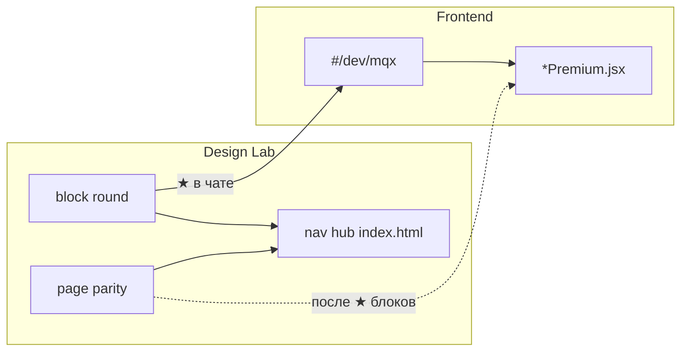

# Design Lab — навигация: что, когда и куда

**Для людей и агентов.** Канон процесса: [`DESIGN_WORKFLOW.md`](../../frontend-react/src/components/mqx/DESIGN_WORKFLOW.md).  
**Скилл:** `design-lab-mqx` · **Правило:** `tvoy-hod-design-lab.mdc`.

---

## Три уровня «правды»

| Уровень | Назначение | Где |
|---------|------------|-----|
| **Block round** | 2–5 вариантов одного блока (A/B/C) | `design-lab/<тема>/<round>/` |
| **Page parity** | Блоки на одной странице, как в prod | `dashboard/parity-generated-page-round/`, `finance/parity-generated-page-round/` |
| **React canon** | Утверждённый UI в приложении | `mqx/` + `#/dev/mqx` |

Lab-HTML **не подменяет** prod: сначала round → ★ в чате → MQX → prod. Parity — проверка композиции **после** ★ блоков.

---

## Куда смотреть (шпаргалка)

| Задача | Куда | Как открыть |
|--------|------|-------------|
| **Обзор всех макетов, поиск раунда** | **Хаб** | `cd design-lab` → `npx serve .` → `/` (поиск по названию) |
| **Сравнить блоки дашборда на одной странице** | Dashboard parity | Хаб → «Dashboard (S5 Unified)» или `dashboard/parity-generated-page-round/` |
| **Сравнить блоки финансов** | Finance parity | Хаб → finance parity или `finance/parity-generated-page-round/` |
| **Один раунд (правка CSS, 404)** | Папка раунда | Хаб → ссылка на round **или** `cd design-lab/<тема>/<round>` + `npx serve .` |
| **Утверждённый React-компонент** | MQX catalog | `npm run dev` → `#/dev/mqx` |
| **Prod vs зафиксированный lab** | compare-prod | Хаб → `compare-prod/` (после `design-lab:freeze-baseline`) |

**По умолчанию для ревью** — **хаб**, не `serve` в подпапке раунда. Локальный `serve` в раунде — только для отладки sync/стилей.

---

## Конфигурация ссылок

| Файл | Роль |
|------|------|
| [`design-lab/nav.manifest.json`](../../design-lab/nav.manifest.json) | Секции и ссылки хаба (ручное редактирование) |
| [`design-lab/index.html`](../../design-lab/index.html) | **Генерируется** — не править руками |
| [`design-lab/dashboard/canon.manifest.json`](../../design-lab/dashboard/canon.manifest.json) | Порядок блоков дашборда → page parity |
| [`design-lab/finance/canon.manifest.json`](../../design-lab/finance/canon.manifest.json) | То же для финансов |

### После правок `nav.manifest.json`

```powershell
cd frontend-react
npm run design-lab:build-nav
```

Полная пересборка (nav + оба page parity):

```powershell
cd frontend-react
npm run design-lab:build
```

Перед релизом: `release-tma` / `tvoy-hod-release-guardrails.mdc`.

---

## Новый раунд (чеклист агента)

1. Создать `design-lab/<тема>/<round>/` — `index.html`, `styles.css`, `sync-lab.ps1`, `VARIANTS.md`.
2. Только `./` пути в HTML; запустить `sync-lab.ps1`; закоммитить `lab-base.css` + `assets/`.
3. Добавить пункт в **`nav.manifest.json`** (секция темы, `kind: "lab"`, при ★ — `"status": "approved"`).
4. **`npm run design-lab:build-nav`** — обновить хаб.
5. Показать пользователю ссылку через **хаб**, не «откройте папку round».

Для **events**: после правок родительских стилей — `design-lab/events/sync-all-rounds.ps1`.

---

## Когда что **не** использовать

| Не делать | Вместо этого |
|-----------|----------------|
| `serve` только в `tails-round/` без хаба | Хаб → раздел «События» |
| Править `design-lab/index.html` вручную | `design-lab:build-nav` |
| Склеивать page parity из CSS нескольких раундов вручную | `design-lab:build` + `canon.manifest.json` |
| Новый визуал сразу в `*Premium.jsx` | Round → ★ → `mqx/` → `#/dev/mqx` → prod |
| Архив `events/index.html` как «текущий канон» | Актуальные раунды + хаб |

---

## События (особый случай)

Нет единой page parity как у Dashboard. Актуальные раунды:

| Раунд | Содержание |
|-------|------------|
| `events/layout-round/` | L3 ★ каркас |
| `events/overlay-round/` | O1 ★ оверлей |
| `events/domains-round/` | Скины доменов |
| `events/tails-round/` | E2/E5 ★ хвосты |

В prod: `EventCard`, `EventCarouselOverlay` — сверка в `#/dev/mqx` → «События — E2/E5».

---

## Схема потока



---

## Связанные документы

- [`design-lab/README.md`](../../design-lab/README.md)
- [`docs/vision/ideas/design-lab-always-actual-canon-manifest-and-parity.md`](../vision/ideas/design-lab-always-actual-canon-manifest-and-parity.md)
- [`docs/agents/DESIGN_IMPROVEMENTS_BACKLOG.md`](DESIGN_IMPROVEMENTS_BACKLOG.md)
