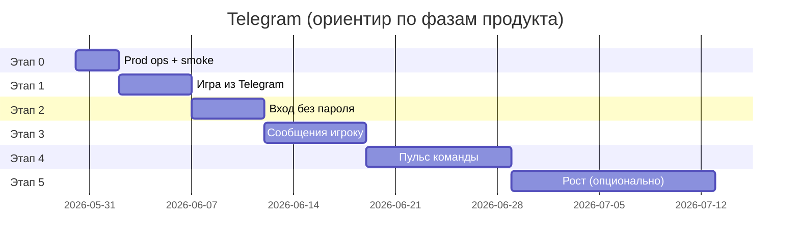

# Telegram — бэклог и этапы

Понятный план: **что делаем с ботами и каналом**, в каком порядке и когда считаем этап готовым.

**Технический контракт:** [`SPEC_telegram-bots-and-notifications.md`](../specs/features/SPEC_telegram-bots-and-notifications.md)  
**Связанный эпик в общем бэклоге:** A0 Watchtower · [`PRODUCT_BACKLOG.md`](PRODUCT_BACKLOG.md)

---

## Зачем это отдельным документом

В Telegram у нас **три роли**, не одна:

| Роль | Кто | Простыми словами |
|------|-----|------------------|
| **Игровой бот** | Игроки | Кнопка «Играть», позже — редкие напоминания от Монетки |
| **Ops-бот** | Команда | «Кто-то зарегистрировался / победил / застрял» → чат + ссылка в админку |
| **Канал** | Подписчики | Посты про прогресс проекта, кнопка «Открыть игру» |

Код ops-уведомлений **уже написан**; не хватает prod-настройки, игрового бота и доработок под Closed Alpha.

---

## Карта этапов

| Этап | Название | Фаза продукта | Срок (ориентир) | Главный результат |
|------|----------|---------------|-----------------|-------------------|
| **0** | Включить в prod | Pre-Alpha | 2–3 дня | Команда видит каждого тестера в TG и в `#/admin` |
| **1** | Игра из Telegram | Pre-Alpha | ~1 нед | Можно приглашать «открой бота → Играть», не только браузер |
| **2** | Вход без пароля | Pre-Alpha / CA | ~1 нед | В TMA не нужна отдельная регистрация |
| **3** | Сообщения игроку | Closed Alpha prep | ~1–2 нед | Победа/поражение и мягкие nudge — без спама |
| **4** | Пульс для команды | Closed Alpha | ~2 нед | Одна сводка в день + «кто застрял» |
| **5** | Рост и эксперименты | Soft launch prep | по запросу | UTM, дайджест Монетки, buddy |

---

## Этап 0 — «Включить в prod»

**Для кого:** ops, product.  
**Смысл:** то, что уже есть в коде, реально работает на Render и в вашем ops-чате.

### Что получим

- Новый тестер зарегистрировался → через несколько секунд сообщение в **закрытый чат команды**.
- В сообщении — ссылка на `#/admin`, там же виден этот пользователь.
- Победа / поражение / закрытие 1-го, 3-го, 7-го периода — тоже приходят в чат (без лишнего шума по шагам онбординга).

### Задачи

| ID | Pri | Кто | Задача | Готово когда |
|----|-----|-----|--------|--------------|
| TG-001 | P0 | Ops | Создать **@TvoyHodOpsBot** (или использовать текущий), **не** светить username публично | Token в Render secrets |
| TG-002 | P0 | Ops | Создать **приватный ops-чат**, добавить бота админом | `OPS_TELEGRAM_CHAT_ID` в env |
| TG-003 | P0 | Ops | Render: `OPS_TELEGRAM_BOT_TOKEN`, `OPS_TELEGRAM_CHAT_ID`, `ADMIN_USER_IDS`, `PUBLIC_APP_URL` | См. [`DEPLOY.md`](../ops/DEPLOY.md) |
| TG-004 | P0 | Dev | Smoke: регистрация тестового user → алерт в чат **< 5 с** | CS-1 / ручной чек |
| TG-005 | P0 | Dev | Smoke: `#/admin` открывается под allowlist-user | Ручной чек |
| TG-006 | P1 | Ops | В ops-чате **закрепить** строку билда (дата, commit) на волну | [`PRE_ALPHA_WAVE1_OPS.md`](../foundation/PRE_ALPHA_WAVE1_OPS.md) |

### Критерий «этап закрыт»

- [ ] TG-001…005 выполнены на **prod** API.
- [ ] Команда договорилась: ops-чат читаем **минимум раз в день** на Pre-Alpha.

**Уже в коде (не делать заново):** `notification_log`, `emit_admin_alert`, hooks register/start/win/loss/milestone, Watchtower.

---

## Этап 1 — «Игра из Telegram»

**Для кого:** игроки, marketing.  
**Смысл:** официальный вход в игру через Telegram, а не только ссылка на сайт.

### Что получим

- У бота есть описание, аватар (Монетка), кнопка меню **«Играть»** → Mini App.
- Игрок пишет `/start` → приветствие + та же кнопка.
- В канале пост: «Открой бота → /start → Играть».
- **Важно:** пока без `/start` мы **не сможем** слать игроку личные сообщения позже — это правило Telegram.

### Задачи

| ID | Pri | Кто | Задача | Готово когда |
|----|-----|-----|--------|--------------|
| TG-101 | P0 | Ops | Создать **@TvoyHodBot** (player), отдельный token от ops | BotFather |
| TG-102 | P0 | Ops | BotFather: **Web App URL** = prod (`…/#/`), привязать **domain** | Menu Button открывает игру |
| TG-103 | P0 | Marketing | Оформить description / about (тон Монетки, 30+, финграмотность) | Текст согласован |
| TG-104 | P0 | Dev | Webhook `POST /api/telegram/webhook/player` + `/start` → сохранить `telegram_chat_id` | CS-4 |
| TG-105 | P0 | Dev | Миграция: `users.telegram_chat_id`, `telegram_started_at` | migrate.ps1 prod |
| TG-106 | P1 | Dev | Ответ на `/start`: текст + InlineKeyboard `web_app` «Играть» | Ручной TMA smoke |
| TG-107 | P1 | Dev | `/help` — 3–4 строки + ссылка на чат фидбека волны | Copy из invite |
| TG-108 | P1 | Marketing | Первый пост в канале + invite Pre-Alpha с **deeplink на бота** | Wave 1 ушла |
| TG-109 | P2 | Ops | **Staging-бот** (отдельный token + test chat) — не палить prod-алерты с local | Решение § ниже |

### Критерий «этап закрыт»

- [ ] Android **или** desktop Telegram: Menu → игра загружается, CORS ок.
- [ ] `/start` → в БД появился `telegram_chat_id`.
- [ ] Приглашение волны 1 упоминает бота (browser остаётся запасным путём).

**Пока не делаем:** initData-login, push игроку, digest.

---

## Этап 2 — «Вход без пароля»

**Для кого:** игроки в TMA.  
**Смысл:** открыл игру из Telegram — **не вводишь логин/пароль**; аккаунт привязан к Telegram.

### Что получим

- При открытии Mini App — автоматический вход (или одна кнопка «Продолжить как …»).
- Меньше отвала на регистрации в WebView.
- Ops видит `telegram_linked` в логе.

### Задачи

| ID | Pri | Кто | Задача | Готово когда |
|----|-----|-----|--------|--------------|
| TG-201 | P0 | Dev | `POST /api/auth/telegram` — проверка HMAC `initData` | CS-3 |
| TG-202 | P0 | Dev | Find-or-create user по `telegram_id`; merge с существующим аккаунту **не** ломаем без явного UX | Тест merge policy |
| TG-203 | P0 | Frontend | При `Telegram.WebApp.initData` — auth на load, fallback login/password в браузере | build ok |
| TG-204 | P1 | Dev | Emit `telegram_linked` в ops (опционально quiet) | Log + TG admin |
| TG-205 | P1 | QA | Smoke: новый TG user → игра без register form; browser по-прежнему login | 2 сценария |

### Критерий «этап закрыт»

- [ ] Новый пользователь из TMA играет без ручной регистрации.
- [ ] Браузер/PWA без Telegram — старый login **не сломан**.

**Решение для утверждения:** merge «старый email-аккаунт + тот же telegram_id» — только через явную кнопку «Привязать Telegram» (не автоматически).

---

## Этап 3 — «Сообщения игроку»

**Для кого:** игроки (retention), product (опрос волны).  
**Смысл:** **редкие** полезные сообщения от Монетки — не дублируем тосты в игре.

### Что получим

| Сообщение | Когда | Лимит |
|-----------|-------|-------|
| Победа | один раз за партию | всегда |
| Поражение | один раз | всегда |
| Опрос плейтеста | после 4-го периода | 1 раз |
| «Вернись» | D1 / D3 без активности | max 2 в неделю |
| `/quiet` | игрок сам | выключает всё кроме win/loss **или** всё — см. решение |

### Задачи

| ID | Pri | Кто | Задача | Готово когда |
|----|-----|-----|--------|--------------|
| TG-301 | P0 | Dev | `PLAYER_TELEGRAM_BOT_TOKEN` + отправка `audience=player` в NotificationService | CS-5 |
| TG-302 | P0 | Dev | Player TG: **game_won**, **game_lost** + кнопка «Играть» | Ручной smoke |
| TG-303 | P1 | Dev | `/quiet` и `/resume` + поле `users.notify_telegram` | Bot + API prefs |
| TG-304 | P1 | Product | Тексты Монетки (win/loss/survey) — [`CHARACTER_MONETKA.md`](../reference/CHARACTER_MONETKA.md) | Copy в коде/constants |
| TG-305 | P1 | Dev | `playtest_survey` после period 4; URL из env `PLAYTEST_SURVEY_URL` | Wave 2+ |
| TG-306 | P2 | Dev | Cron `d1_nudge` / `d3_nudge` с weekly cap | Closed Alpha |
| TG-307 | P2 | Dev | Лог-only: `period_closed`, `salary_claimed` для воронки (без TG) | notification_log |

### Критерий «этап закрыт»

- [ ] Победа в TMA → одно сообщение в личку бота (если был `/start`).
- [ ] `/quiet` → nudge не приходят; win/loss — **утвердить поведение** (§ решения).
- [ ] Не больше **2** marketing-style nudge / user / неделя.

**Не делаем на этом этапе:** in-app inbox (колокольчик) — отдельный эпик A0 Phase 1.

---

## Этап 4 — «Пульс для команды»

**Для кого:** product, solo-dev на Closed Alpha (50–150 человек).  
**Смысл:** перестать читать 50 отдельных алертов — одна **утренняя сводка** + сигналы «застрял».

### Что получим

- **08:00 МСК** — одно сообщение: новые users за сутки, wins, средний period, сколько застряло.
- Отдельный алерт, если API health падает.
- В `#/admin` — KPI-карточки за 7 дней и фильтр «застрял».

### Задачи

| ID | Pri | Кто | Задача | Готово когда |
|----|-----|-----|--------|--------------|
| TG-401 | P1 | Dev | `GET /api/admin/metrics/summary?days=7` | A2 из PLAN_admin |
| TG-402 | P1 | Frontend | KPI-карточки сверху Watchtower | UI review |
| TG-403 | P1 | Dev | Cron `ops_digest_daily` → **1** msg в ops-чат | Ручной trigger ok |
| TG-404 | P1 | Dev | Эвристики `onboarding_stuck` (48h), `player_stuck` (72h) | Алерт + dedupe |
| TG-405 | P1 | Frontend | Фильтр / бейдж «застрял» в таблице профилей | A4 |
| TG-406 | P2 | Ops | Второй чат `OPS_TELEGRAM_CRITICAL_CHAT_ID` для 5xx / health | Опционально |
| TG-407 | P2 | Dev | `last_seen_at` на user + обновление при API bootstrap | Для D1/D3 |

### Критерий «этап закрыт»

- [ ] За неделю Closed Alpha product отвечает «как дела?» из summary **без SQL**.
- [ ] Digest заменяет **не** realtime алерты win/loss на Pre-Alpha — digest **дополняет** с CA; realtime win/loss **оставляем**.

### Связь с KPI

| KPI | Откуда |
|-----|--------|
| PA-T1 (≥60% до 3-го периода) | опрос + `period_milestone` в log |
| CA D7 | cohort script по `notification_log` + `last_seen_at` |
| «Кто застрял на онбординге» | `onboarding_stuck` + воронка в admin |

---

## Этап 5 — «Рост и эксперименты» (опционально)

**Когда:** после стабильного Closed Alpha или Soft Launch.

| ID | Pri | Идея | Зачем |
|----|-----|------|-------|
| TG-501 | P3 | `/start playtest_w1_student` → UTM в БД | Какой канал привёл игрока |
| TG-502 | P3 | «Месячный дайджест» Монетки после закрытия периода | Обучение вне сессии |
| TG-503 | P3 | Buddy-code (анонимный прогресс другу) | Мягкая социализация без leaderboard |
| TG-504 | P3 | GitHub Action → пост в канал ([`TELEGRAM_PUBLISHING.md`](../marketing/TELEGRAM_PUBLISHING.md)) | Автоматизация changelog |
| TG-505 | P3 | Ops `/stats` только для `ADMIN_TELEGRAM_IDS` | Быстрый ответ без ноутбука |

---

## Что сознательно не в этом бэклоге

| Тема | Где |
|------|-----|
| In-app inbox (колокольчик) | A0 Phase 1 · [`admin-and-notifications.md`](../vision/ideas/admin-and-notifications.md) |
| Content Studio, draft/publish | A0 Phase 2+ |
| Userbot, парсинг чужих групп | **Never** |
| Hamster-style tap mechanics | **Never** |
| Полный BI (Metabase) | После Soft Launch |

---

## Решения для утверждения

Отметьте **Да / Нет / Комментар** — после этого бэклог переводим в `status: approved`.

| # | Решение | Предложение | Статус |
|---|---------|-------------|--------|
| **R1** | **Два бота** (player + ops), разные token | **Да** — безопасность и проще CI для канала | ⬜ |
| **R2** | **Staging-бот** отдельно от prod | **Да** — `@TvoyHodBot` prod + `@TvoyHodTestBot` staging | ⬜ |
| **R3** | Pre-Alpha invite: **браузер + бот** параллельно | **Да** — как в [`PRE_ALPHA_WAVE1_OPS.md`](../foundation/PRE_ALPHA_WAVE1_OPS.md) | ⬜ |
| **R4** | Ops: **realtime** алерты register/win/loss на Pre-Alpha | **Да** — при 10–20 игроках нужен каждый сигнал | ⬜ |
| **R5** | **Digest** с Closed Alpha (не раньше) | **Да** — до 50 DAU шумнее пользы | ⬜ |
| **R6** | Player nudge (D1/D3) — **только после** initData (этап 2) | **Да** | ⬜ |
| **R7** | `/quiet` отключает **все** TG, включая win/loss | **Нет** — win/loss всё равно шлём (1 раз, продуктовый итог) | ⬜ |
| **R8** | Merge email-аккаунта и TG — **только явная привязка** | **Да** | ⬜ |
| **R9** | Spec [`SPEC_telegram-bots-and-notifications.md`](../specs/features/SPEC_telegram-bots-and-notifications.md) — канон для реализации | **Да** | ⬜ |

---

## Анализ: что уже есть vs gap

| Область | Сейчас | Gap |
|---------|--------|-----|
| Ops → TG | Код ✅ | Prod env ⬜ (TG-001…003) |
| Watchtower | UI ✅ | KPI summary ⬜ (TG-401) |
| Player bot | Только BotFather вручную | Webhook, /start ⬜ (TG-104…) |
| TG login | Нет | initData ⬜ (TG-201…) |
| Player push | Нет | win/loss ⬜ (TG-301…) |
| Analytics | `notification_log` ✅ | digest, stuck, D7 ⬜ (TG-4xx) |
| Канал | Док + черновики постов | Пост + deeplink ⬜ (TG-108) |

**Узкое место Pre-Alpha:** не код, а **ops env + player bot + invite copy**. Это этапы 0–1 (~1 неделя календарно при part-time).

**Узкое место Closed Alpha:** без этапа 2–3 retention-метрики (D7) будут слепыми — игроки отваливаются на регистрации и мы не можем вернуть.

---

## Рекомендуемый порядок работ (сводка)

| Неделя | Этап | ID задач | Блокер для волны |
|--------|------|----------|------------------|
| 1 | 0 + начало 1 | TG-001…006, TG-101…102 | Pre-Alpha **можно** стартовать с browser; TG — параллельно |
| 2 | 1 | TG-104…108 | Invite с ботом |
| 3–4 | 2 | TG-201…205 | Перед расширением до 50+ |
| 4–5 | 3 | TG-301…305 | Опрос после 4-го периода |
| 6+ | 4 | TG-401…407 | Closed Alpha gate |

---

## Связь с PRODUCT_BACKLOG

| Эпик | Пересечение |
|------|-------------|
| **A0** Watchtower | Этапы 0, 4 — ops, metrics, stuck |
| **α** Playtest | Этапы 1, 3 — invite, survey |
| **PW1** TMA resume | Smoke этапа 1 в реальном Telegram (S8) |

Обновить в [`PRODUCT_BACKLOG.md`](PRODUCT_BACKLOG.md): строка **TG1** в сводке эпиков → этот файл.

---

## Журнал

| Дата | Событие |
|------|---------|
| 2026-05-30 | Черновик бэклога из spec + сессии architecture review |

---

*После утверждения R1–R9: `status: approved`, spec → `approved`, нарезка tasks в `docs/plans/PLAN_telegram-bots.md`.*
