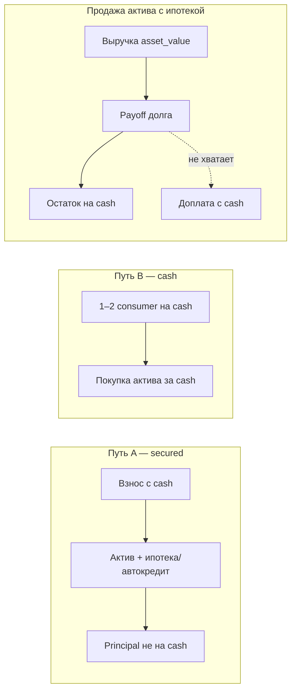

# ADR-010: Граф актив ↔ долг ↔ страховка (DL1)

## Context

В prod кредит из шаблона зачисляет **весь principal на cash**; ипотеку можно «обналичить» и купить что угодно. Продажа актива (`delete_asset`) зачисляет **полную** `asset_value` на cash, **не** гася связанный долг (которого в модели ещё нет).

Продукт требует **два честных пути** владения имуществом/авто и одно правило продажи при целевом кредите. Эпик: [DL1](../vision/ideas/debt-liability-capital-graph.md), spec: [`SPEC_debt-liability-capital-graph`](../specs/features/SPEC_debt-liability-capital-graph.md).

## Decision

### 1. Два пути приобретения актива

| Путь | Название | Как игрок получает дом/авто | Деньги |
|------|----------|-----------------------------|--------|
| **A** | **Целевой кредит (secured)** | Один атомарный сценарий: **актив + ипотека / автокредит** (`liability_kind` = `mortgage` \| `auto_loan`) | Principal **не** на свободный cash. Списывается **первоначальный взнос** с cash (если задан шаблоном); остаток цены — тело secured-долга на активе |
| **B** | **Покупка за cash** | `POST /assets/from-template` (или эквивалент) при достаточном cash | Списание cash на цену актива. Допускаются **1–2 потребительских** кредита (`consumer` / `unsecured`, `disbursement_mode=to_cash`) **без** привязки к активу — игрок копит/берёт cash и покупает квартиру или машину |

**Запрещено:** шаблон ипотеки/автокредита с `disbursement_mode=to_cash` (полная сумма на счёт).

**Связь 1:1:** на один актив — не более одного **активного** secured-долга (`mortgage` / `auto_loan`). Путь B: актив без `secured_liability` (или явный флаг `acquisition_mode=cash`).

### 2. Продажа актива с привязанным целевым долгом

Если у актива есть активный secured-долг (`FinanceLiability.secured_asset_id = asset.id`):

1. **Выручка** = `asset_value` (как сейчас, рыночная цена продажи в MVP).
2. **Погашение долга** из выручки **в порядке:** сначала `overdue_amount` (недоплата по графику, в т.ч. просроченные проценты/тело в составе платежа), затем `total_debt` = **остаток основного долга** \(P\). Отдельно проценты **не** прибавляются к `total_debt` — иначе двойной учёт с `overdue` (канон: SPEC §4.0).
3. **На cash** зачисляется только **остаток:**  
   `max(0, sale_proceeds - payoff_total)`.
4. Secured-обязательство **закрывается** (`is_active=0` или удаление по правилу реализации; в транзакциях — `liability_close` / `liability_payoff_from_sale`).
5. Актив снимается с баланса (`is_active=0` / delete).

**Недостаточная выручка** (`sale_proceeds < payoff_total`):

- Продажа **разрешена** только если `cash_balance >= (payoff_total - sale_proceeds)`; недостающая сумма **досписывается с cash** (доплата при «минусе по сделке»).
- Иначе **400** с понятным текстом: недостаточно выручки и cash для погашения кредита.

**Продажа актива без secured-долга** (путь B): как сейчас — вся `asset_value` на cash, долги не затрагиваются.

### 3. Страховка на объект

- Полисы на имущество/авто получают `insured_asset_id` → `finance_assets.id`.
- Покупка без подходящего актива — **400**.
- При продаже/деактивации актива: активные полисы с `insured_asset_id` этого актива → **`is_active=0`** (без выплаты), кроме случая claim по событию до продажи.

### 4. Потребительские кредиты

- `liability_kind` ∈ {`consumer`, `unsecured`}, `secured_asset_id` = NULL, выдача на cash.
- Лимит **одновременно активных** потребительских — **2** (конфиг шаблона / константа; ужесточение DTI — backlog DL1-200).
- Потребительский кредит **не** блокирует покупку актива за cash, если хватает cash после учёта платежей (DTI — позже).

### 5. Legacy

- Существующие `finance_liabilities` без `liability_kind` → трактуются как **unsecured**, `payment_mode=interest_only`, выдача уже произошла — **не** пересчитывать историю.
- Существующие полисы без `insured_asset_id` — grandfather до истечения/claim; новые покупки — только с FK.

### 6. Направление связи в БД

- **Канон:** `FinanceLiability.secured_asset_id` → `FinanceAsset.id`.
- Обратный поиск при продаже: query liabilities WHERE secured_asset_id = :asset_id AND is_active.

## Consequences

- Нужны миграции DL1-110/111, изменения `create_liability_from_template`, `create_asset_from_template`, **`delete_asset` / sell flow**, страховка `buy_policy`.
- UI «Капитал»: два входа («В ипотеку» vs «Купить за свои»), при продаже — превью: «Погашение кредита X ₽, на счёт Y ₽».
- События: предикаты по `insured_asset_id` (DL1-210).
- **Breaking для старых сохранений:** только если у профиля уже есть «ипотека на cash» — остаётся legacy unsecured до ручного закрытия.

## Alternatives considered

1. **Запрет продажи при наличии ипотеки** — отклонено: нереалистично; пользователь выбрал погашение из выручки.
2. **Остаток долга переводить в consumer после продажи** — отклонено: размывает педагогику целевого кредита.
3. **Только путь A (без cash-покупки жилья)** — отклонено: нужен путь накопления + 1–2 потребительских кредита.

## Open items (не блокируют ADR)

| Тема | Куда |
|------|------|
| Legacy-полисы без `insured_asset_id` | Миграция optional; grandfather по умолчанию |
| Только аннуитет в v1 | SPEC §4.1 |
| DTI / лимит суммы consumer | DL1-200 |

## Связанные артефакты

- Spec: [`SPEC_debt-liability-capital-graph`](../specs/features/SPEC_debt-liability-capital-graph.md)
- Plan: [`PLAN_debt-liability-capital-graph`](../plans/PLAN_debt-liability-capital-graph.md)
- Idea: [`debt-liability-capital-graph`](../vision/ideas/debt-liability-capital-graph.md)
- Code (to change): `services/finance/liabilities.py`, `services/finance/assets.py`, `services/insurance/service.py`, `game/period.py`
- Product: [`SPEC_PRODUCT.md`](../foundation/SPEC_PRODUCT.md) §12.1
