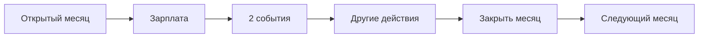

# События — как устроена «жизнь» в игре

Публичное описание **роли событий**, **ожиданий игрока** и **принципов дизайна**. Без полей YAML, классов lifecycle и формул баланса — это для команды контента: [`EVENTS_AGENT.md`](../agents/EVENTS_AGENT.md).

**См. также:** краткий глоссарий кодов — [`EVENTS_TERMS_RU.md`](EVENTS_TERMS_RU.md) · механики в цикле — [`GAME.md`](GAME.md) · плейтест за 5 минут — [`PLAYER_EXPERIENCE.md`](PLAYER_EXPERIENCE.md).

---

## Зачем события в ТВОЙ ХОД

Игра учит не «запомнить цифру», а **принять компромисс**: потратить сейчас, отложить, защититься страховкой, пожертвовать комфортом ради подушки. События — главный носитель этой дилеммы: каждый месяц игрок видит **ситуации из взрослой жизни** с понятными последствиями на **деньги**, **ежемесячные расходы** и **потребности** (комфорт, статус, связи, здоровье).

События **не заменяют** вкладки «Финансы» и цели победы — они **связывают** их с эмоцией «это про меня», а не про таблицу.

---

## Место в игровом месяце

Типичный порядок (см. [`PLAYER_EXPERIENCE.md`](PLAYER_EXPERIENCE.md)):

1. Забрать **зарплату** (если не забрали до закрытия месяца — за этот месяц не повторится).
2. Открыть **события** — обычно **две** карточки с выбором за период.
3. При необходимости: подушка, «Порадовать себя», финансовые вкладки.
4. **Закрыть месяц** — списания, decay потребностей, новый период.

**Важно:** период **не тикает по часам** — только по кнопке «Закрыть месяц».

---

## Что видит игрок

| Элемент | Поведение |
|---------|-----------|
| **Кнопка «События»** | Показывает, сколько карточек ждёт решения |
| **Карусель** | Листание карточек, свайп / стрелки |
| **Варианты выбора** | Кнопки с кратким текстом; на кнопках — превью эффектов (деньги, расходы, **чипы потребностей**) |
| **После выбора** | Цифры и шкалы обновляются; возможна короткая обратная связь (juice на потребностях) |

Игрок должен **до нажатия** понимать: «если соглашусь — станет лучше по жизни, но ударит по кошельку / наоборот».

---

## Принцип честного выбора (trade-off)

**Нет «бесплатного улучшения жизни».** Если вариант поднимает потребности или снимает стресс — у него должна быть **видимая цена**: трата с cash, рост ежемесячных расходов, риск в будущем или осознанный отказ с **падением** другой шкалы.

| Плохо для игрока | Хорошо |
|------------------|--------|
| Одна кнопка «и деньги, и все потребности в плюс» без минусов | Две–три осмысленные ветки: «сейчас дешевле / потом дороже», «комфорт vs подушка» |
| Отказ без последствий, когда «да» что-то даёт | Отказ часто **стоит** по потребностям или по отношениям — как в жизни |
| Одна кнопка явно лучше всех остальных | Нет «очевидно правильного» ответа без контекста партии |

Это **не** «наказание ради наказания»: цель — **умная игра**, где отказ и согласие оба объяснимы. Педагогика — через прозрачные последствия, не через скрытые штрафы.

Подробнее для команды (зачем так): [`event-choice-balance-tradeoffs.md`](../vision/ideas/event-choice-balance-tradeoffs.md).

---

## События и потребности

Четыре шкалы на главном экране: **комфорт**, **статус**, **связи**, **здоровье**. Они **медленно падают** сами, если игрок только «закрывает месяца» без решений.

| Источник пополнения | Роль |
|---------------------|------|
| **События** | Основной путь: выборы с эффектом на потребности |
| **«Порадовать себя»** | Редкий запасной путь (~раз в 15 месяцев), не замена событиям |

**Тематическая связь:** ситуация про **жильё и быт** должна в первую очередь бить по **комфорту**; про **семью и друзей** — по **связям**; про **карьеру и статус** — по **статусу**; про **здоровье** — по **здоровью**. Смешивать «семейный сюжет» с ростом только комфорта без причины — путает игрока.

Поражение по потребностям **независимо** от победы по деньгам: любая шкала на нуле **три месяца подряд** → game over ([`GAME.md`](GAME.md), [ADR-005](../decisions/ADR-005-character-needs-state-and-defeat.md)).

---

## Повторы и «узнаваемые» истории

Игрок **не должен** каждые 2–3 месяца снова «переезжать в студию» или «снова урезать интернет на −2500 ₽/мес» — это ломает ощущение сюжета.

| Тип ситуации (по-русски) | Ожидание |
|---------------------------|----------|
| **Разовый жизненный шаг** (переезд, крупный поворот) | Один раз за партию или явное продолжение цепочки |
| **Оптимизация расходов** (тариф, жильё подешевле) | Редко, с долгой паузой; не чаще «бытовой покупки» |
| **Бытовые траты** (еда, подписка, мелочь) | Могут возвращаться, но не подряд одним и тем же текстом |

В **production сейчас** не все карточки ещё приведены к этим ожиданиям — это цель ближайшей волны контента (см. бэклог EVT1-105). На плейтесте полезно отмечать: **«та же история снова и снова»**.

---

## Какие бывают ситуации (продуктовые типы)

Не путать с техническими полями в каталоге — расшифровка кодов в [`EVENTS_TERMS_RU.md`](EVENTS_TERMS_RU.md) §1.

| Тип | Примеры | Зачем в игре |
|-----|---------|--------------|
| **Повседневное** | ресторан, подписка, мелкий ремонт | Привычные trade-off «сейчас / потом» |
| **Про вашу роль** | подработка студента, курсы профессионала | Ощущение «это мой сценарий жизни», не абстрактный человек |
| **Про финансы и имущество** | страховка на авто, ДТП, ипотека и залив | Связка механик игры с последствиями |
| **Риск при просадке потребностей** | выгорание, конфликт, когда шкала низкая | Давление, если игрок игнорировал «жизнь» |
| **Фон рынка** *(план)* | кризис, ставка | Редкий контекст среды, не «ваша машина сломалась» |

**Цепочки:** решение в одном месяце может привести к **новой карточке** позже («вы отказали брату — через три месяца он вернул долг»). В prod уже есть несколько таких веток; UI пока слабо подчёркивает отсылку к прошлому выбору — улучшение в плане.

**Обязательные решения:** часть карточек **блокирует** «Закрыть месяц», пока игрок не выберет вариант (например, ДТП, срочная медицина). Это осознанное давление, не баг.

---

## Сложность и «случайность»

- **Не** «уровень персонажа» — в игре **нет** XP/level ([ADR-003](../decisions/ADR-003-remove-character-progression.md)).
- **Глубина сценария** (`event_tier`) привязана к **номеру игрового месяца**: дальше по кампании — крупнее финансовые развилки в пуле.
- **Две карточки за месяц** — осознанный лимит, чтобы месяц не превращался в марафон чтения ([ADR-009](../decisions/ADR-009-metrics-dictionary-tb1.md)).
- **Cooldown** между повторами одной и той же истории — чтобы пул не зацикливался на одном ключе.

Случайность **управляемая**: веса и паузы, а не «рандом ради рандома».

---

## Что уже в билде vs что в плане

| Возможность | Статус |
|-------------|--------|
| 2 choice-события / период, tier, cooldown, цепочки enqueue | ✅ |
| Превью `needs_delta` на кнопках | ✅ |
| Блокировка месяца до выбора (`mandatory`) | ✅ |
| Каталог `data/events/mvp11/` (~20+ сценариев) | ✅ |
| Фильтр «только для шаблона Студент/Профессионал» | ⬜ |
| 3-е **информационное** событие без ветки | ⬜ |
| Отдельный слот **риск при низких потребностях** | ⬜ |
| **Глобальное макро** (рынок) без занятия 2 слотов | ⬜ |
| Типизация `content_class` / слоты v2 в данных | ⬜ draft — [`SPEC_event-system-v2`](../specs/features/SPEC_event-system-v2-slots-and-taxonomy.md) |
| Полная сверка каталога с trade-off и повторами | 🟡 в работе |

Актуальная матрица: [`FEATURE_STATUS.md`](FEATURE_STATUS.md).

---

## Для плейтеста: на что смотреть

| Наблюдение | Куда писать |
|------------|-------------|
| Непонятно, что даст кнопка | **UX** + скрин |
| «Одна кнопка всегда выгоднее» | **BALANCE** |
| Та же история 3-й раз за 5 месяцев | **BALANCE** / **IDEA** («повтор сюжета») |
| Семейный текст, а растёт только «комфорт» без смысла | **UX** / **BALANCE** |
| Нельзя закрыть месяц — непонятно почему | **BLOCKER** или **UX** (часто mandatory-событие) |

Не просим оценивать «справедливость экономики в целом» — только **понятность** и **блокеры** ([`PRE_ALPHA_PLAYTEST_PROTOCOL.md`](../foundation/PRE_ALPHA_PLAYTEST_PROTOCOL.md)).

---

## Копирайт и аудитория 30+

Ориентиры — [`TARGET_PLAYER_AND_SESSION.md`](../foundation/TARGET_PLAYER_AND_SESSION.md) §7:

- Короткий **заголовок**; основной текст **2–4 предложения**.
- Финтермины — одна фраза или сноска, не лекция.
- Тон: уважение к интеллекту; **без** коллекторов, казино, микрозаймов как «решения».

Шаблон «Студент» и «Профессионал» — **разные суммы и тон**, не один текст на всех.

---

## Связанные документы

| Документ | Аудитория |
|----------|-----------|
| [`EVENTS_TERMS_RU.md`](EVENTS_TERMS_RU.md) | Коды полей, слоты, глоссарий для spec/партнёра |
| [`EVENTS_AGENT.md`](../agents/EVENTS_AGENT.md) | Конвейер `/create-event`, `/event-analysis` (команда) |
| [`SPEC_mvp-11-progression-events.md`](../specs/features/SPEC_mvp-11-progression-events.md) | Норматив движка M11 |
| [`SPEC_event-system-v2-slots-and-taxonomy.md`](../specs/features/SPEC_event-system-v2-slots-and-taxonomy.md) | Draft: слоты и таксономия |
| [`event-repeat-and-state-ladder.md`](../vision/ideas/event-repeat-and-state-ladder.md) | Идея: повторы, downgrade (команда) |
| [`GLOSSARY.md`](../foundation/GLOSSARY.md) | Короткие определения API |

---

*Обновлено: 2026-05-30 — публичная глава событий; authoring в EVENTS_AGENT.*
