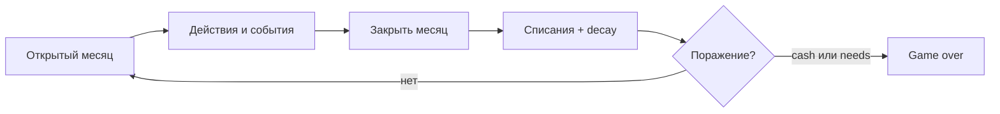

# ТВОЙ ХОД — игра по финансовой грамотности

Описание **текущей** игры: механики, логика, статус в production. Детали API и полей — в [`SPEC_PRODUCT.md`](../foundation/SPEC_PRODUCT.md) и spec фич. История решений и анкета — [`HISTORY.md`](HISTORY.md), [`QUESTIONNAIRE.md`](../../QUESTIONNAIRE.md).

**Путеводитель:** [`README.md`](README.md)

**На этой странице:** [В двух словах](#в-двух-словах) · [Статус production](#статус-production) · [Core loop](#core-loop) · [Механики](#механики) · [События (`EVENTS.md`)](EVENTS.md) · [Прогрессия и контент](#прогрессия-и-контент) · [Игрок и сессия](#игрок-и-сессия) · [Продуктовые принципы](#продуктовые-принципы) · [Куда движемся](#куда-дывиемся) · [Воронка](#воронка-привлечения-игроков) · [Связанные документы](#связанные-документы)

---

## В двух словах

**ТВОЙ ХОД** — Telegram Mini App: **игра про финансовую грамотность**, а не сухой курс. Игрок проживает **игровые месяцы** (периоды): зарплата, обязательства, подушка, события из жизни, инвестиции и страховки — в безопасной песочнице с правилами, близкими к реальности.

**ЦА:** люди **30+**, готовые поиграть в **умную игру** (финансовая тема, осмысленные решения) — [`TARGET_PLAYER_AND_SESSION.md`](../foundation/TARGET_PLAYER_AND_SESSION.md).

**Стадия:** поздний **Pre-Alpha** → подготовка к Closed Alpha. Массовый набор игроков **не начинали**.

**Педагогический тезис:** ошибки допустимы и учат (например, не забрать зарплату до конца периода — выплата за период не повторяется).

---

## Статус production

| Блок | Статус | Комментарий |
|------|--------|-------------|
| Стек | ✅ | FastAPI, PostgreSQL, React + Vite, TMA |
| Core loop периода | ✅ | «Закрыть месяц», `process_period_end`, поражение по cash |
| Зарплата, подушка, финансы | ✅ | Шаблоны, вклад, облигации, страховки |
| События (M11) | ✅ | **2/период**, tier от `period_index`, cooldown — [ADR-009](../decisions/ADR-009-metrics-dictionary-tb1.md) |
| Победа Victory v2 | ✅ BE | `victory_engine`, `min_period_index` обычно **7** |
| Victory v2 UI | ✅ P1 | `MqxGoalDash`, `overview.victory` |
| Game / Plan, шаблоны | ✅ G1 | Plan в UI — «Скоро» |
| **Потребности (Z-NEEDS)** | 🟡 | BE + UI на дашборде; [SPEC](../specs/features/SPEC_game-character-needs.md) draft |
| `mechanics_unlock` | ✅ | [ADR-004](../decisions/ADR-004-mechanics-unlock-victory-chain.md) |
| Достижения | 🟡 | Движок + API; UI «Развитие» — M12 |
| Онбординг O1 | 🟡 | [SPEC_onboarding-tma](../specs/features/SPEC_onboarding-tma.md) |
| Balance playtest | ✅ | [`docs/balance/`](../balance/README.md) |
| Pre-Alpha 10–20 | 🟡 | [Протокол](../foundation/PRE_ALPHA_PLAYTEST_PROTOCOL.md) · [Ops](../foundation/PRE_ALPHA_WAVE1_OPS.md) · [5 мин](PLAYER_EXPERIENCE.md) |
| Closed Alpha D1/D7 | ⬜ | KPI лайт: D7 gate **≥8%** — [`KPI_AND_PHASES.md`](KPI_AND_PHASES.md) |

**Приоритеты:** Pre-Alpha пилот; needs + O1; M12; E1 расходы.

**Backlog:** [`PRODUCT_BACKLOG.md`](../backlog/PRODUCT_BACKLOG.md) · **Аудит vs код:** [`MVP_AUDIT_VS_SPEC.md`](../foundation/MVP_AUDIT_VS_SPEC.md).

---

## Core loop

**Один период = один игровой месяц.** Закрытие только кнопкой **«Закрыть месяц»** — без real-time таймера (TB1).

**Фазы периода:**

1. **Доходы:** зарплата по кнопке; в конце периода — вклад, купоны, доход активов.
2. **Автосписания:** обслуживание активов, долги (+ просрочка), страховки, lifestyle (`base_monthly_lifestyle_expense` + дельты).
3. **Decay потребностей** (Game, `needs.enabled`): снижение шкал комфорта / статуса / связей / здоровья.
4. **События:** **2** карточки с выбором; эффекты на cash, подушку, lifestyle, `needs_delta`.
5. **Действия игрока:** подушка, «Порадовать себя», каталоги, инвестиции, страховки.
6. **Закрытие:** новый `period_index`, снимок аналитики, события следующего периода; проверка поражения.



---

## Механики

### Финансовые инструменты

| Инструмент | MVP |
|------------|-----|
| Зарплата (явное действие в периоде) | ✅ |
| Кредиты / обязательства, просрочка | ✅ |
| Активы (недвижимость, транспорт) из шаблонов | ✅ |
| Вклад, облигации | ✅ |
| Акции, ETF, биржа | ❌ вне scope |
| Налоги, ИИС, пенсия | ⬜ backlog |

### Стабильность и защита

- **Подушка** — `safety_fund_balance`, ориентир 3–6 мес. расходов.
- **Страховки** — премия vs защита от редких убытков.

### Активы, кредиты, подушка

- Отличать **доходный актив** от **потребительской траты**.
- Новые разделы капитала — **`mechanics_unlock`** после шагов победы, не level-gates.
- Кредиты: просрочка → `overdue_amount`; в UI — суммы, не формулы.

### Победа и поражение

**Победа** — [`victory_engine`](../../backend/app/victory/engine.py) + `victory_config_json` ([ADR-002](../decisions/ADR-002-victory-engine-and-template-config.md)):

- **`chain`:** все шаги tutorial-цепочки + `period_index >= min_period_index_for_victory` (обычно **7**).
- **`parallel` (legacy):** M из N целей + ворота периода.
- UI: `MqxGoalDash`.

**Поражение (независимо):**

| Тип | Условие |
|-----|---------|
| **Cash** | 3 подряд периода с `cash_balance < 0` после закрытия |
| **Потребности** | Любая шкала **== 0** три периода подряд — [ADR-005](../decisions/ADR-005-character-needs-state-and-defeat.md) |

**Метрики:** `net_monthly_cashflow` **не** включает lifestyle burn — [ADR-009](../decisions/ADR-009-metrics-dictionary-tb1.md), [`GLOSSARY.md`](../foundation/GLOSSARY.md).

### События

Полное описание для продукта, плейтеста и партнёров — **[`EVENTS.md`](EVENTS.md)** (trade-off, потребности, повторы, типы ситуаций, цепочки).

Кратко в production:

- **2** карточки с выбором на период; карусель, превью эффектов и чипы потребностей на кнопках.
- Сложность пула — от **номера месяца** (`event_tier`), не от «уровня персонажа».
- **Честный выбор:** нет бесплатного роста потребностей; отказ часто имеет цену.
- **Cooldown** и правила повтора — чтобы одна и та же «история переезда» не приходила каждые 2–3 месяца (каталог дорабатывается).
- Цепочки и обязательные карточки (блок «Закрыть месяц») — см. [`EVENTS.md`](EVENTS.md).

Техника: каталог [`data/events/mvp11/`](../../data/events/mvp11/) · [SPEC_mvp-11](../specs/features/SPEC_mvp-11-progression-events.md) · глоссарий кодов [`EVENTS_TERMS_RU.md`](EVENTS_TERMS_RU.md).

### Потребности персонажа

Слой **«жизнь рядом с деньгами»**. Победа и потребности **независимы**.

| Аспект | Решение |
|--------|---------|
| Шкалы | `comfort`, `status`, `social`, `health` (0–100) |
| Decay | ~10–15 периодов до нуля без пополнения |
| Пополнение | События (`needs_delta`); **«Порадовать себя»** — кулдаун **15** периодов |
| Профили | Soft — подсказки; Hard — справочник «?» |
| UI | Блок **Z-NEEDS** на главной (после hero, до финансов), заголовок **«Потребности»** |
| Поражение | 3 периода подряд с нулевой шкалой → `needs_depletion` |

Детали: [SPEC_game-character-needs](../specs/features/SPEC_game-character-needs.md), [CHARACTER_NEEDS_UX](../ux/CHARACTER_NEEDS_UX.md), [ADR-005](../decisions/ADR-005-character-needs-state-and-defeat.md), [ADR-006](../decisions/ADR-006-treat-self-options-and-cooldown.md).

### Режимы Game и Plan

- **`save_kind: game`** — старт из `game_starter_templates`, blueprint.
- **`save_kind: plan`** — ручной бюджет (MVP 2.0); потребности **выключены**; UI «Скоро».
- Legacy `light` / `hardcore` сняты — [ADR-001](../decisions/ADR-001-save-kind-remove-light-hardcore.md).

### Образовательные слои

- Lifestyle + события; экран аналитики — [SPEC_ANALYTICS](../specs/SPEC_ANALYTICS.md).
- Предупреждения при опасных паттернах; макро-события — backlog.

---

## Прогрессия и контент

**Без character XP/level** — [ADR-003](../decisions/ADR-003-remove-character-progression.md), [`remove-character-xp`](../vision/ideas/remove-character-xp-and-levels.md).

- **События:** `event_tier` от периода (10 периодов = band).
- **Достижения:** осмысленные действия, без XP — [SPEC_achievements](../specs/features/SPEC_achievements.md), M12.
- **Старт партии:** каталог шаблонов («выбор персонажа»), blueprint, `victory_config`, `needs`.
- **Реиграбельность:** новая игра + другой шаблон.

Vision «глав жизни» — [`HISTORY.md`](HISTORY.md), [evolution §II](../vision/ideas/tvoy-hod-evolution-after-mvp.md).

---

## Игрок и сессия

Потоки TMA — [`TMA_USER_FLOWS.md`](../foundation/TMA_USER_FLOWS.md):

| № | Сценарий | Поток |
|---|----------|--------|
| 1 | Вход | Логин → меню → GameScreen |
| 1a | Новая партия | Game/Plan → выбор персонажа (шаблон) |
| 2 | Период | «Закрыть месяц» |
| 3 | Зарплата | До конца периода |
| 3a | **Потребности** | Z-NEEDS: раскрыть → treat-self / «?» |
| 4 | События | Карусель, чипы `needs_delta` |
| 5 | Подушка | Пополнение / снятие |
| 6 | Капитал | Инвестиции, страховки, активы, долги |
| 7 | Конец периода | Предупреждения (зарплата, потребности) |
| 8 | Новая партия | Меню |

**Сессия (канон [`TARGET_PLAYER_AND_SESSION.md`](../foundation/TARGET_PLAYER_AND_SESSION.md) §2):** период **1–3 мин** (опытный); плейтест **≥5 периодов**; полная победа **~40–60 периодов**. Победа — только по целям chain (без ворот по period_index). TB1.

**UX:** Telegram UI для форм; кастом — карточки событий, шапка; `tg-theme-*`.

---

## Продуктовые принципы

**Design pillars:** **умная игра** · **честные последствия** — [`PRODUCT_BRIEF.md`](PRODUCT_BRIEF.md). Каналы: TMA, браузер, PWA (не «только Telegram»).

### Тон и эмоция

Спокойствие при дисциплине и подушке; напряжение при долге и низких потребностях — через UI, не через сокрытие цифр.

### Симулятор и компромиссы

Ключ — **решения внутри периода:** зарплата, два события, вклад vs подушка, **деньги vs потребности**. Несколько действий за месяц — намеренно.

### Числа и визуал

Метафоры **дополняют** суммы и проценты. Ползунки с превью на сервере. Инструменты — короткие «карты» (надёжность, доход, риск).

### События и случайность

Управляемая выдача: tier-окно от периода, веса, cooldown — не «гнев рандома». Игрок видит trade-off до нажатия; повтор одного сюжета — редкое исключение, не норма ([`EVENTS.md`](EVENTS.md)). Предвестники и расширение слотов (informational, macro) — в плане.

### Обратная связь

Тосты, overview, juice на шкалах потребностей после выбора в событии.

### Типичные опасения (кратко)

| Жалоба | Ответ |
|--------|--------|
| Перегруз механик | Tier, шаблоны, онбординг, compact needs |
| Рандом | 2/период, cooldown, tier |
| Два game over | Cash и потребности — раздельно, осознанно |

Развёрнутые ответы и история критики — [`HISTORY.md`](HISTORY.md), QUESTIONNAIRE.

---

## Куда движемся

[`tvoy-hod-evolution-after-mvp.md`](../vision/ideas/tvoy-hod-evolution-after-mvp.md) §II:

- Баланс целей Victory v2 (playtest).
- Контент потребностей: treat-self, rescue-события.
- Plan mode, E1 статьи расходов.
- Цепочки событий, штрафы просрочки, налоги.

---

## Воронка привлечения игроков

### Зрелость продукта (набор в игру)

| Этап | N | Статус |
|------|---|--------|
| **Pre-Alpha** | 10–20 | **сейчас** |
| **Closed Alpha** | 50–150 | следующий |
| **Soft Launch** | 500–2k | ⬜ |

Протокол: [`PRE_ALPHA_PLAYTEST_PROTOCOL.md`](../foundation/PRE_ALPHA_PLAYTEST_PROTOCOL.md) · KPI лайт: [`KPI_AND_PHASES.md`](KPI_AND_PHASES.md) · игроку: [`PLAYER_EXPERIENCE.md`](PLAYER_EXPERIENCE.md).

### Конверсия в услуги советника (гипотеза, не prod)

Параллельный трек **после** вовлечения в игру — детали только в [`ADVISOR_FUNNEL_AUDIENCE.md`](ADVISOR_FUNNEL_AUDIENCE.md):

```text
TG / партнёр / контент → игра (бесплатно) → опрос + поведение → CTA → советник 45–75k ₽
```

| Приоритет канала (гип.) | Зачем |
|-------------------------|--------|
| **P0** Telegram, **партнёр(и)-советники** | TMA/PWA; чек = их продукт |
| **P1** YouTube/подкасты, корп. wellbeing | Доверие 30+ |
| **P2** SEO, TG Ads → лендинг | Масштаб после креативов |

**Сигналы в игре для сегментации (план, ⬜ в prod):** ≥7 периодов или game over + новая партия; действия во «Финансах»; шаблон mortgage/debt; клик CTA.  
**Не обещать в маркетинге:** готовый **Plan Mode** (UI «Скоро»).  
**Три потока сообщений:** «Порядок» / «Стабилизация» / «Второе мнение» — §9.3 advisor-doc.

---

## Связанные документы

| Документ | Зачем |
|----------|--------|
| [`README.md`](README.md) | Путеводитель, три аудитории пакета |
| [`PRODUCT_BRIEF.md`](PRODUCT_BRIEF.md) | Vision, pillars, MVP 2.0 Plan |
| [`EVENTS.md`](EVENTS.md) | События: роль, принципы, плейтест |
| [`PLAYER_EXPERIENCE.md`](PLAYER_EXPERIENCE.md) | Плейтест: 5 минут |
| [`FEATURE_STATUS.md`](FEATURE_STATUS.md) | Матрица фич |
| [`ECONOMY_OVERVIEW.md`](ECONOMY_OVERVIEW.md) | Экономика (публично) |
| [`ADVISOR_FUNNEL_AUDIENCE.md`](ADVISOR_FUNNEL_AUDIENCE.md) | ЦА воронки «игра → финсоветник» |
| [`HISTORY.md`](HISTORY.md) | Анкета, отступления, архив XP |
| [`SPEC_PRODUCT.md`](../foundation/SPEC_PRODUCT.md) | Продукт в prod |
| [`GLOSSARY.md`](../foundation/GLOSSARY.md) | Термины |
| [`CLAUDE.md`](../../CLAUDE.md) | Разработка / агент |
| ADR-001 – ADR-009 | Решения |
| [`docs/balance/`](../balance/README.md) | Симуляция баланса |
| [`PRODUCT_BACKLOG.md`](../backlog/PRODUCT_BACKLOG.md) | Очередь |

---

*Обновлено: 2026-05-30 — ЦА 30+, умная игра; именованные разделы; история в HISTORY.*
