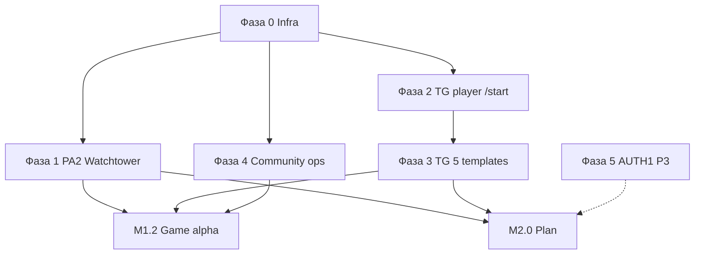

# Plan: Platform layer (эпик PLT)

**Epic ID:** `PLT` · **Idea (approved):** [`post-playtest-wave1-two-directions.md`](../vision/ideas/post-playtest-wave1-two-directions.md)  
**Блокирует:** **M1.2** (Game), **M2.0** (Plan) — оба трека используют один ops-слой.

**Суть:** один вертикальный ops-пакет для закрытой альфы «своих»: **платный стенд** → **углублённая продуктовая аналитика (Watchtower/SQL)** → **player Telegram (5 шаблонов)** → **канал/чат**. Без PostHog/Amplitude; **email verify (AUTH1)** — P3, вне P0 gate.

**Статус плана:** **approved** (2026-06-21). **Фаза 0 (infra)** — отдельная декомпозиция после выбора целевого хостинга (см. [`PLAN_INFRA.md`](PLAN_INFRA.md) — placeholder). **Старт реализации:** фаза 1 Watchtower funnel (PLT-101…106).

**После утверждения плана:** `incremental-implementation` по фазам; **текущий фокус:** фаза 1 → фаза 2–3.

---

## Карта документов

| # | Документ | Роль в PLT |
|---|----------|------------|
| 1 | [`post-playtest-wave1-two-directions.md`](../vision/ideas/post-playtest-wave1-two-directions.md) | **approved** — scope PLT |
| 2 | [`DEPLOY.md`](../ops/DEPLOY.md) | Инфра: Render Starter, домен, CORS, миграции |
| 3 | [`PLAN_admin-analytics-ops.md`](PLAN_admin-analytics-ops.md) | PA2: Watchtower, funnel, KPI, `notification_log` |
| 4 | [`TELEGRAM_BACKLOG.md`](../backlog/TELEGRAM_BACKLOG.md) | TG этапы 0–3 (player bot + 5 шаблонов) |
| 5 | [`SPEC_telegram-bots-and-notifications.md`](../specs/features/SPEC_telegram-bots-and-notifications.md) | Контракт ботов (draft) |
| 6 | [`PRE_ALPHA_WAVE1_OPS.md`](../foundation/PRE_ALPHA_WAVE1_OPS.md) | SQL KPI PA-A* — шаблон для CA-волны |
| 7 | `PLAN_PLT.md` (этот файл) | Порядок работ и gate |

**Не путать:** вкладка «Аналитика» у игрока — [`SPEC_ANALYTICS.md`](../specs/SPEC_ANALYTICS.md) (out of scope PLT).

---

## Summary

Порядок поставки:

1. **Фаза 0 — Infra:** API Starter без sleep, `app.*` + `api.*`, SSL, health smoke, бэкап БД.
2. **Фаза 1 — PA2 (analytics v1):** сегменты `save_kind` + `channel`, воронка register → старт → периоды → исход; KPI-карточки и SQL-срез для волны CA; без внешнего SaaS.
3. **Фаза 2 — TG player bot:** этап 1 TELEGRAM_BACKLOG (`/start`, `telegram_chat_id`, Menu → игра).
4. **Фаза 3 — TG 5 шаблонов:** исходящие сообщения игроку (см. таблицу ниже).
5. **Фаза 4 — Community (ops):** канал/чат, invite, закреплённый билд — без кода.
6. **Фаза 5 — P3 (отложено):** AUTH1 email verify, AC1 merge TG↔email.

---

## Dependency graph



```text
Render Starter + домен
  └── health + CORS + migrate
        ├── Watchtower funnel / KPI (PA2)
        ├── TG ops smoke (уже в коде)
        └── TG player webhook + chat_id
              └── 5 player templates
```

---

## Vertical slices

| # | Срез | Phase | Skill | Satellites | Next skill |
|---|------|-------|-------|------------|------------|
| 1 | Prod API + домен + smoke | `ship` | `incremental-implementation` | `release-web` | verify smoke |
| 2 | Funnel KPI: `save_kind`, channel, PA-A* SQL | `build` | `incremental-implementation` | `test-driven-development` | `code-review-and-quality` |
| 3 | Player bot: `/start` + `web_app` | `build` | `incremental-implementation` | `telegram-mini-app-runtime` | TDD webhook tests |
| 4 | 5 TG-шаблонов + dedupe + `/quiet` | `build` | `incremental-implementation` | TDD | manual TG smoke |
| 5 | Канал/чат + invite CA | `ship` | ops (human) | — | — |

---

## Фаза 0 — Infra (P0, блокер) ⏸ отложена

> **2026-06-21:** целевой хостинг уточняется отдельно. Декомпозиция — [`PLAN_INFRA.md`](PLAN_INFRA.md). Gate PLT P0 для M1.2/M2.0 **временно** без фазы 0, если текущий стенд уже стабилен для закрытой альфы.

**Цель:** стабильный prod без cold start; единые URL для PWA/web и TMA.

| ID | Pri | Слой | Задача | Acceptance |
|----|-----|------|--------|------------|
| **PLT-001** | P0 | Ops | Render API на **Starter** (не Free); sleep отключён | `GET /api/health` < 2 с после idle 30 мин |
| **PLT-002** | P0 | Ops | Custom domain `api.*` + SSL (Render) | HTTPS 200 |
| **PLT-003** | P0 | Ops | GitHub Pages: `app.*`, `VITE_BASE_PATH=/`, `VITE_API_BASE_URL` | Игра открывается с домена |
| **PLT-004** | P0 | Ops | Env: `PUBLIC_APP_URL`, `CORS_ALLOW_ORIGINS`, `ADMIN_USER_IDS`, `SECRET_KEY` | См. [`DEPLOY.md`](../ops/DEPLOY.md) §2 |
| **PLT-005** | P0 | Ops | `bash backend/scripts/db.sh migrate` на prod | Миграции без ошибок |
| **PLT-006** | P0 | Ops | Smoke: register → `#/admin` видит user | Ручной + ops TG < 5 с |
| **PLT-007** | P1 | Ops | Бэкап БД + одна проверка restore (staging или local) | Запись в ops-чате «restore ok» |
| **PLT-008** | P1 | Ops | Uptime: Render health **или** внешний ping на `/api/health` | Алерт при 5xx (опц. TG-406) |

**Gate фазы 0:** PLT-001…006 ✅ → можно приглашать закрытую альфу на **PWA/web** (вертикаль).

**Estimate:** 2–4 дня (ops-heavy).

---

## Фаза 1 — Product analytics v1 / PA2 (P0) 🟡 в работе

**Принцип:** углубление **A0 Watchtower** + SQL; не внедрять PostHog/Amplitude.

| ID | Pri | Слой | Задача | Acceptance | Статус |
|----|-----|------|--------|------------|--------|
| **PLT-101** | P0 | BE+FE | Воронка в `#/admin`: register → profile → milestones → исход; `product_funnel` | Счётчики за 7–30d; фильтр `save_kind` | ✅ 2026-06-21 |
| **PLT-102** | P0 | BE | `metrics/summary` + `save_kind`; PA-A1 метрики в funnel | `pct_ge5`, median closes | ✅ в funnel |
| **PLT-103** | P0 | Doc+Ops | SQL CA в PRE_ALPHA_WAVE1_OPS (уже есть § PA-A*) | Сверка опроса | ✅ ссылка в UI hint |
| **PLT-104** | P1 | BE | Поле `channel` tma/pwa/web | Сегмент воронки | ⬜ |
| **PLT-105** | P1 | BE | Log-only emits с `save_kind` | notification_log | ⬜ |
| **PLT-106** | P1 | FE | Колонка + фильтр `save_kind` в профилях | Admin profiles + WT | ✅ 2026-06-21 |
| **PLT-107** | P2 | BE | `last_seen_at` на user (bootstrap) — для D7 / stuck | См. TG-407, A4+ |

**Связь с существующим планом:** фазы A2–A4 [`PLAN_admin-analytics-ops.md`](PLAN_admin-analytics-ops.md) — **база**; PLT-101…106 — дельта под **1.x / 2.x** и CA.

**Gate фазы 1:** product отвечает «сколько дошли до 5 периодов / кто застрял» из admin **без** ручного SQL (кроме сверки PA-A*).

**Estimate:** 3–5 дней dev.

---

## Фаза 2 — TG player bot (P0) 🟡 BE готов, ops — PLT-201

Этап **1** из [`TELEGRAM_BACKLOG.md`](../backlog/TELEGRAM_BACKLOG.md). Без этапа 2 (initData-login) на P0 — PWA/web остаётся email+password.

| ID | Pri | Слой | Задача | Maps | Статус |
|----|-----|------|--------|------|--------|
| **PLT-201** | P0 | Ops | `@TvoyHodBot`, token, Menu Button → `app.*` | TG-101, TG-102 | ⬜ ops |
| **PLT-202** | P0 | BE | Webhook `POST /api/telegram/webhook/player`, `/start` | TG-104 | ✅ 2026-06-21 |
| **PLT-203** | P0 | DB+BE | `users.telegram_chat_id`, `telegram_started_at` | TG-105 | ✅ `0048_*` |
| **PLT-204** | P1 | BE | Ответ `/start`: приветствие + InlineKeyboard `web_app` | TG-106 | ✅ 2026-06-21 |
| **PLT-205** | P1 | Ops+Doc | Copy `/help`, deeplink в invite CA | TG-107 | 🟡 `/help` в коде; invite — ops |

**Ops (PLT-201):** BotFather → token → `PLAYER_TELEGRAM_BOT_TOKEN`; `setWebhook` на `{API}/api/telegram/webhook/player` + `secret_token` = `PLAYER_TELEGRAM_WEBHOOK_SECRET`; Menu Button → `PUBLIC_APP_URL` (`…/#/`).

**Gate фазы 2:** `/start` → `telegram_chat_id` в БД; Menu → TMA/PWA грузится.

**Estimate:** 3–5 дней.

---

## Фаза 3 — TG player: 5 шаблонов (P0)

Утверждённый набор (**5**):

| # | Шаблон | Триггер | Dedupe |
|---|--------|---------|--------|
| 1 | **Победа** | `game_won` | 1× за партию |
| 2 | **Поражение** | `game_lost` | 1× за партию |
| 3 | **Достижение** | achievement tier unlock | 1× за tier |
| 4 | **«Сегодня не закрыл период»** | локальный день, активный профиль, `period_open` | max 1×/сутки |
| 5 | **Re-engage D+7** | нет `last_seen` 7d, был `/start` | max 1× за цикл неактивности |

| ID | Pri | Слой | Задача | Acceptance |
|----|-----|------|--------|------------|
| **PLT-301** | P0 | BE | `PLAYER_TELEGRAM_BOT_TOKEN` + `audience=player` в NotificationService | CS-5 |
| **PLT-302** | P0 | BE | Шаблоны 1–2: win/loss + кнопка «Играть» | Ручной smoke |
| **PLT-303** | P0 | BE | Шаблон 3: achievement unlock hook | Тост в игре + ≤1 TG |
| **PLT-304** | P0 | BE | Шаблон 4: cron/job «не закрыл период сегодня» | Не шлёт, если период закрыт |
| **PLT-305** | P0 | BE | Шаблон 5: cron D+7 re-engage | Уважает `notify_telegram` |
| **PLT-306** | P1 | BE+Bot | `/quiet` / `/resume` + `users.notify_telegram` | TG-303 |
| **PLT-307** | P1 | Product | Тексты Монетки — [`CHARACTER_MONETKA.md`](../reference/CHARACTER_MONETKA.md) | Copy в constants |

**Out PLT P0:** in-app inbox; playtest survey TG (можно шаблон 3 заменить survey — **не менять** без product ok); D1/D3 отдельно от D+7.

**Gate фазы 3:** победа в TMA → 1 сообщение в личку (если был `/start`); `/quiet` глушит 4–5, не 1–2 (утвердить в smoke).

**Estimate:** 4–6 дней.

---

## Фаза 4 — Community (ops, P0)

Код не требуется; блокирует **рост сообщества**, не деплой.

| ID | Pri | Кто | Задача |
|----|-----|-----|--------|
| **PLT-401** | P0 | Ops | Создать **канал** + **чат** для закрытой альфы |
| **PLT-402** | P0 | Ops | Правила: фидбек, баги, без PII в публичном канале |
| **PLT-403** | P0 | Marketing | Первый пост + invite (бот + PWA URL) |
| **PLT-404** | P1 | Ops | Закреп: билд (commit, дата), ссылка на анкету CA |
| **PLT-405** | P1 | Product | Шаблон обработки фидбека (наследие PA-W1 RESULTS) |

**Gate:** N≥10 в чате; процесс «баг → issue» согласован.

---

## Фаза 5 — Отложено (P3)

| ID | Эпик | Когда |
|----|------|-------|
| **PLT-501** | AUTH1 email verify | После стабильной CA-волны |
| **PLT-502** | AC1 TG ↔ email merge | После AUTH1 / WD1 |
| **PLT-503** | WD1 wide layout | После **2-го плейтеста** |
| **PLT-504** | PostHog / Amplitude | DAU или 2-й плейтест |

---

## PLT P0 — Definition of Done (общий gate)

- [ ] **Infra:** PLT-001…006; health стабилен 48 ч smoke
- [ ] **Analytics:** PLT-101…103; воронка по `save_kind` в admin
- [ ] **TG:** PLT-201…205 + PLT-301…305; 5 шаблонов smoke
- [ ] **Community:** PLT-401…403
- [ ] **Док:** `TRACEABILITY` Plan колонка → этот файл; backlog PLT → `in dev`
- [ ] **Не блокирует gate:** PLT-104 channel, AUTH1, WD1

После gate → старт **M1.2** (анкета CA, EVT1 срез) и параллельно **P2-ONB** по готовности опросника советника.

---

## Risks & mitigations

| Risk | Mitigation |
|------|------------|
| Solo-dev: ops + dev в одном потоке | Фаза 0 — один ops-день; dev не начинает TG до health |
| Нет `telegram_chat_id` → шаблоны 4–5 молчат | Invite явно требует `/start`; PWA-путь без TG — ok |
| `channel` сложно на TMA | v1: tma если `Telegram.WebApp`; иначе pwa/web по `display-mode` |
| Cron на Render | Lightweight job endpoint + external cron или Render cron |
| Спам TG | dedupe + `/quiet` + cap на 4–5 |

---

## Checkpoints

- [ ] Idea **APPROVED** — ✅ 2026-06-21
- [ ] Plan **approved** (этот документ)
- [ ] Фаза 0 gate
- [ ] Фаза 1 gate
- [ ] Фаза 2+3 gate
- [ ] M1.2 / M2.0 unblocked

---

## Порядок PR (рекомендуемый)

```text
PR-1 (ops):  PLT-001…006 — только deploy/env/docs
PR-2 (BE):   PLT-101…103, PLT-106 — watchtower funnel
PR-3 (BE):   PLT-201…204 — player webhook
PR-4 (BE):   PLT-301…306 — player templates + quiet
PR-5 (ops):  PLT-401…403 — чеклист community (markdown в foundation/)
```

---

## Tasks (детализация MQ-*)

Полная выгрузка в трекер (опционально): `docs/tasks/TASKS_PLT.md` — создать при старте фазы 0.

### PLT-001 — Render Starter + домен

- **Phase:** `ship`
- **Skill:** `incremental-implementation`
- **Satellites:** `release-web`
- **Acceptance:** cold start устранён; см. фаза 0
- **Verify:** `curl` health после 30 мин idle
- **Estimate:** M
- **Depends:** —

### PLT-101 — Funnel save_kind в Watchtower

- **Phase:** `build`
- **Skill:** `incremental-implementation`
- **Satellites:** `test-driven-development`
- **Acceptance:** PLT-101 таблица
- **Verify:** pytest admin metrics; ручной smoke `#/admin`
- **Files:** `backend/app/admin/`, `frontend-react` admin screen
- **Estimate:** M
- **Depends:** PLT-006

### PLT-301 — Player NotificationService

- **Phase:** `build`
- **Skill:** `incremental-implementation`
- **Satellites:** `test-driven-development`, `telegram-mini-app-runtime`
- **Acceptance:** win → 1 TG message
- **Verify:** `test_notification_*` + manual bot
- **Depends:** PLT-204

---

*Последнее обновление: 2026-06-21.*
