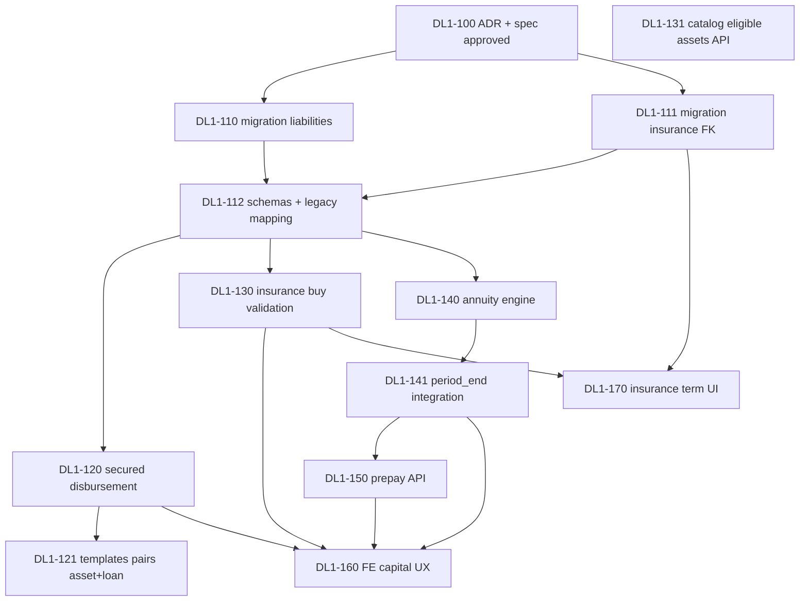

# План эпика DL1: Реалистичный долг и граф капитала

**Эпик:** `DL1` — перед **Pre-Alpha PA-W2** (после PA-W1 / стабилизации O2+I1), **параллельно не конкурирует** с E1 (расходы ждут go).

**Primary skills по волнам:** `game-economy-and-victory` + `api-and-interface-design`; UI — `frontend-ui-engineering` + `design-lab-mqx` при смене экрана «Капитал».

**Satellites:** `test-driven-development`, `critical-test-scenarios`, `balance-playtest` (после волны D), `doubt-driven-development` (ADR по продаже актива с ипотекой).

---

## 1. Сводка волн

| Волна | Название | Игрок видит | Зависимости |
|-------|----------|-------------|-------------|
| **0** | Контракт | ADR + approved spec | — |
| **A** | Схема и legacy | Ничего (только совместимость) | 0 |
| **B** | Целевой кредит | Ипотека «на квартиру», не на кошелёк | A |
| **C** | Страховка ↔ актив | Выбор машины/дома при полисе | A |
| **D** | Срок + аннуитет | Платёж тает, срок кончается | A, B (для mortgage) |
| **E** | Частичное погашение | Кнопка «Погасить часть» | D |
| **F** | Страховка: срок в UI | «Действует ещё N периодов» | C (частично без C) |

**Gate:** волна B не в prod без зелёных тестов A; волна D — balance-playtest на tutorial + 1 сложный шаблон.

**Test gate (100% математики + сценарии эпика):** SPEC §11. Уже в репо: `app/finance/annuity.py`, `tests/test_dl1_annuity_golden.py` (V1–V5). Каждый PR — расширять матрицу, не ослаблять golden без правки spec §4.4.

---

## 2. Граф зависимостей

---

## 3. Vertical slices (для агентов)

| # | Срез | Phase | Skill | Satellites | Next skill |
|---|------|-------|-------|------------|------------|
| 0 | ADR + spec **approved** | `define` | `documentation-and-adrs` | `doubt-driven-development` | `incremental-implementation` |
| 1 | A: миграции + legacy | `build` | `game-economy-and-victory` | `test-driven-development` | `test-driven-development` |
| 2 | B: целевой кредит E2E | `build` | `game-economy-and-victory` | `api-and-interface-design`, `test-driven-development` | `incremental-implementation` |
| 3 | C: страховка на актив E2E | `build` | `game-economy-and-victory` | `test-driven-development` | `frontend-ui-engineering` |
| 4 | D: аннуитет + срок | `build` | `game-economy-and-victory` | `balance-playtest`, `test-driven-development` | `balance-playtest` |
| 5 | E+F: prepay + UI polish | `build` | `incremental-implementation` | `frontend-ui-engineering` | `code-review-and-quality` |

---

## 4. Детализация задач

Полный чеклист: [`TASKS_debt-liability-capital-graph.md`](../tasks/TASKS_debt-liability-capital-graph.md).

### Волна 0

| ID | Задача | DoD |
|----|--------|-----|
| DL1-100 | ADR: граф актив–долг–страховка, продажа актива, legacy | ✅ [`ADR-010`](../decisions/ADR-010-liability-asset-insurance-graph.md) accepted 2026-06-01 |
| DL1-101 | Spec → **approved**; строка TRACEABILITY | Product sign-off (потоки зафиксированы в spec §5) |

### Волна A

| ID | Задача | DoD |
|----|--------|-----|
| DL1-110 | Миграция `finance_liabilities` (kind, FK asset, term, …) | ORM + downgrade note |
| DL1-111 | Миграция `insurance_policies.insured_asset_id` | FK index |
| DL1-112 | Pydantic/API: новые поля, default legacy | `test_liability_legacy_compat.py` |

### Волна B

| ID | Задача | DoD |
|----|--------|-----|
| DL1-120 | Путь A: `secured_bundle` API; путь B: consumer ≤2 + cash asset | DL1-AC-1, 1b |
| DL1-121 | Шаблоны: bundled mortgage+home, auto_loan+car; consumer отдельно | Admin catalog C1 sync |
| DL1-122 | Запрет второго secured на актив; sell: payoff → cash остаток | DL1-AC-1c |
| DL1-123 | `delete_asset` / sell: payoff secured, доплата с cash | ADR-010 §2 |

### Волна C

| ID | Задача | DoD |
|----|--------|-----|
| DL1-130 | `buy_policy`: валидация `insured_asset_id` | DL1-AC-5 |
| DL1-131 | `GET /insurance/catalog` → `eligible_assets[]` per plan | FE может строить селект |

### Волна D

| ID | Задача | DoD |
|----|--------|-----|
| DL1-140 | `finance/annuity.py` — расчёт платежа и split | unit tests |
| DL1-141 | `period.py`: применение аннуитета, закрытие по сроку | DL1-AC-2,3 |
| DL1-142 | `LiabilityTemplate.term_periods` + seeds | — |
| DL1-143 | balance-playtest report vs baseline | `docs/balance/reports/` |

### Волна E

| ID | Задача | DoD |
|----|--------|-----|
| DL1-150 | `POST .../prepay` + транзакция | DL1-AC-4 |
| DL1-151 | Идемпотентность / валидация cash | pytest |

### Волна F + Frontend

| ID | Задача | DoD |
|----|--------|-----|
| DL1-170 | Тесты истечения полиса (регрессия) | DL1-AC-6 |
| DL1-160 | `FinancePremium`: актив в строке долга/полиса, prepay sheet | design-lab round при смене layout |
| DL1-161 | `api.js` + hooks | контракт |
| DL1-162 | Копирайт: «платёж включает погашение тела» | UX doc finance.md |

---

## 5. Риски

| Risk | Mitigation |
|------|------------|
| Ломаем активные сохранения | Legacy `interest_only`; миграция без forced close |
| Баланс tutorial слишком жёсткий | Отдельные `term_periods` / ставки в шаблонах; playtest |
| Дублирование с E1 (жильё) | Ипотека ≠ rent burn; ADR граница |
| I1 уже в prod | C — расширение, не откат `product`/`insured_object` |

---

## 6. Checkpoints

- [x] DL1-100 ADR merged ([ADR-010](../decisions/ADR-010-liability-asset-insurance-graph.md))
- [ ] Spec **approved**
- [ ] Волна A в `main`, тесты зелёные
- [ ] B+C в prod (anti-exploit + страховка)
- [ ] D + balance report
- [ ] E+F + doc sync `DOC_SYNC_LOG`
- [ ] TRACEABILITY: `implemented`

---

## 7. Порядок для «потихоньку»

Рекомендуемая очередь PR (каждый — вертикальный срез с тестами):

1. **PR-1:** 0 + A (схема, без смены gameplay)
2. **PR-2:** B (ипотека без cash-эксплойта) — максимальный product win
3. **PR-3:** C (страховка на актив)
4. **PR-4:** D (аннуитет + срок)
5. **PR-5:** E + F (prepay + UI)

События YAML (GD-11) — **после PR-3**, отдельные задачи EVT1.
