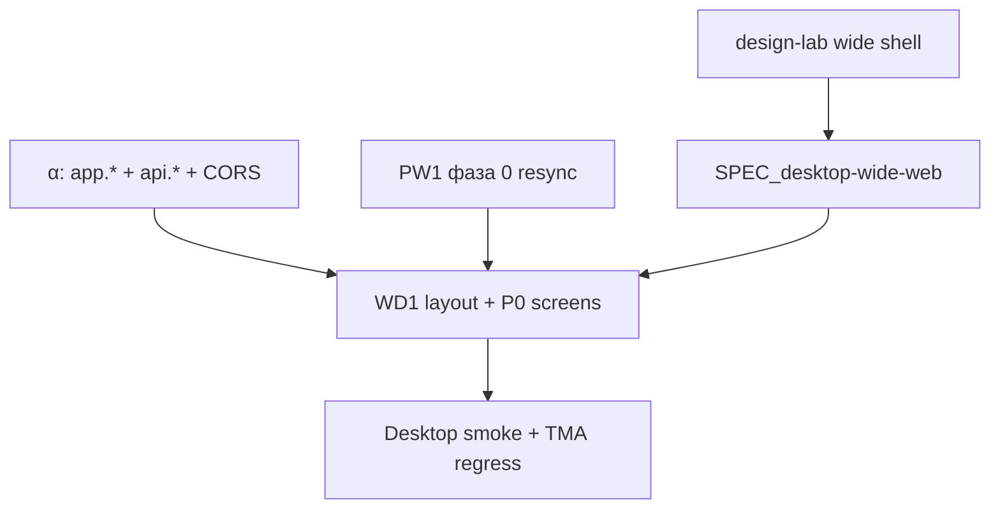

# Plan: полноразмерный веб-канал (эпик WD1)

**Драйвер:** игрок на desktop не должен видеть «вертикальное мини-приложение по центру экрана».  
**Принцип:** один SPA и API; второй layout-режим; TMA/PWA не ломаем.

**Не путать с:**

| Эпик | Смысл |
|------|--------|
| **PW1** | PWA, resume, install — тот же узкий layout, другой lifecycle |
| **TG1** | Бот, initData, вход из Telegram |
| **α ops** | Домен, API Starter, CORS — **зависимость** WD1 для CA |

---

## Карта документов

| # | Документ | Статус |
|---|----------|--------|
| 1 | [`desktop-wide-web-channel.md`](../vision/ideas/desktop-wide-web-channel.md) | **approved** 2026-06-01 |
| 2 | `SPEC_desktop-wide-web.md` | ⬜ после lab |
| 3 | `PLAN_desktop-wide-web.md` (этот файл) | draft |
| 4 | [`PRODUCT_BACKLOG.md`](../backlog/PRODUCT_BACKLOG.md) | WD1 |
| 5 | [`TRACEABILITY.md`](../TRACEABILITY.md) | WD1 |
| 6 | design-lab `wide-game-shell/` (создать) | ⬜ |

---

## Зависимости

**Параллельно:** ops домена (эпик α) не блокирует lab/spec.

---

## Фаза 0 — Lab + spec (P1, до кода prod)

| # | Задача | Слой | Детали |
|---|--------|------|--------|
| 0.1 | Раунд **wide-game-shell** в design-lab | Frontend + Doc | Дашборд + nav + finance snippet; [`DESIGN_WORKFLOW.md`](../../frontend-react/src/components/mqx/DESIGN_WORKFLOW.md) |
| 0.2 | Черновик **`SPEC_desktop-wide-web.md`** | Doc | Breakpoints, layout mode, экраны v1, Not Doing |
| 0.3 | Продуктовая приёмка макета | Product | Sign-off перед incremental |

**Оценка:** 2–4 дня (lab + spec).

---

## Фаза 1 — Layout foundation (P1)

| # | Задача | Слой |
|---|--------|------|
| 1.1 | `MqLayoutMode` / `data-mq-layout` + детект viewport | Frontend |
| 1.2 | Токены wide: max-width контента, gutters, grid | Frontend + CSS |
| 1.3 | Shell: обёртка `#root` — wide vs narrow | Frontend |
| 1.4 | Навигация: `BottomGameNav` → вариант wide (side/bottom) | Frontend |
| 1.5 | Unit/визуальный smoke: narrow default на 390px | Frontend + QA |

**Файлы (ориентир):** `GameScreen.jsx`, `BottomGameNav.jsx`, `styles/mqx/dashboard.css`, `styles/mqx/layout-wide.css` (новый).

**Оценка:** 3–5 дней.

---

## Фаза 2 — P0 экраны в wide (P1, блокер CA wide)

| # | Задача | Слой |
|---|--------|------|
| 2.1 | Dashboard / hero / события | Frontend |
| 2.2 | Finance (вкладка, сетка действий) | Frontend |
| 2.3 | Auth / start menu / template pick — не ломать на wide | Frontend |
| 2.4 | Admin — опционально: оставить desktop как есть (`AdminWebShell`) | Frontend |

**Оценка:** 4–6 дней.

---

## Фаза 3 — Closed Alpha ready (P1)

| # | Задача | Слой |
|---|--------|------|
| 3.1 | Smoke desktop (1280+, 1440) на **prod domain** | QA |
| 3.2 | Регрессия TMA + PWA 390px | QA |
| 3.3 | Протокол CA: канал «широкий браузер» + URL в [`PRE_ALPHA_PLAYTEST_PROTOCOL.md`](../foundation/PRE_ALPHA_PLAYTEST_PROTOCOL.md) или CA-аналог | Doc |
| 3.4 | Скрины для будущего лендинга — опционально, не блокер | Doc + Marketing |

**Зависит от:** эпик α — домен, бэкапы БД, [`DEPLOY.md`](../ops/DEPLOY.md) §6.

---

## Фаза 4 — После CA (P2–P3)

| # | Задача | Слой |
|---|--------|------|
| 4.1 | Остальные экраны (analytics, capital polish) в wide | Frontend |
| 4.2 | **AC1** — связка TG ↔ email (см. backlog) | Backend + Frontend |
| 4.3 | Контентные страницы лендинга (FAQ, privacy) | Marketing + landing/ |

---

## Приёмка эпика (WD1 v1 для CA)

- [ ] Viewport ≥ breakpoint: дашборд и финансы **используют ширину**, не одна колонка 480px по центру.
- [ ] Полный путь: login → шаблон → зарплата → событие → закрыть месяц на desktop Chrome.
- [ ] TMA Android/iOS: layout **как сейчас** (узкий).
- [ ] PWA на телефоне: без регрессии.
- [ ] Prod URL на **своём домене** в инструкции для волны 50–100.

---

## Оценка суммарно

| Фаза | Срок (ориентир) |
|------|-----------------|
| 0 lab + spec | 2–4 дн |
| 1 foundation | 3–5 дн |
| 2 P0 screens | 4–6 дн |
| 3 CA smoke | 1–2 дн |
| **WD1 v1 (0–3)** | **~2–3 нед** (с учётом lab и MQX review) |

---

## Связь с волной 50–100

| Канал | Роль в CA |
|-------|-----------|
| TMA | Основной привлечение (после TG1) |
| PWA / mobile browser | Телефон вне TG |
| **WD1 wide** | Desktop и широкий браузер — **целевой UX этой идеи** |
| Лендинг | Номинальный; прямая ссылка на игру достаточна |
