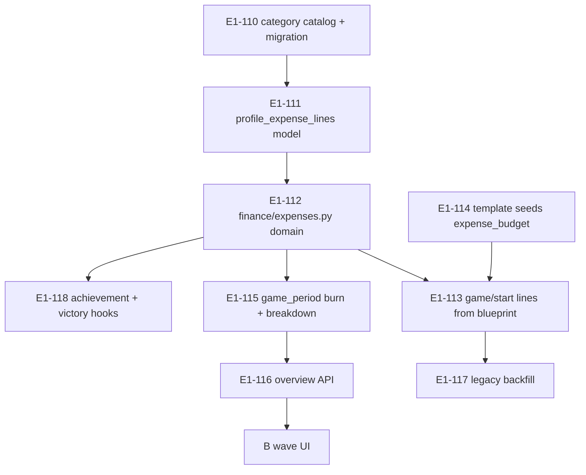

# План эпика E1: Расходы на жизнеобеспечение

Нарезка под **[`SPEC_expenses.md`](../specs/features/SPEC_expenses.md)** и **[`EXPENSES_SYSTEM.md`](../specs/gameplay/EXPENSES_SYSTEM.md)**.  
Чеклист слоёв: **[`EXPENSES_LAYER_CHECKLIST.md`](../specs/economy/EXPENSES_LAYER_CHECKLIST.md)**.

---

## 1. Волны (не «только рефактор поля»)

| Волна | Название | Результат для игрока | PR |
|-------|----------|----------------------|-----|
| **A** | Логическая правда | Burn = сумма статей; шаблоны с категориями; period end с breakdown | 2–3 PR |
| **B** | Видимость | Дашборд + экран «Расходы» + итог периода | 1–2 PR |
| **C** | Контент и мета | События по категориям; victory ratio; analytics | 2 PR |
| **D** | Plan Mode | Редактор статей, префилл | отдельный эпик-хвост |

**Gate:** волна B только после зелёных тестов волны A и заполнения чеклиста §1–5 в LAYER_CHECKLIST.

---

## 2. Граф зависимостей (волна A)

---

## 3. Волна A — Backend (детализация)

| ID | Задача | DoD |
|----|--------|-----|
| E1-110 | `expense_category_definitions` + migration 0013 | 8 категорий в БД |
| E1-111 | `profile_expense_lines` + ORM | FK, индексы |
| E1-112 | `finance/expenses.py` — `BurnSnapshot`, compute, CRUD | unit tests |
| E1-113 | `game/start` — создать lines из `expense_budget` | тест на каждый template |
| E1-114 | Сиды: `expense_budget` во всех game templates | sum = base_monthly_lifestyle |
| E1-115 | `game_period` — burn, breakdown, expiry | integration test |
| E1-116 | `finance/overview` — burn, breakdown, outflow, ratio | schemas |
| E1-117 | Backfill активных профилей | скрипт или migration SQL |
| E1-118 | `achievement_engine`, `victory_engine` | регрессия |

---

## 4. Волна B — Frontend

| ID | Задача |
|----|--------|
| E1-210 | `api.js` контракт |
| E1-211 | Dashboard: burn + пояснение vs cashflow |
| E1-212 | Экран/панель «Расходы» (категории) |
| E1-213 | Period end UI (breakdown) |
| E1-214 | Design-lab + MQX компоненты |

---

## 5. Волна C — Контент и цели

| ID | Задача |
|----|--------|
| E1-310 | `events.py` — `expense_line` effect |
| E1-311 | Обновить 5–10 сидов событий |
| E1-312 | Victory: `expense_to_income_ratio` в шаблонах |
| E1-313 | Analytics timeseries burn |
| E1-314 | VictoryGoalsPanel + Analytics copy |

---

## 6. Волна D — Plan (после Game стабилен)

| ID | Задача |
|----|--------|
| E1-410 | Spec Plan master § expenses |
| E1-411 | CRUD API `save_kind=plan` |
| E1-412 | UI редактор |

---

## 7. Риски

| Риск | Митигация |
|------|-----------|
| Двойной учёт жилья | Content checklist на каждый шаблон |
| Legacy delta + lines | Backfill + флаг; события только в lines после cutover |
| Перегруз UI | Game: свёрнутая сумма, детали на отдельном экране |
| Scope creep Plan | Волна D отдельно |

---

## 8. История

2026-05-19: план переписан под полный слой жизнеобеспечения (idea-refine V7).
