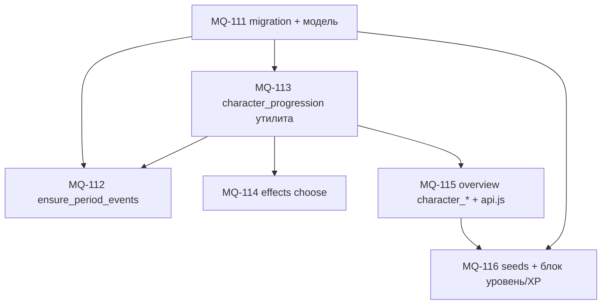

# План MVP 1.1: события по уровню, прокачка, связка UX

Нарезка под **[`SPEC_mvp-11-progression-events`](../specs/features/SPEC_mvp-11-progression-events.md)** (approved). Общая дорожная карта фаз и константы — см. **[`PLAN_level-xp-progression`](PLAN_level-xp-progression.md)** и **[`LEVEL_XP_SYSTEM`](../specs/gameplay/LEVEL_XP_SYSTEM.md)**.

---

## 1. Контур и ограничения

- Инвариант отбора: **`event_tier ≤ L`**; fallback только «вниз» (spec §6.4).
- **`xp_delta` ≥ 0**; порядок применения эффектов — spec §7.
- Миграция SQL: файл **`backend/migrations/0006_event_tiers_repeat_policy.sql`** (номер следующий после имеющегося каталога миграций в репо).

---

## 2. Граф зависимостей задач

- **MQ-112** технически читает `profile.level`; после **MQ-113** уровень везде согласуется с одной утилитой XP/L — поэтому **MQ-113 перед или вместе с началом тестирования MQ-112** рекомендован порядком ниже.

---

## 3. Рекомендуемый порядок выполнения

| Шаг | Задача | Результат / критерий готовности |
|-----|--------|----------------------------------|
| **1** | **MQ-111** | Колонки `event_definitions.event_tier`, `repeat_policy`; модель SQLAlchemy; смоук приложения после миграции. |
| **2** | **MQ-113** | **`character_progression.py`**: единый `apply_character_xp`; перенос дубля из **`game_period`**, **`period_actions`** (spec §11). |
| **3** | **MQ-112** | `ensure_period_events`: окно **\[max(1,L−2), L\]**, **`repeat_policy`**, весовая выборка **без** повторов, fallback §6 spec. |
| **4** | **MQ-114** | Whitelist `effects_json`: **`xp_delta`**, **`monthly_lifestyle_delta`** + clamp; обработчик choose после денежных эффектов. |
| **5** | **MQ-115** | **`GET /api/finance/overview`**: **`character_*`**; синхронизация **`frontend-react/src/api.js`**. |
| **6** | **MQ-116** | Siды ≥12 defs (распределение tier — spec §9); блок **Уровень + XP-бар** на главной игры (**не** `gamification_*` как единственный индикатор). |

---

## 4. Параллелизм (при двух исполнителях)

После **MQ-111** и **MQ-113**:

- можно параллелить **MQ-112** (отбор событий) и **MQ-114**/`MQ-115`, если интерфейсы не конфликтуют по файлам — на практике **MQ-114** и **MQ-115** чаще идут последовательно после стабильного утилиты.

---

## 5. Проверка среза (Definition of Done по spec)

См. spec §Success criteria и §13 тест-план:

- случаи L = 1, 2, 7 для окна tier;
- `once_per_profile` не показывает определение повторно после **selected**;
- `character_*` в overview после цепочек XP совпадает с утилитой;
- **`npm run build`**; смоук: новый профиль, несколько периодов, хотя бы одно событие с **`xp_delta`**.

---

## 6. История

2026-05-17: черновик плана после утверждения **SPEC_mvp-11**.
