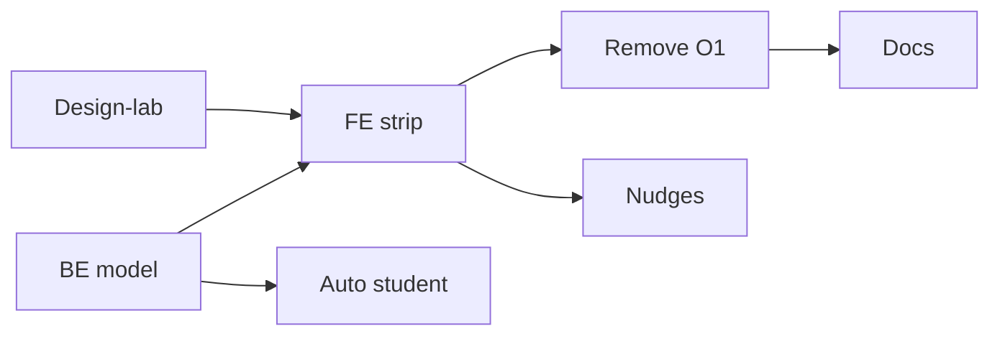

# Plan: O2 Progressive Guidance

План реализации по [`SPEC_onboarding-o2.md`](../specs/features/SPEC_onboarding-o2.md). **Без hotfix O1** — замена одним эпиком.

---

## Фазы

| Фаза | Deliverable | Gate |
|------|-------------|------|
| **0** | Design-lab `onboarding-o2/` — strip, close icon, nav «N из M» | APPROVED в lab |
| **1** | BE: `users.guidance_*`, streaks, backfill migration; API PATCH/GET | pytest |
| **2** | FE: `MqxGuidanceStrip` + `curriculum.yaml` + engine hook | vitest |
| **3** | FE: first-game auto student (`App.jsx` + start API) | manual |
| **4** | Remove O1 `GameOnboardingLayer` from prod | no regression tests |
| **5** | Adaptive nudge layer + template thresholds | pytest + manual |
| **6** | Watchtower/notify beat ids; docs sync | DOC_SYNC_LOG |

---

## Порядок зависимостей

---

## Риски

| Риск | Mitigation |
|------|------------|
| Strip vs events overlay z-index | Единая таблица z-index; curriculum скрыт при events open |
| Strip vs period close ritual | Debrief — paragraph в `p1_close` после ritual dismiss |
| User vs profile state drift | Single source: `user.guidance_completed`; profile `brief_done` mirror |

---

## Out of scope этого плана

- Replay guidance из меню.
- SPEC_game-plan изменения beyond auto-first-start.
