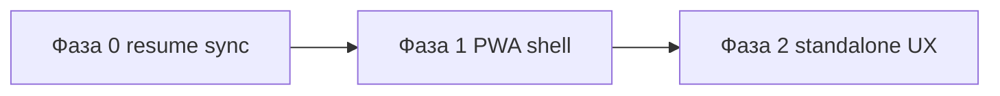

# Plan: PWA / standalone (эпик PW1)

**Драйвер:** нестабильный resume в TMA при блокировке экрана.  
**Принцип:** сначала исправить lifecycle на клиенте (выигрыш для всех каналов), потом упаковка PWA.

---

## Карта документов

| # | Документ | Статус |
|---|----------|--------|
| 1 | [`pwa-standalone-channel.md`](../vision/ideas/pwa-standalone-channel.md) | draft |
| 2 | `SPEC_pwa-standalone.md` | ⬜ черновик после фазы 0 |
| 3 | `PLAN_pwa-standalone.md` (этот файл) | draft |
| 4 | [`PRODUCT_BACKLOG.md`](../backlog/PRODUCT_BACKLOG.md) | PW1 |
| 5 | [`TRACEABILITY.md`](../TRACEABILITY.md) | PW1 |

---

## Фаза 0 — Стабильный resume (P1, **до** install prompt) 🟡 в коде

**Задача:** при возврате приложения на передний план пересинхронизировать игру с сервером.

**Реализовано (2026-05-25):** `frontend-react/src/utils/appLifecycle.js`, правки `useGame.js`.  
**Плейтест:** [`PW1_RESUME_PLAYTEST_CHECKLIST.md`](../foundation/PW1_RESUME_PLAYTEST_CHECKLIST.md) — прогон A–D перед Pre-Alpha.

| # | Задача | Слой | Детали |
|---|--------|------|--------|
| 0.1 | Хук `useAppForeground` | Frontend | `document.visibilitychange`, `window.focus`, опционально `pageshow` (bfcache) |
| 0.2 | Resync в `useGame` | Frontend | При foreground: `API.getGameBootstrap()` + overview; сброс `lastSyncRef`; **без** клиентского секундомера (TB1) |
| 0.3 | Защита от двойного `setTimeNext` | Frontend | Debounce resync; не вызывать `time/next` из resync; при расхождении — обновить UI из API |
| 0.4 | Тест/чеклист | Doc | Сценарий: lock 2–5 мин → unlock; `period_index` и балансы = API; AFK **не** закрывает месяц ([`PW1_RESUME_PLAYTEST_CHECKLIST`](../foundation/PW1_RESUME_PLAYTEST_CHECKLIST.md)) |
| 0.5 | ~~pause при hidden~~ | — | **N/A после TB1** — период не тикает по времени |

**Файлы:** `frontend-react/src/hooks/useGame.js`, новый `useAppForeground.js` (или утилита в `utils/appLifecycle.js`).

**Оценка:** 0.5–1 день.

---

## Фаза 1 — Installable PWA (P1) ✅ в коде (2026-05-25)

Инструкция: [`PWA_INSTALL.md`](../foundation/PWA_INSTALL.md). После деплоя — Lighthouse / install на телефоне.

| # | Задача | Слой |
|---|--------|------|
| 1.1 | Иконки 192/512 (maskable) из бренда | Frontend / assets |
| 1.2 | `vite-plugin-pwa`: manifest, precache статики | Frontend |
| 1.3 | `start_url` под `base` + HashRouter (`/telegram-mini-app/#/`) | Frontend |
| 1.4 | Meta: `theme-color`, apple-mobile-web-app | Frontend |
| 1.5 | CORS: origin prod PWA в `CORS_ALLOW_ORIGINS` / `PUBLIC_APP_URL` | Backend + Ops | ✅ |
| 1.6 | `VITE_API_BASE_URL` в CI для PWA-сборки | Ops | ✅ 2026-06-01 |
| 1.7 | Lighthouse PWA audit на staging | QA |

**Оценка:** 1–2 дня.

---

## Фаза 2 — Standalone UX (P2)

| # | Задача | Слой |
|---|--------|------|
| 2.1 | `isTelegramEnvironment()` — единая проверка | Frontend |
| 2.2 | Безопасные обёртки TG API (MainButton, Haptic, close) | Frontend |
| 2.3 | Тема вне TG: `--mq-*` без поломки layout | Frontend |
| 2.4 | Копирайт входа: «В Telegram» / «На сайте» | Frontend + Doc |
| 2.5 | Баннер «Установить приложение» (Android/desktop) | Frontend + design-lab при необходимости |

**Оценка:** 2–3 дня.

---

## Фаза 3 — Расширения (P3, по метрикам)

| # | Задача |
|---|--------|
| 3.1 | Web Push (напоминание о периоде) |
| 3.2 | Telegram Login / привязка `telegram_id` |
| 3.3 | Custom domain + `BrowserRouter` (не обязательно) |

---

## Зависимости

Фаза 0 **не блокируется** PWA и должна идти **параллельно** с другими P1-задачами.

---

## Приёмка эпика (MVP PW1)

- [ ] После lock/unlock в TMA `period_index`, cash и overview совпадают с API (без auto-next по времени, TB1).
- [ ] После lock/unlock overview/events не «застревают» на старых значениях.
- [ ] Chrome: «Установить приложение» доступно на prod URL.
- [ ] Установленная PWA открывает игру, логин JWT работает, игра доходит до конца периода.

---

## Оценка суммарно

| Фаза | Срок |
|------|------|
| 0 | 0.5–1 дн |
| 1 | 1–2 дн |
| 2 | 2–3 дн |
| **MVP PW1 (0+1)** | **~2–3 дн** |
