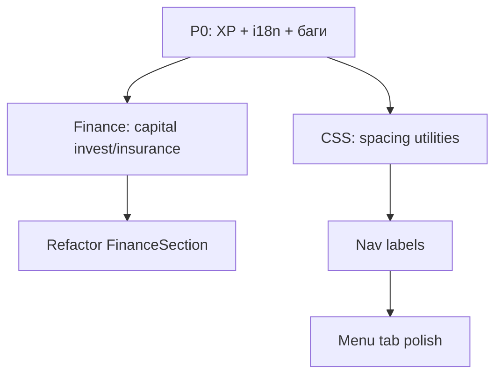

# Spec: Frontend UI/UX — Money Quest TMA

**Статус:** принят (аудит 2026-05)  
**Связанные документы:** [`reference/brandbook/BRANDBOOK.md`](../reference/brandbook/BRANDBOOK.md), [`foundation/TMA_USER_FLOWS.md`](../foundation/TMA_USER_FLOWS.md), [`CLAUDE.md`](../../CLAUDE.md)  
Проектные Agent Skills и приоритеты — [`agents/CURSOR_SKILLS.md`](../agents/CURSOR_SKILLS.md).

---

## Objective

Зафиксировать единые правила интерфейса Telegram Mini App **Money Quest**: визуальный язык MQX, доступность, состояния экрана и границы между кастомным UI и `@telegram-apps/telegram-ui`.

**Пользователь:** игрок в TMA (мобильный, 320–480px, светлая/тёмная тема Telegram).

**Успех спецификации:**
- Новые и изменённые экраны выглядят как часть одного приложения (не «два продукта»).
- Нет англоязычных хвостов и ложных индикаторов прогресса в production UI.
- Агент и разработчик могут свериться с spec + `.cursor/rules/money-quest-frontend-*.mdc` без повторного аудита.

**Вне scope этой spec:** продуктовый переход Game/Plan ([`SPEC_game-plan`](features/SPEC_game-plan.md), [evolution §II](../vision/ideas/money-quest-evolution-after-mvp.md)), бэкенд-контракты.

### Assumptions

1. Целевой стек UI: React 18 + Vite, стили в `frontend-react/src/index.css`, компоненты в `frontend-react/src/components/`.
2. Premium-вкладки игры (`DashboardPremium`, `FinancePremium`, `AnalyticsPremium`, `MenuPremium`) — **эталон**; legacy `*Section.jsx` не расширяем, только поддерживаем до удаления.
3. Язык интерфейса — **русский**; латиница допустима в терминах API/коде, не в видимых подписях.
4. TMA: одна колонка `#root` max-width 480px, нижний таббар с safe-area.

---

## Tech Stack

| Слой | Технология |
|------|------------|
| UI framework | React |
| Сборка | Vite |
| Библиотека форм/модалок | `@telegram-apps/telegram-ui` |
| Стили | CSS (`index.css`), классы `mqx-*`, токены `--mq-*` |
| Роутинг | React Router (HashRouter) |
| API | `frontend-react/src/api.js` |

---

## Commands

```bash
# Dev (из frontend-react/)
npm run dev

# Production build
npm run build

# Preview build
npm run preview
```

Проверка UI вручную: открыть TMA или `npm run dev`, пройти табы Главная / Финансы / Аналитика / Меню на ширине 320px и 390px.

---

## Project Structure

```
frontend-react/src/
  components/           # Экраны и блоки
    *Premium.jsx        # Вкладки игры (эталон MQX)
    *Section.jsx        # Legacy — не добавлять фичи
    mqx/                # Общие UI-примитивы (бары, и т.д.)
    icons/              # NavIcons, StatIcons
  hooks/                # useGame и др.
  index.css             # Дизайн-система MQX + TMA shell
  api.js                # Контракт с backend
docs/
  specs/SPEC_FRONTEND_UI.md           # Этот документ
  reference/brandbook/BRANDBOOK.md  # Цвета, тон, типографика
  foundation/TMA_USER_FLOWS.md      # Потоки и боли
.cursor/rules/
  money-quest-frontend-*.mdc  # Правила для агента
```

---

## Code Style

### Компонент

```jsx
// ✅ Эталон: presentation + данные из props, MQX-классы, семантика
export function ExampleBlock({ overview }) {
  if (!overview) return null;

  return (
    <section className="mqx-card mqx-capital-card" aria-labelledby="example-title">
      <h2 id="example-title" className="mqx-capital-card__title">
        Заголовок секции
      </h2>
      <p className="mqx-capital-lead">Короткая подсказка на русском.</p>
      <div className="mqx-capital-template-list">
        {/* строки, кнопки type="button", MoneyText для сумм */}
      </div>
    </section>
  );
}
```

### Конвенции

| Область | Правило |
|---------|---------|
| Суммы | `<MoneyText value={n} decimals={0} />`, не `toLocaleString` в JSX без нужды |
| Отступы | Классы `mqx-*` / `mqx-content`; не `style={{ marginTop: 12 }}` в новом коде |
| Цвета | `var(--mq-violet)`, `--mq-emerald`, `--mq-ink`; не `#7c3aed` в компонентах |
| CTA | telegram-ui `Button` или `mqx-btn` / `mqx-capital-mode-btn` в premium-блоках |
| Размер файла | Компонент &lt; ~200 строк; иначе вынос в подкомпонент (`CapitalPortfolioPanels`) |
| Табы | `role="tablist"`, `role="tab"`, `aria-selected`, `aria-controls` |

---

## Design System (MQX)

### Токены (`:root` / `#root`)

- `--mq-violet` `#6d28d9`, `--mq-violet-deep` `#5b21b6`
- `--mq-emerald` `#059669`, `--mq-danger`, `--mq-warning`, `--mq-ink`, `--mq-line`
- `--mq-fs-body` 15px, `--mq-fs-caption` 12px, `--mq-fs-small` 11px

### Паттерны экрана

1. **Оболочка:** `mqx-screen` → `mqx-frame` (в `GameScreen`).
2. **Hero вкладки:** `mqx-hero mqx-hero--tab`, pills MQ + контекст, один **h1** на экран.
3. **Контент:** `mqx-content` + стек карточек `mqx-card` / `mqx-capital-card` (radius ~22px, blur, лёгкая тень).
4. **Навигация:** `BottomGameNav` — не дублировать в страницах.

### Градиенты

- Hero и **один** primary CTA на экран — допустимы (бренд).
- Не добавлять новые full-screen violet gradients на каждую секцию.

### Telegram theme

- Фон/текст: `var(--tg-theme-*)` с fallback `--mq-*`.
- Акцент кнопок: `--mq-accent-fill` / `--tgui--button_color` (см. `#root` в `index.css`).

### Действия в строках (Row Actions) — канон MQX

**Процесс:** варианты в [`design-lab/row-actions/`](../../design-lab/row-actions/) → утверждение → `mqx/primitives/` → витрина `#/dev/mqx` → prod. См. [`DESIGN_WORKFLOW.md`](../../frontend-react/src/components/mqx/DESIGN_WORKFLOW.md).

**Утверждено (2026-05):** вариант **B** — компактная иконка **+** / **−**; подпись действия только в `aria-label`; для всех разрушающих действий — **подтверждение** (`MqxConfirmDialog`).

| Компонент | Назначение | Где использовать |
|-----------|------------|------------------|
| `MqxRowAction` | Кнопка **+** (add) или **−** (remove), hit-area ≥ 44px | Списки позиций, шаблоны с «+», страховки, инвестиции |
| `MqxFinListRow` | Компактная строка: заголовок, подзаголовок/метрики, trailing action | Режим «Позиции» (активы, долги, депозиты) |
| `MqxConfirmDialog` | Подтверждение опасного действия (Modal) | Любое **−** / отмена полиса / закрытие позиции |
| `useMqxConfirm` | Хук: `await confirm({ title, message })` | Экраны с удалением |
| `CapitalPositionCard` | Карточка с accent + метриками + action | Только **каталог шаблонов** («Добавить»), не список позиций |

**Запрещено в новом коде (premium):**

- Текстовая кнопка **«Удалить»** в списках строк (допустима только внутри диалога подтверждения).
- `Button mode="destructive"` в trailing списка позиций.
- Класс `mqx-capital-delete-btn` для компактных строк (legacy; не расширять).

**Платформы:**

- **Touch (TMA):** `:active` + достаточная зона нажатия.
- **Desktop / Telegram desktop / браузер:** `@media (hover: hover)` — подсветка **−** (фон danger-soft, border); `:focus-visible` — outline.

**Вне scope до отдельного эпика:** Plan-мастер (`BaseParamsScreen`), `PlanExpenseEditor` — не менять при унификации финансов.

**Витрина:** секция «Паттерны действий» в `#/dev/mqx` — все варианты + живые `MqxRowAction` / `MqxFinListRow` / confirm.

---

## Testing Strategy

| Уровень | Что проверять | Как |
|---------|----------------|-----|
| Сборка | Нет ошибок импорта/JSX | `npm run build` |
| Ручной TMA | 4 таба, модалки, события | Чеклист в Success Criteria |
| a11y (выборочно) | Tab, `aria-*` на табах и dialog | DevTools / VoiceOver |
| Визуал | 320px, safe-area снизу | Эмулятор / DevTools device |

Автотесты UI на MVP не обязательны; при добавлении — Vitest + Testing Library в `frontend-react/`.

---

## Boundaries

### Always

- Сверяться с [`BRANDBOOK.md`](../reference/brandbook/BRANDBOOK.md) и этой spec.
- Новый игровой UI — в `*Premium.jsx` + классы `mqx-*`.
- Показывать loading / empty / error там, где есть асинхронные данные.
- Тосты через `showNotification`, не `alert`.
- Синхронизировать API с `api.js` при новых полях overview.

### Ask first

- Новые глобальные CSS-переменные или смена `--tgui--*` токенов.
- Зависимости (UI-kit, chart lib).
- Удаление legacy `*Section` или смена потока старта (Game/Plan).
- Видимые подписи на английском в production.

### Never

- Расширять `FinanceSection` legacy-ветку (`premium === false`) новыми фичами.
- Хардкодить прогресс-бары без данных API (пример: XP 90%).
- Дублировать нижний таббар внутри страницы.
- Inline hex/Tailwind в новых компонентах (в проекте нет Tailwind).
- Коммитить секреты; ломать `tg-theme-*` глобально без причины.

---

## Success Criteria

### P0 (блокеры качества)

- [ ] На главной прогресс XP привязан к `overview` или блок скрыт.
- [ ] Нет видимых EN-подписей (`Positions`, `cashflow` в kicker и т.п.) — только RU.
- [ ] Вкладка «Инвестиции» открывается без `ReferenceError` (константы help, импорты).

### P1 (единый UX)

- [ ] На каждой вкладке `GameScreen` ровно один `h1` в hero.
- [ ] `FinancePremium`: инвестиции и страховки визуально в том же `mqx-capital-*`, что портфель.
- [ ] `BottomGameNav`: подписи под иконками **или** tooltip при первом визите (решение зафиксировать в PR).
- [ ] `MenuPremium` не выбивается по плотности контента (минимум: тот же hero-стиль или явный «служебный» экран).

### P2 (поддерживаемость)

- [ ] `FinanceSection` разбит: portfolio / invest / insurance — отдельные модули.
- [ ] Новые отступы без голого `style={{ marginTop: N }}`.
- [ ] Документ spec обновляется при смене паттернов.

### Верификация релиза (ручная)

1. Логин → старт → игра → 4 таба.
2. Зарплата, подушка (модалка), следующий период (предупреждение).
3. События: оверлей, свайп, выбор, закрытие.
4. Финансы: три вкладки, добавление из шаблона, удаление позиции.
5. Аналитика: графики с 0 периодов и с данными.

---

## Open Questions

| # | Вопрос | Владелец |
|---|--------|----------|
| 1 | Подписи под иконками таббара vs только `aria-label`? | Продукт |
| 2 | Единый hero на `MenuPremium` или оставить «лёгкую» карточку? | Продукт |
| 3 | Поле XP/level в API для главной — есть ли в overview? | Backend + UI |
| 4 | Срок sunset legacy `*Section.jsx`? | Команда |

---

# Plan (Phase 2)

## Компоненты и порядок



| Этап | Риск | Митигация |
|------|------|-----------|
| P0 | Низкий | Малый diff, сразу `npm run build` |
| Finance capital parity | Средний | Переиспользовать `mqx-capital-mode-grid`, не копировать логику API |
| FinanceSection split | Средний | Вынос по одному табу, без смены props контракта |
| Nav labels | Низкий | CSS-only + короткие RU подписи |

---

# Tasks (Phase 3)

- [ ] **P0: XP на главной**
  - Acceptance: полоса от реальных полей `overview` или блок удалён.
  - Verify: визуально при score 0 / 50 / 100; `npm run build`.
  - Files: `DashboardPremium.jsx`

- [ ] **P0: Локализация kickers**
  - Acceptance: нет `Positions`, `cashflow`, `Forecast` в видимом UI.
  - Verify: grep по `frontend-react/src/components`.
  - Files: `AnalyticsPremium.jsx`, `CapitalPortfolioPanels.jsx`

- [ ] **P1: h1 на всех табах**
  - Acceptance: один `h1` в hero каждого `*Premium`.
  - Verify: инспектор DOM / axe heading-order.
  - Files: `DashboardPremium.jsx`, `AnalyticsPremium.jsx`, `MenuPremium.jsx`

- [ ] **P1: Invest/Insurance — capital layout**
  - Acceptance: те же `mqx-capital-card`, lead, mode-кнопки, что у портфеля.
  - Verify: ручной проход вкладок.
  - Files: `FinanceSection.jsx`, `index.css`

- [ ] **P1: Таббар — подписи**
  - Acceptance: RU подпись 10–11px под иконкой или documented tooltip.
  - Verify: 320px, не перекрывает safe-area.
  - Files: `BottomGameNav.jsx`, `index.css`

- [ ] **P2: Вынести InvestPanel / InsurancePanel**
  - Acceptance: `FinanceSection.jsx` &lt; 400 строк; поведение без регрессий.
  - Verify: build + чеклист Success Criteria §Финансы.
  - Files: `components/finance/*.jsx`, `FinanceSection.jsx`

- [ ] **P2: Утилиты отступов**
  - Acceptance: в новых PR нет `style={{ marginTop` в premium-компонентах.
  - Verify: grep в diff PR.
  - Files: `index.css`

- [ ] **P1: Row actions — единый − и confirm**
  - Acceptance: позиции портфеля/инвестиций/страховок — `MqxFinListRow` + `MqxRowAction`; любое удаление через `MqxConfirmDialog`.
  - Verify: `#/dev/mqx` → «Паттерны действий»; ручной проход Финансы → Позиции.
  - Files: `mqx/primitives/MqxRowAction.jsx`, `MqxFinListRow.jsx`, `MqxConfirmDialog.jsx`, `CapitalPortfolioPanels.jsx`, `index.css`
  - Design: [`design-lab/row-actions/`](../../design-lab/row-actions/) — вариант **B** утверждён.

---

*Живой документ: при изменении паттерна MQX обновляйте этот файл и `.cursor/rules/money-quest-frontend-*.mdc`.*
