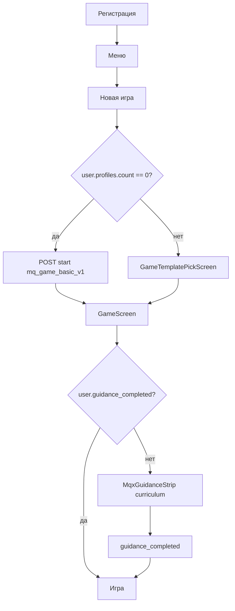

# Spec: Онбординг TMA v2 (O2 — Progressive Guidance)

## Objective

Заменить **O1 guided coach** (spotlight + scrim) на **Progressive Guidance**: обучение **3 периода**, **без** перегрузки дашборда и **без** повторного PNG Монетки в подсказках.

**Пользователь:** новичок Pre-Alpha, первая партия — шаблон **«Студент»** (`mq_game_basic_v1`).

**Успех:**

- Понимает цикл TB1, **списания в конце месяца**, события как решения, шкалы потребностей (α-FB-01, 13, 15, 04).
- Нет layout shift / «ломающегося» overlay (α-FB-17).
- Guidance проходит **один раз на аккаунт**; новые партии — без автопоказа.
- PA-W1: улучшение Q1/Q2 vs wave-0; PA-T1 без регрессии.

**Не делаем hotfix O1** — только плановая замена по этому spec.

---

## Продуктовые решения (зафиксировано 2026-06-01)

| Тема | Решение |
|------|---------|
| Паттерн UI | **Bottom guidance strip** — блок **снизу** (над tab bar), slide-up как sheet, **без** scrim/spotlight |
| Монетка PNG | **Не показывать** в guidance/nudge — только **голос и стилистика** (`mqx-voice-em`, типографика approved blocks) |
| Видимый track на dash | **Нет** — прогресс только в strip: «**N из M**» + стрелки |
| Навигация | **Назад** — на любой пройденный шаг; **Вперёд** — только до **последнего выполненного**; на **невыполненный** вперёд **нельзя** |
| Завершение шага | Действие игрока → **`completed: true`** → авто-переход к следующему beat (если есть) |
| Закрытие strip | **Крестик** — только иконка, **без фона**; 1-е нажатие = skip beat; 2-е в сессии = skip весь guidance |
| Горизонт curriculum | **Периоды 1–3** (`period_index`) |
| Scope completion | **`users.guidance_completed`** — один раз на **user** |
| Первый профиль | `profiles.count == 0` → «Игра» → **автостарт** `mq_game_basic_v1`, **без** `GameTemplatePickScreen` |
| 2+ профиль | Обычный выбор шаблона; guidance **не** показывается, если `user.guidance_completed` |
| Replay из меню | **Out of scope O2** (API зарезервировать) |
| Реактивные nudge | Тот же **strip**, inline-текст; пороги по шаблону (Студент — раньше) |
| Backfill | Пользователи с любым профилем `onboarding_state = brief_done` → `users.guidance_completed = true` |

---

## UX: `MqxGuidanceStrip` (новый MQX-компонент)

### Размещение

- `position: fixed`; **bottom**: `calc(var(--tma-tabbar-inset) + safe-area)`; full width колонки `#root`.
- **Не** перекрывает tab bar; **не** добавляет постоянных блоков на scrollable dash.
- Один экземпляр на `GameScreen`; curriculum и adaptive nudge **не одновременно** (nudge — только если strip curriculum скрыт).

### Анатомия

```
┌─────────────────────────────────────────────┐
│  [×]                          ‹  2 из 4  ›  │  ← крестик: icon-only, no bg
│  Заголовок beat                             │
│  Текст в голосе Монетки (без PNG)           │
│  [ опционально: чек ✓ выполнено ]           │
└─────────────────────────────────────────────┘
```

| Элемент | Правило |
|---------|---------|
| **Close (×)** | `aria-label="Закрыть подсказку"`; hit area ≥ 44px; **transparent** background; hint/icon color из `--tg-theme-hint-color` |
| **Счётчик** | `{currentIndex + 1} из {moduleStepCount}` — счётчик **внутри модуля периода** (см. curriculum) |
| **Стрелки ‹ ›** | `‹` disabled на первом шаге; `›` disabled если `index >= lastCompletedIndex` |
| **Чек выполнения** | После gate — иконка ✓ у текущего beat; затем auto-advance |
| **Текст** | Заголовок + 2–4 предложения; классы как у `MqxMonetkaDialogScreen` subtitle, **без** `MonetkaAvatar` |

### Запрещено

- Spotlight, scrim-hole, practice timer O1.
- PNG / `MonetkaAvatar` в strip.
- Блокирующий fullscreen modal для curriculum.
- Mission track / чеклист на дашборде.

**Design-lab:** раунд `design-lab/onboarding-o2/` → утверждение → `mqx/` → `#/dev/mqx` (см. `DESIGN_WORKFLOW.md`).

---

## Curriculum (скрытый track)

Конфиг: `frontend-react/src/guidance/curriculum.yaml` (или JSON) + зеркало для валидации на BE.

Каждый beat:

```yaml
id: p1_salary
period_index: 1
module_step: 2          # для «2 из 4»
module_step_count: 4
gate: action_salary     # см. таблицу gates
title: "Зарплата не сама"
body: "..."
skippable: true
```

### Период 1 — 4 шага ( «1 из 4» … «4 из 4» )

| module_step | id | Тема | Gate → `completed` |
|-------------|-----|------|---------------------|
| 1 | `p1_period` | Период открыт; план: зарплата → подушка → закрыть | Read: CTA «Понятно» / skip |
| 2 | `p1_salary` | Зарплата по кнопке | `periodStatus.salary_claimed` |
| 3 | `p1_cushion` | Подушка | `safety_fund_contribution > 0` в периоде |
| 4 | `p1_close` | Preview **списаний в конце месяца** + «Закрыть месяц» | `period_index` увеличился; после close — **debrief** текст (подшаг без смены module_step, или второй paragraph в том же beat) |

### Период 2 — 2 шага ( «1 из 2» … «2 из 2» )

| module_step | id | Тема | Gate |
|-------------|-----|------|------|
| 1 | `p2_events_intro` | События = решения, не только листание | `POST event choose` ≥1 |
| 2 | `p2_events_done` | Краткий follow-up | 2 choices или skip |

### Период 3 — 2 шага

| module_step | id | Тема | Gate |
|-------------|-----|------|------|
| 1 | `p3_needs` | 4 шкалы; help / treat-self | Read или первый treat-self |
| 2 | `p3_farewell` | Прощание | CTA → `guidance_completed` |

**События:** pill «События» скрыт, пока `period_index === 1` и curriculum P1 не завершён (как O1).

---

## Adaptive nudge (отдельно от curriculum)

Тот же `MqxGuidanceStrip`, без счётчика «N из M» (или «Подсказка» без стрелок).

| id | Условие | Студент | Прочие |
|----|---------|---------|--------|
| `nudge_salary_miss` | close без salary | каждый такой период | после **2** подряд |
| `nudge_negative_close` | cash < 0 после close | с 1-го | после **2** подряд |

Источник порогов: `game_starter_templates.blueprint.player_support.proactive_hints` (+ явные override в config).

Закрытие × — dismiss до следующего триггера (не skip curriculum).

---

## User flow (старт игры)



---

## Data model

### `users` (новые поля)

| Поле | Тип | Смысл |
|------|-----|--------|
| `guidance_completed` | bool, default false | Один раз прошёл O2 |
| `guidance_progress_json` | JSONB/text | `{ "current_beat_id", "completed_beats": [], "skip_count_session", "last_period_index" }` |
| `guidance_completed_at` | datetime, nullable | Аналитика |

### `game_profiles` (legacy O1, сохраняем)

| Поле | O2 поведение |
|------|----------------|
| `onboarding_state` | Если `user.guidance_completed` при создании → сразу **`brief_done`** |
| `onboarding_step` | Deprecated для UI; синхронизировать для Watchtower / notify |

### Счётчики nudge (profile-level)

| Поле | Смысл |
|------|--------|
| `salary_miss_streak` | Подряд периодов closed без salary |
| `negative_close_streak` | Подряд closes с cash < 0 |

---

## API

| Method | Path | Назначение |
|--------|------|------------|
| `GET` | `/api/finance/overview` | + `guidance` block: `{ active, beat, progress, module_step, module_step_count, completed_beats }` |
| `GET` | `/api/game/guidance` | Полный progress user (optional, если не в overview) |
| `PATCH` | `/api/game/guidance` | `{ beat_id, completed }`, `{ dismiss_beat }`, `{ skip_all }`, `{ advance_read }` |
| `POST` | `/api/game/guidance/replay` | **Reserved** — 501 / not in O2 |

**Overview extension (пример):**

```json
{
  "guidance": {
    "show_curriculum": true,
    "beat_id": "p1_salary",
    "module_step": 2,
    "module_step_count": 4,
    "last_completed_index": 1,
    "nudge_id": null
  }
}
```

### `POST /api/game/start`

- Если `user.guidance_completed` → новый профиль: `onboarding_state = brief_done`.
- Если **первая** партия user (`count profiles == 0`) → `template_key = mq_game_basic_v1` (server default или FE bypass pick).

---

## Frontend

| Область | Изменение |
|---------|-----------|
| `App.jsx` | Первая игра: `onChooseGame` → direct start student |
| `GameScreen.jsx` | Удалить `GameOnboardingLayer` / O1 portal |
| `DashboardPremium.jsx` | Host `MqxGuidanceStrip`; gates через `periodStatus` / overview |
| `mqx/guidance/` | `MqxGuidanceStrip`, hook `useGuidanceEngine` |
| Стили | `mqx/guidance.css` — bottom strip, icon close |

**Gates (FE + BE sync):** при успешных API (salary, cushion, time/next) — PATCH guidance completed.

---

## Backend

- Migration: `users.guidance_*`; profile streak fields.
- **Backfill script/migration:** `UPDATE users SET guidance_completed = true WHERE id IN (SELECT DISTINCT user_id FROM game_profiles WHERE onboarding_state = 'brief_done')`.
- `ensure_schema_compatibility` в `main.py` — лёгкие колонки.
- Notify: переиспользовать `onboarding_step_reached` / `onboarding_brief_done` с новыми beat_id (опционально).

---

## Tests

| Уровень | Сценарий |
|---------|----------|
| BE | first start → student template; user completed → profile draft skipped; PATCH beat; backfill |
| BE | salary_miss_streak increment / nudge threshold |
| FE/vitest | strip nav: forward blocked; back allowed; auto-advance on gate |
| FE/vitest | close icon skip ×2 → completed |
| Manual | нет PNG; strip above tab bar; нет scrim; 3 periods flow |

**Commands:**

```bash
cd backend && pytest -q tests/test_onboarding.py tests/test_guidance_o2.py
cd frontend-react && npm run test -- --run src/guidance
cd frontend-react && npm run build
```

---

## Success criteria (O2)

- [ ] O1 spotlight удалён из prod path.
- [ ] `MqxGuidanceStrip` в design-lab **approved** → mqx.
- [ ] Первая игра → Студент без picker.
- [ ] `guidance_completed` user-level; 2-я игра без curriculum.
- [ ] Backfill migration applied.
- [ ] α-FB-15 copy в `p1_close`; debrief после close.
- [ ] pytest + vitest + build green.

---

## Explicit non-goals (O2)

- Hotfix O1 / patch spotlight.
- Replay guidance из меню (только reserved API).
- Plan Mode onboarding.
- PNG Монетки в strip.
- Visible dashboard checklist.
- Полный redesign «Финансы» (α-FB-06).

---

## Supersedes

[`SPEC_onboarding-tma.md`](SPEC_onboarding-tma.md) (O1) — статус **superseded by O2** после merge O2.

[`design-lab/onboarding-guided/`](../../../design-lab/onboarding-guided/) — superseded для prod UI (контент — reference для копирайта).

---

## Next steps (gated)

1. **APPROVED** этот spec (product).
2. `planning-and-task-breakdown` → `docs/plans/PLAN_onboarding-o2.md`.
3. `design-lab-mqx` → `design-lab/onboarding-o2/`.
4. `incremental-implementation` + `test-driven-development`.

---

### История

| Дата | Событие |
|------|---------|
| 2026-06-01 | Draft O2 из idea-refine + уточнения UX (strip, no PNG, nav 1..N, backfill) |
