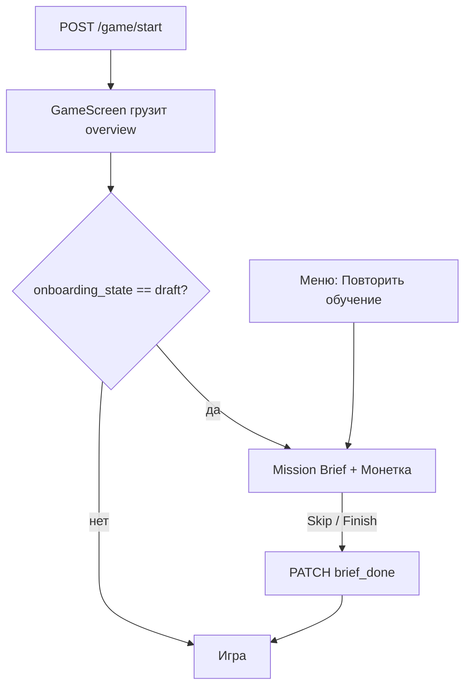

# Spec: Онбординг TMA (Mission Brief + Монетка)

## Objective

Дать **минимальное** вводное обучение в тоне **игры-квеста**: период, зарплата, подушка, события. Наставник — персонаж **Монетка**.

**Успех (Pre-Alpha):** бриф за **< 60 с** или skip; меньше вопросов «зачем подушка» в опросе ([`PRE_ALPHA_PLAYTEST_PROTOCOL.md`](../../foundation/PRE_ALPHA_PLAYTEST_PROTOCOL.md) §6).

**Волна 1 (O1):** только Mission Brief. **Coach marks — волна 2** (отдельный design-lab).

---

## Продуктовые решения (зафиксировано)

| Тема | Решение |
|------|---------|
| Когда показывать | После **первой успешной загрузки `overview`** на `GameScreen` |
| Повтор при новой игре | **Не показывать** автоматически (`brief_done` на профиле) |
| Повтор вручную | **«Повторить обучение»** в меню — бриф без смены `brief_done` |
| Персонаж | **Монетка** — [`CHARACTER_MONETKA.md`](../../reference/CHARACTER_MONETKA.md) |
| Визуал | Варианты **A–F** в [`design-lab/onboarding-brief/`](../../../design-lab/onboarding-brief/) → утверждение → MQX |

---

## UX Pattern

| Слой | Паттерн |
|------|---------|
| Brief | 3 шага, полноэкранный оверлей поверх дашборда, MQX + Монетка |
| Навигация | Точки 1–3, «Далее», на последнем — «Начать первый месяц» |
| Skip | Всегда видим («Пропустить») |
| Coach marks | **Out of scope v1** |

**Запрещено:** блокировка кнопок игры до конца текста; финтех-лекции; показ брифа на каждой новой партии.

---

## User Flow

1. Создание профиля → `onboarding_state = draft`.
2. `GameScreen`: после `overview` — если `draft`, показать оверлей (подложка — приглушённый дашборд).
3. Skip или финиш → `PATCH` → `brief_done` → оверлей снять.
4. Вторая новая игра с новым профилем — снова `draft` только у **нового** профиля; у профиля с `brief_done` бриф не автопоказывается.
5. Меню: «Повторить обучение» — показать бриф **без** PATCH (сессионный флаг UI).

---

## Content (3 шага — черновик с Монеткой)

| Шаг | Заголовок | Реплика Монетки (пример) |
|-----|-----------|--------------------------|
| 1 | Месяц за месяцем | «Привет! Я **Монетка**. Игра идёт **периодами** — как месяцы. Таймер можно поставить на паузу.» |
| 2 | Зарплата и подушка | «Зарплату **забираешь сам** до конца периода. **Подушка** — твой запас, когда месяц жмёт.» |
| 3 | Ситуации и цель | «В шапке — **События**: пару решений за период. На главной видна **цель**. Погнали?» |

Финальный CTA: **«Начать первый месяц»**.

---

## Design-lab (до кода)

Утвердить один из вариантов в [`design-lab/onboarding-brief/README.md`](../../../design-lab/onboarding-brief/README.md):

| ID | Кратко |
|----|--------|
| A | Без персонажа |
| B | Монетка + bubble (рекомендуем к обсуждению) |
| C | Компактный avatar |
| D | Дневник квеста |
| E | Сцена + карточка |
| F | Лента 3 глав |

**Gate:** без «утверждаем **X**» — фазы 1–2 плана не стартуют.

---

## Data Model

| `onboarding_state` | Смысл |
|--------------------|--------|
| `draft` | Автопоказ брифа при первом overview |
| `brief_done` | Автопоказ больше не нужен |

Заменить текущее `started` при `POST /game/start` на `draft`.

---

## API

| Method | Path | Body |
|--------|------|------|
| `GET` | `/api/finance/overview` (или профиль) | — → `onboarding_state` |
| `PATCH` | `/api/game/profile/onboarding` | `{ "onboarding_state": "brief_done" }` |

---

## Frontend (после утверждения design-lab)

- `MissionBriefOverlay` + `MonetkaAvatar` (SVG/CSS по утверждённому варианту).
- Точка входа: `GameScreen.jsx` — `useEffect` после `overview` и `onboarding_state === 'draft'`.
- Меню: `MenuPremium` — «Повторить обучение».
- Каталог: `#/dev/mqx`.

---

## Tests

- Backend: start → `draft`; PATCH; overview field.
- Manual: light/dark, 320px, skip, menu replay.

---

## Success Criteria (O1 v1)

- [ ] Утверждён вариант design-lab + Монетка.
- [ ] Один автопоказ на профиль; menu replay работает.
- [ ] `pytest -q`, `npm run build` OK.

---

## Explicit Non-Goals (v1)

- Coach marks периода 1.
- Plan onboarding.
- CMS / A/B / Amplitude.

---

### История

2026-05-19: решения продукта (overview, Монетка, menu replay, поэтапно); design-lab A–F.
