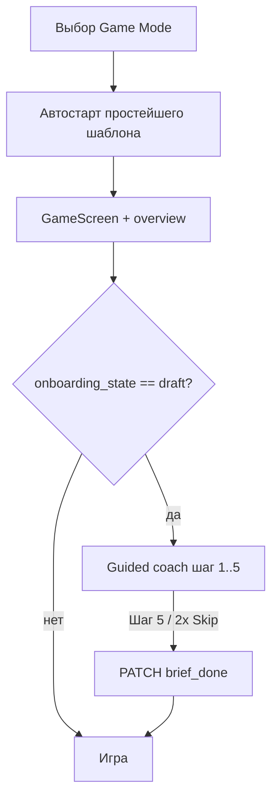

# Spec: Онбординг TMA (Guided Coach + Монетка)

## Objective

Дать **минимальное интерактивное** обучение на живом дашборде: **одна механика на шаг**, короткий текст Монетки, практика на реальных кнопках. Наставник — **Монетка**.

**Успех (Pre-Alpha):** игрок за первую сессию понимает период/таймер, зарплату, «Следующий период», подушку; онбординг можно пройти или выйти за **< 2 мин**; меньше вопросов «зачем подушка» в опросе.

**Заменяет (2026-05-20):** Mission Brief из 3 полноэкранных карточек + видео — см. [`design-lab/onboarding-brief/`](../../../design-lab/onboarding-brief/) (superseded).

---

## Продуктовые решения (зафиксировано 2026-05-20)

| Тема | Решение |
|------|---------|
| Когда показывать | Только **первая игра** после выбора **Game Mode**; партия **автостартует** с **самым простым** шаблоном каталога |
| Повтор при новой игре | **Не показывать** автоматически (`brief_done` на профиле) |
| Повтор вручную | **Отложено** — сначала проще; поведение изучим по метрикам (фаза 2 плана) |
| Персонаж | **Монетка** — PNG [`CHARACTER_MONETKA.md`](../../reference/CHARACTER_MONETKA.md) |
| Паттерн | **Guided coach** — spotlight + пузырь на `GameScreen` |
| Зарплата 0 в шаблоне | **Не сценарий онбординга** — считается **багом** данных/шаблона |
| «Следующий период» до зарплаты | **Не блокировать**; порядок подсказок сохраняем; при переходе без зарплаты — **существующее** модальное предупреждение |
| Практика | Шаги **1 и 4** (`period_timer`, `next_period`): **10 с** без пузыря, **без** видимого таймера для игрока, затем авто-переход |
| Skip | **1-е** «Пропустить» = пропуск **шага**; **2-е** = пропуск **всего** онбординга → `brief_done` |
| Подушка (шаг 3) | Засчитывается **любая** успешная сумма пополнения |
| События в coach | Pill «События» **скрыт** на всём онбординге |

---

## UX Pattern

| Слой | Паттерн |
|------|---------|
| Coach | 5 шагов на приглушённом дашборде; **spotlight** на целевой элемент |
| Персонаж | Монетка в пузыре рядом с подсветкой |
| Текст | **Заголовок** + **2–4 предложения** — одна механика |
| Практика | Пузырь скрывается → **10 с** без UI-счётчика (шаги 1, 4) или ждём **действие** (шаги 2, 3) |
| Финиш | Шаг 5 — прощание, CTA **«Начать игру»** |
| Skip | Кнопка «Пропустить» на каждом шаге (логика см. выше) |

**Запрещено в копирайте:** называть «Следующий период» **«Дальше»**; рассказывать про «Следующий период» **до** шага 4; упоминать «N секунд» / обратный отсчёт практики; пачкать несколько механик в одном шаге.

**Out of scope v1:** видео в онбординге; coach marks «волна 2» как отдельный продукт; Plan Mode onboarding.

---

## User Flow

1. Пользователь выбирает **Игра** → создаётся профиль с `onboarding_state = draft`, `onboarding_step = 0` (или `period_timer`).
2. `GameScreen`: после `overview` — если `draft`, запуск coach с текущего шага.
3. Переходы шагов — по таблице ниже; прогресс **сохранять** на сервере (пережить refresh).
4. Шаг 5 или второй Skip → `brief_done`.
5. Вторая игра / тот же профиль после `brief_done` — coach **не** автопоказывается.

---

## Шаги и гейты

| # | `onboarding_step` | Тема | Spotlight | Переход |
|---|-------------------|------|-----------|---------|
| 1 | `period_timer` | Период, таймер, ▶/⏸ | Hero (таймер, пауза, № периода) | **10 с** практики без UI-таймера после «Понятно» |
| 2 | `salary` | **Зарплата** | Кнопка «Зарплата» | Успешный `POST claim-salary` |
| 3 | `safety_fund` | **В подушку** | Кнопка «Пополнить» (`cushion`) | Успешный `POST contribute-to-safety-fund` (любая сумма > 0) |
| 4 | `next_period` | **Следующий период** | Pill в hero | **10 с** практики без UI-таймера; только после шага 2 |
| 5 | `farewell` | Прощание | — | CTA «Начать игру» → `brief_done` |

**Детекция гейтов (frontend):**

- Шаг 2: `periodStatus.salary_claimed === true` после `claimSalary`.
- Шаг 4: `periodStatus.safety_fund_contribution > 0` или рост `safety_fund_balance` / флаг в ответе contribute.

**Таймер онбординга:** рекомендуется **пауза периода**, пока виден пузырь; на 10 с практики — снять паузу (уточнить в MQX при реализации).

---

## Content

Канон текстов: [`design-lab/onboarding-guided/CONTENT.md`](../../../design-lab/onboarding-guided/CONTENT.md).

**Голос Монетки:** игривый напарник, «только что поняла»; мягкий задор; женский род. [`CHARACTER_MONETKA.md`](../../reference/CHARACTER_MONETKA.md).

---

## Design-lab

**Утверждено 2026-05-20:** guided coach — [`design-lab/onboarding-guided/APPROVED.md`](../../../design-lab/onboarding-guided/APPROVED.md).

**Superseded:** [`design-lab/onboarding-brief/`](../../../design-lab/onboarding-brief/) (layout A, 3 карточки + видео).

---

## Data Model

| Поле | Смысл |
|------|--------|
| `onboarding_state` | `draft` \| `brief_done` |
| `onboarding_step` | `period_timer` \| `salary` \| `next_period` \| `safety_fund` \| `farewell` (nullable при `brief_done`) |

При `POST /game/start` (первая игра): `onboarding_state = draft`, `onboarding_step = period_timer`.

**Skip-счётчик:** хранить в UI-сессии (не в БД): `skip_press_count` 0→1 (шаг) → 2 (весь онбординг).

---

## API

| Method | Path | Body / response |
|--------|------|-----------------|
| `GET` | `/api/finance/overview` (или профиль) | `onboarding_state`, `onboarding_step` |
| `PATCH` | `/api/game/profile/onboarding` | `{ "onboarding_state": "brief_done" }` или `{ "onboarding_step": "salary" }` |

---

## Frontend (реализация)

- `OnboardingCoach` + `MonetkaBubble` + spotlight (MQX).
- Точка входа: `GameScreen.jsx` — после `overview`, `draft`.
- `data-onboarding-anchor` на hero, `MqxPeriodActions`, pills (для spotlight).
- Повтор из меню — **не в v1** (см. план фаза 2).
- Каталог: `#/dev/mqx`.

---

## Tests

- Backend: start → `draft` + step; PATCH step; PATCH `brief_done`; overview fields.
- Frontend/manual: шаг 1→5, 10 с таймер, гейт зарплаты, гейт подушки, skip×2, skip×1 на шаге, предупреждение зарплаты без блокировки кнопки.

---

## Success Criteria (O1 v1)

- [x] Утверждён guided coach (5 шагов).
- [ ] Автопоказ только на первой игре (Game Mode + простейший шаблон).
- [ ] Skip: шаг / весь онбординг.
- [ ] `pytest -q`, `npm run build` OK.

---

## Explicit Non-Goals (v1)

- Mission Brief 3 карточки + видео.
- Жёсткая блокировка «Следующий период».
- «Повторить обучение» в меню.
- Plan onboarding; CMS / A/B.

---

### История

2026-05-19: approved layout A (Mission Brief) — superseded 2026-05-20.  
2026-05-20: **approved** guided coach 5 шагов — [`onboarding-guided/APPROVED.md`](../../../design-lab/onboarding-guided/APPROVED.md).
