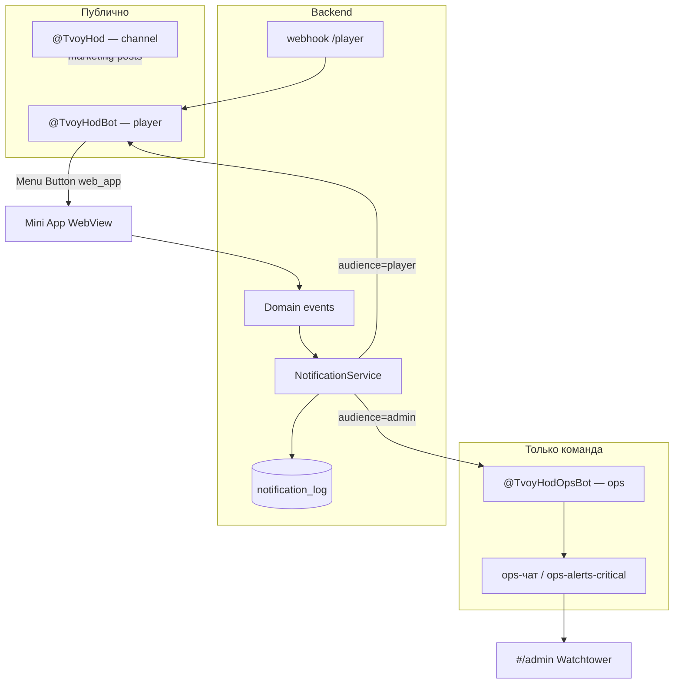

# Spec: Telegram-боты, уведомления и ops-аналитика

## Assumptions

1. **Два отдельных бота** (player + ops) + **маркетинговый канал** — разные token'ы, разный blast radius при утечке.
2. **Prod API** на Render Starter; Mini App — GitHub Pages или свой домен `app.*` ([`DEPLOY.md`](../../ops/DEPLOY.md)).
3. **HashRouter** (`#/…`) сохраняется; deep link в TMA через `web_app` keyboard и Menu Button.
4. **Аналитика** — server-side (`notification_log` + метрики в `#/admin`); Telegram — только доставка, не источник правды.
5. **Pre-Alpha:** login/password; **Closed Alpha:** auth через `Telegram.WebApp.initData`.
6. Игрок получает **исходящие** сообщения только после **`/start`** player-бота (правила Telegram Bot API).
7. Solo-dev / низкий DAU: **минимальный шум** в ops-TG; digest — с Closed Alpha.

→ Уточнить до Phase 1: один `@TvoyHodBot` на prod или отдельный staging-бот.

---

## Objective

**Why:** опубликовать игру в Telegram, собирать продуктовую аналитику, информировать команду в ops-чате и доставлять игроку **редкие, полезные** nudge — без spam и без дублирования in-app тостов.

**Who:**

| Актор | Потребность |
|-------|-------------|
| Игрок | Открыть TMA из TG, опционально получить напоминание «вернуться» / итог партии |
| Ops / product | Видеть каждого тестера, win/loss, воронку; ссылка в Watchtower |
| Marketing | Посты в канал с кнопкой «Играть» |

**Success criteria (Phase 0 — уже частично в коде):**

- [ ] `OPS_TELEGRAM_*` на prod → register / win / loss → сообщение в ops-чат **&lt; 5 с**
- [ ] `#/admin` (allowlist) показывает того же user/profile
- [ ] BotFather: Menu Button → prod Web App URL; smoke из Telegram Android/desktop

**Success criteria (Phase 1 — player bot):**

- [ ] `/start` → сохранён `telegram_chat_id`; кнопка «Играть» (`web_app`)
- [ ] `POST /api/auth/telegram` — вход по `initData` без пароля в TMA
- [ ] win / loss → **одно** сообщение игроку с deep link (если `/start` был)
- [ ] `/quiet` отключает player-TG; игра не ломается

**Success criteria (Phase 2 — Closed Alpha analytics):**

- [ ] `GET /api/admin/metrics/summary` — KPI 7d
- [ ] Утренний **digest** (1 msg/day) в ops-чат
- [ ] Эвристика `player_stuck` → алерт + фильтр в Watchtower

Ref: [`KPI_AND_PHASES.md`](../../handbook/KPI_AND_PHASES.md), [`PLAN_admin-analytics-ops.md`](../../plans/PLAN_admin-analytics-ops.md).

---

## Scope

### In scope

| Срез | Содержание |
|------|------------|
| **T0** (есть) | Ops-алерты, `notification_log`, Watchtower, hooks в auth/game/period |
| **T1** | Player bot webhook, `/start`, chat_id, initData auth |
| **T2** | Player TG notifications (win/loss/nudge/survey) |
| **T3** | Ops digest, metrics summary, stuck heuristics |
| **T4** (optional) | UTM `/start`, «Монетка digest» после периода, buddy code |

### Out of scope

- Player **in-app inbox** (колокольчик) — отдельный срез Phase 1 из parent idea
- Content Studio, draft/publish правил уведомлений
- Userbot / MTProto, парсинг групп
- Tap-to-earn, inline-игры вне TMA
- Mass broadcast &gt; rate limits без paid broadcasts (Telegram Stars)
- Полноценный BI (Metabase, Amplitude) на Pre-Alpha

---

## Архитектура ботов



### Роли и env

| Сущность | Env (предложение) | Направление |
|----------|-------------------|-------------|
| Player bot | `PLAYER_TELEGRAM_BOT_TOKEN`, `PLAYER_TELEGRAM_WEBHOOK_SECRET` | ↔ игроки |
| Ops bot | `OPS_TELEGRAM_BOT_TOKEN`, `OPS_TELEGRAM_CHAT_ID` | → ops-чат (уже есть) |
| Ops critical | `OPS_TELEGRAM_CRITICAL_CHAT_ID` (optional) | → отдельный чат 5xx |
| Channel CI | `TELEGRAM_CHANNEL_BOT_TOKEN`, `TELEGRAM_CHANNEL_ID` | → канал ([`TELEGRAM_PUBLISHING.md`](../../marketing/TELEGRAM_PUBLISHING.md)) |
| Admin allowlist | `ADMIN_USER_IDS`, `ADMIN_TELEGRAM_IDS` | JWT admin + ops `/stats` |

**BotFather (player):** description, about, avatar, Menu Button Web App URL, domain для Mini App.

**Ops-бот:** не публиковать username; token только на сервере; **без** публичных команд.

---

## Единый каталог событий (`kind`)

Колонки:

- **Log** — запись в `notification_log` (всегда для перечисленных ниже, кроме debug)
- **TG admin** — `sendMessage` через ops-bot
- **TG player** — `sendMessage` через player-bot (требует `telegram_chat_id` + `notify_telegram != false`)
- **Dedupe** — ключ идемпотентности

### Слой: привлечение и аккаунт

| kind | Trigger (код) | Audience | Log | TG admin | TG player | dedupe_key |
|------|---------------|----------|-----|----------|-----------|------------|
| `user_registered` | `POST /api/register` | admin | ✅ | ✅ | ❌ | `user_registered:{user_id}` |
| `telegram_linked` | `POST /api/auth/telegram` (новая связка) | admin | ✅ | ✅ | ❌ | `telegram_linked:{user_id}` |
| `player_bot_started` | webhook `/start` | admin | ✅ | ❌ | ❌ | `player_bot_started:{telegram_id}` |

### Слой: профиль и старт партии

| kind | Trigger | Audience | Log | TG admin | TG player | dedupe_key |
|------|---------|----------|-----|----------|-----------|------------|
| `profile_created` | `POST /api/game/profiles` | admin | ✅ | ✅ | ❌ | `profile_created:{profile_id}` |
| `game_started` | первая активация партии (`services/game/start`) | admin | ✅ | ✅ | ❌ | `game_started:{profile_id}` |

### Слой: онбординг

| kind | Trigger | Audience | Log | TG admin | TG player | dedupe_key |
|------|---------|----------|-----|----------|-----------|------------|
| `onboarding_step_reached` | смена шага coach | admin | ✅ | ❌ | ❌ | `onboarding_step:{profile_id}:{step}` |
| `onboarding_brief_done` | `brief_done` | admin | ✅ | ✅ | ❌ | `onboarding_brief_done:{profile_id}` |
| `onboarding_skipped` | 2-й skip / exit coach | admin | ✅ | ✅* | ❌ | `onboarding_skipped:{profile_id}:{skip_count}` |

\* В prod сейчас: TG только при `skip_count >= 2` — **сохранить** (tg_minimal).

### Слой: core loop

| kind | Trigger | Audience | Log | TG admin | TG player | dedupe_key |
|------|---------|----------|-----|----------|-----------|------------|
| `period_milestone` | после `process_period_end`, closed ∈ {1,3,7} | admin | ✅ | ✅ | ❌ | `period_milestone:{profile_id}:{closed}` |
| `salary_claimed` | `POST claim-salary` | admin | ✅ | ❌ | ❌ | — (T3: log-only для воронки) |
| `period_closed` | `POST time/next` success | admin | ✅ | ❌ | ❌ | `period_closed:{profile_id}:{closed}` |
| `game_won` | `profile_win_reached` first true | admin + player | ✅ | ✅ | ✅ T2 | `game_won:{profile_id}` |
| `game_lost` | `is_active=0` defeat | admin + player | ✅ | ✅ | ✅ T2 | `game_lost:{profile_id}` |

### Слой: retention (Phase 2)

| kind | Trigger | Audience | Log | TG admin | TG player | dedupe_key |
|------|---------|----------|-----|----------|-----------|------------|
| `player_stuck` | cron: нет действий 72h, active profile | admin | ✅ | ✅ | ❌ | `player_stuck:{profile_id}` |
| `onboarding_stuck` | cron: draft + step без прогресса 48h | admin | ✅ | ✅ | ❌ | `onboarding_stuck:{profile_id}` |
| `d1_nudge` | cron: registered, 0 period close, 24h | player | ✅ | ❌ | ✅ | `d1_nudge:{user_id}` |
| `d3_nudge` | cron: last_seen &gt; 72h, active | player | ✅ | ❌ | ✅ | `d3_nudge:{user_id}:{week}` |
| `playtest_survey` | period_milestone closed=4 + wave flag | player | ✅ | ❌ | ✅ | `playtest_survey:{profile_id}` |

### Слой: ops / infra (Phase 2)

| kind | Trigger | Audience | Log | TG admin | TG player | dedupe_key |
|------|---------|----------|-----|----------|-----------|------------|
| `ops_digest_daily` | cron 08:00 MSK | admin | ✅ | ✅ (1 msg) | ❌ | `ops_digest:{date}` |
| `health_degraded` | cron `/api/health` fail | admin | ✅ | ✅ critical | ❌ | `health_degraded:{hour}` |
| `api_error_spike` | middleware 5xx count | admin | ✅ | ✅ critical | ❌ | `api_error_spike:{hour}` |

### Слой: narrative (Phase 4+, out of scope v1)

| kind | Trigger | Audience | Log | TG admin | TG player |
|------|---------|----------|-----|----------|-----------|
| `narrative_precursor` | `process_period_end` + metadata | player | ✅ | ❌ | optional in-app first |

---

## Формат сообщений

### Ops (существующий + расширение)

Текст plain, до 4096 символов, без preview ссылок. Пример:

```
🏁 game_won
name=Моя игра template=mq_game_basic_v1 period_index=8
profile_id=42 user_id=7
→ https://app.example.com/#/admin?profile=42
```

Эмодзи по kind — см. [`backend/app/admin/notify.py`](../../../backend/app/admin/notify.py) `_KIND_EMOJI` (дополнить при новых kinds).

### Player (Phase 2)

- Тон: **Монетка**, 1–3 предложения, без морали
- Обязательна **InlineKeyboard**: `web_app` «Продолжить» или URL `#/game`
- Без сумм на счёте в nudge (privacy в групповых пересылках)
- Max **2** player-TG сообщения / user / calendar week (кроме win/loss — always once)

Пример win:

```
🏁 Цель достигнута!
Монетка: посмотри, как сошлись подушка и потоки — это твоя победа в «Студенте».
[Играть → web_app]
```

---

## User flows

### F1 — Публикация (Pre-Alpha)

| Step | Actor | Result |
|------|-------|--------|
| 1 | Dev | BotFather: Web App URL, domain |
| 2 | Marketing | Пост в `@TvoyHod`: «Открой бота → /start → Играть» |
| 3 | Игрок | `/start` → «Играть» → TMA |
| 4 | Игрок | register / login → игра |
| 5 | Ops | Алерт в ops-чат + строка в Watchtower |

Ref: [`PRE_ALPHA_WAVE1_OPS.md`](../../foundation/PRE_ALPHA_WAVE1_OPS.md), [`TMA_USER_FLOWS.md`](../../foundation/TMA_USER_FLOWS.md).

### F2 — Вход через Telegram (Closed Alpha)

| Step | Actor | Result |
|------|-------|--------|
| 1 | TMA | `Telegram.WebApp.initData` на load |
| 2 | Frontend | `POST /api/auth/telegram` `{ init_data }` |
| 3 | Backend | HMAC verify → user find/create → JWT |
| 4 | Backend | `users.telegram_id`, `telegram_chat_id` обновлены |

### F3 — Player notification

| Step | Actor | Result |
|------|-------|--------|
| 1 | Game | `emit(..., audience=player)` |
| 2 | Service | check `telegram_chat_id`, `notify_telegram`, dedupe |
| 3 | Player bot | `sendMessage` + keyboard |
| 4 | Log | `notification_log.telegram_sent=1\|0` |

---

## Data & API

### Models / DB (новые и изменения)

| Таблица / поле | Срез | Назначение |
|----------------|------|------------|
| `users.telegram_id` | есть | ID пользователя TG |
| `users.telegram_chat_id` | T1 | chat для исходящих |
| `users.notify_telegram` | T2 | default true; `/quiet` → false |
| `users.telegram_started_at` | T1 | первый `/start` |
| `users.referral_payload` | T4 | UTM из `/start playtest_w1` |
| `users.last_seen_at` | T3 | cron stuck / D1 |
| `notification_log.audience` | есть | `admin` \| `player` |
| `player_notifications` | Phase 1b (in-app) | inbox; **не** блокер T2 |

Миграция: [`backend/migrations/`](../../../backend/migrations/) — следующий номер после README.

### Endpoints

| Method | Path | Request | Response | Срез | Notes |
|--------|------|---------|----------|------|-------|
| `POST` | `/api/telegram/webhook/player` | Telegram Update JSON | `200 OK` | T1 | Secret header / path token |
| `POST` | `/api/auth/telegram` | `{ init_data: string }` | `Token` | T1 | HMAC-SHA256 BotFather |
| `GET` | `/api/admin/metrics/summary` | `?days=7` | KPI JSON | T3 | allowlist |
| `GET` | `/api/admin/watchtower` | — | exists | T0 | [`routers/admin.py`](../../../backend/app/routers/admin.py) |
| `PATCH` | `/api/user/notification-prefs` | `{ notify_telegram: bool }` | prefs | T2 | дублирует `/quiet` |

Sync: [`frontend-react/src/api.js`](../../../frontend-react/src/api.js), [`CLAUDE.md`](../../../CLAUDE.md) при публичных контрактах.

### NotificationService (рефактор T1)

Единая точка (эволюция [`emit_admin_alert`](../../../backend/app/admin/notify.py)):

```python
def emit_notification(
    db: Session,
    *,
    kind: str,
    audience: Literal["admin", "player"],
    payload: dict[str, Any] | None = None,
    user_id: int | None = None,
    game_profile_id: int | None = None,
    dedupe_key: str | None = None,
    send_telegram: bool | None = None,  # None = по матрице kind
) -> NotificationLog | None:
    ...
```

- `audience=admin` → `OPS_TELEGRAM_*`
- `audience=player` → `PLAYER_TELEGRAM_*` + checks
- Fail-open: ошибка TG **не** откатывает игровую транзакцию

### Player webhook commands (T1)

| Input | Action |
|-------|--------|
| `/start` | welcome + `web_app` button; upsert chat_id |
| `/start {payload}` | + save `referral_payload` (T4) |
| `/help` | краткая справка + ссылка на фидбек-чат |
| `/quiet` | `notify_telegram=false` |
| `/resume` | `notify_telegram=true` |

### Cron jobs (T3)

| Job | Schedule | Action |
|-----|----------|--------|
| `ops_digest_daily` | 08:00 Europe/Moscow | aggregate + one TG message |
| `stuck_scan` | every 6h | onboarding_stuck, player_stuck |
| `retention_nudge` | daily 18:00 | d1_nudge, d3_nudge (caps) |
| `health_watch` | every 5m | health_degraded |

Render Cron или внешний ping endpoint с secret.

---

## UI / UX

| Surface | Изменения |
|---------|-----------|
| TMA login | Кнопка «Войти через Telegram» при `initData` (T1) |
| Settings (future) | Toggle «Уведомления в Telegram» |
| `#/admin` | KPI cards T3; filter «застрял» T3 |
| Channel | Кнопка `t.me/TvoyHodBot/app` — не прямой SPA URL |

In-app inbox — **не** в этом spec; см. parent idea Phase 1.

---

## Rules & edge cases

1. **Без `/start`** — player TG silent; событие только в log (для аналитики).
2. **Dedupe** — повтор win/loss невозможен по ключу профиля.
3. **Foreign pending session** — как сейчас: `emit` не commit'ит чужие изменения ([`notify.py`](../../../backend/app/admin/notify.py)).
4. **Rate limits** — batch digest; player max 2/week; при 429 — log `telegram_sent=0`, retry не обязателен в T2.
5. **PII** — не слать email в TG; username / telegram_id — ok для ops.
6. **Staging** — отдельные `*_CHAT_ID` и bot token; не слать prod-алерты с local.
7. **Игрок заблокировал бота** — API вернёт 403; пометить `telegram_chat_id=null` optional T3.

---

## Implementation slices

| Slice | Deliverable | Depends |
|-------|-------------|---------|
| **T0** | Prod env ops + smoke | — |
| **T1a** | Webhook `/start`, `telegram_chat_id` | BotFather |
| **T1b** | `POST /api/auth/telegram` | T1a |
| **T2a** | Player TG: win, loss | T1a |
| **T2b** | nudge + survey + `/quiet` | T2a, cron optional |
| **T3a** | `metrics/summary` + digest | T0 log data |
| **T3b** | stuck heuristics | T3a |
| **T4** | UTM, Monetka period digest, buddy | product call |

---

## Testing strategy

Skill: **`/critical-tests`**. Ref: [`backend/tests/README.md`](../../../backend/tests/README.md).

| Layer | What to prove |
|-------|----------------|
| Unit | initData HMAC verify; dedupe; matrix send_telegram |
| Integration | register → log + mock TG; webhook /start → chat_id |
| API contract | auth/telegram; metrics/summary 403 non-admin |
| Manual TMA | Menu Button → game; win → TG message |

### Critical scenarios (min gate)

| ID | Scenario | Layer | Command / path |
|----|----------|-------|----------------|
| CS-1 | register → admin log + TG (mocked) | integration | `pytest tests/integration/test_telegram_ops_alerts.py` |
| CS-2 | dedupe_key второй emit → no-op | unit | `pytest tests/unit/admin/test_notify_dedupe.py` |
| CS-3 | initData valid → JWT; invalid → 401 | unit | `pytest tests/unit/auth/test_telegram_init_data.py` |
| CS-4 | webhook /start → telegram_chat_id saved | integration | `pytest tests/integration/test_telegram_webhook.py` |
| CS-5 | player win → TG skipped without chat_id | unit | `pytest tests/unit/admin/test_player_notify.py` |
| CS-6 | emit не commit'ит parent pending | unit | exists: `test_admin_watchtower_quality.py` |

Commands:

```bash
cd backend && pytest tests/test_admin_watchtower_quality.py tests/unit/admin/ tests/integration/test_telegram_*.py -q
cd frontend-react && npm run build
```

Manual smoke: [`DEPLOY.md`](../../ops/DEPLOY.md) §6 + §4 BotFather.

---

## Boundaries

- **Always:** token'ы только в env; dedupe на исходящих; fail-open для игрока; ops и player tokens раздельно
- **Ask first:** новые migrations, cron на Render, paid broadcasts, изменение auth flow prod
- **Never:** token в git; userbot; spam &gt; 2 player msg/week; email/PII в ops-TG; блокировать игру при падении TG

---

## Open questions

| # | Question | Owner | Resolution |
|---|----------|-------|------------|
| 1 | Один бот `@TvoyHodBot` для staging и prod или два? | dev | — |
| 2 | `game_started`: только `/start` game или также create profile? | product | Сейчас: start service |
| 3 | Digest в TG с какой волны (PA vs CA)? | product | Proposal: Closed Alpha |
| 4 | Survey URL — env `PLAYTEST_SURVEY_URL`? | ops | — |
| 5 | Объединить с `SPEC_admin-and-notifications.md` или sibling? | doc | Этот spec = TG + delivery; admin UI/inbox — sibling |

---

## Traceability

| Artifact | Link |
|----------|------|
| Idea (North Star) | [`admin-and-notifications.md`](../../vision/ideas/admin-and-notifications.md) |
| Quarter focus | [`admin-ops-quarter-2026.md`](../../vision/ideas/admin-ops-quarter-2026.md) |
| Plan | [`PLAN_admin-analytics-ops.md`](../../plans/PLAN_admin-analytics-ops.md) |
| Deploy | [`DEPLOY.md`](../../ops/DEPLOY.md) |
| Marketing channel | [`TELEGRAM_PUBLISHING.md`](../../marketing/TELEGRAM_PUBLISHING.md) |
| Code (T0) | [`backend/app/admin/notify.py`](../../../backend/app/admin/notify.py) |
| Backlog | [`PRODUCT_BACKLOG.md`](../../backlog/PRODUCT_BACKLOG.md) § Admin/Ops |

---

## Связь с backlog

Задачи и этапы: [`backlog/TELEGRAM_BACKLOG.md`](../../backlog/TELEGRAM_BACKLOG.md) (эпик **TG1**).

Задача P2 «Spec admin-and-notifications» — **этот документ закрывает TG/notify/delivery**; in-app inbox и Content Studio — sibling в parent idea.

---

*Draft 2026-05-30 — из сессии architecture review Telegram bots.*
