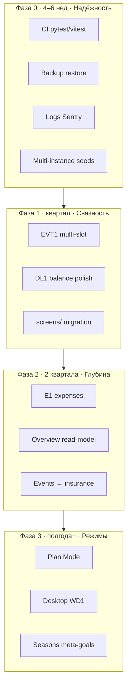

# ТВОЙ ХОД — оценка архитектуры и roadmap развития (июнь 2026)

Документ фиксирует **снимок технической архитектуры**, оценку **масштабируемости**, **порога входа** для новых разработчиков и **предложения по развитию** кодовой базы, инфраструктуры и игровых систем.

**Не заменяет канон реализации.** При конфликте: **код + тесты** → spec фичи → [`foundation/SPEC_PRODUCT.md`](../foundation/SPEC_PRODUCT.md) → ADR → этот документ.

**Отличие от соседних документов:**

| Документ | Фокус |
|----------|--------|
| [`architecture/architecture.md`](../architecture/architecture.md) | Master architecture под фичу (needs, TR-*, sign-off) |
| [`GAME_DESIGN_ROADMAP_2026.md`](GAME_DESIGN_ROADMAP_2026.md) | Геймдизайн, рынок, GD-идеи |
| [`ideas/tvoy-hod-evolution-after-mvp.md`](ideas/tvoy-hod-evolution-after-mvp.md) §II | Продуктовая цель Game/Plan, Q&A |
| **Этот документ** | Software architecture, ops, онбординг, тех. roadmap |

---

## Содержание

1. [Резюме](#1-резюме)
2. [Снимок стека и границ](#2-снимок-стека-и-границ)
3. [Сильные стороны](#3-сильные-стороны)
4. [Масштабируемость](#4-масштабируемость)
5. [Порог входа разработчика](#5-порог-входа-разработчика)
6. [Риски и технический долг](#6-риски-и-технический-долг)
7. [Предложения: backend](#7-предложения-backend)
8. [Предложения: frontend](#8-предложения-frontend)
9. [Паттерны и практики](#9-паттерны-и-практики)
10. [Инфраструктура](#10-инфраструктура)
11. [Roadmap 12–18 месяцев](#11-roadmap-1218-месяцев)
12. [Инновационные направления (игра)](#12-инновационные-направления-игра)
13. [Сводная таблица оценок](#13-сводная-таблица-оценок)
14. [Связь с бэклогом](#14-связь-с-бэклогом)

---

## 1. Резюме

**ТВОЙ ХОД** — зрелый **модульный монолит**: FastAPI + PostgreSQL + React (Vite) TMA, с сильной продуктовой документацией, доменным разрезом `backend/app/{game,finance,victory,events,…}` и осознанным разделением **схема / сиды / контент YAML**.

| Горизонт | Вердикт |
|----------|---------|
| **Pre-Alpha / Closed Alpha (10–100 игроков)** | Архитектура **достаточна** |
| **Рост контента (события, шаблоны, цели)** | **Хорошо масштабируется** через seeds + YAML + `victory_config_json` |
| **Рост трафика (сотни–тысячи DAU)** | Нужны **CI, observability, политика сидов при multi-instance**, профилирование `period` / `overview` |
| **Plan Mode + desktop** | Заложено в vision; **низкая готовность кода** — намеренно отложено |

**Главная рекомендация:** не дробить монолит на микросервисы, пока не закрыты **операционная зрелость** (CI, бэкапы БД, метрики), **EVT1 + баланс DL1** и **завершение FE-структуры** (`screens/`, декомпозиция `useGame`).

---

## 2. Снимок стека и границ

### 2.1. Компоненты

```text
┌─────────────────┐     HTTPS      ┌──────────────────┐
│  TMA / PWA      │ ──────────────►│  FastAPI (API)   │
│  React + Vite   │   /api/*       │  app/routers     │
│  api/* mirror   │                │  app/services    │
└─────────────────┘                │  domain packages │
                                   └────────┬─────────┘
                                            │
                                   ┌────────▼─────────┐
                                   │  PostgreSQL      │
                                   │  migrations/     │
                                   │  seeds on startup│
                                   └──────────────────┘

Контент событий: data/events/mvp11/*.yaml ──sync──► event_definitions
```

| Слой | Технология | Канон |
|------|------------|--------|
| API | FastAPI, Pydantic, SQLAlchemy | [`backend/app/README.md`](../../backend/app/README.md) |
| Экономика периода | `game/period.py` → `process_period_end` | [`SPEC_PRODUCT`](../foundation/SPEC_PRODUCT.md) §3.3 |
| Победа | `victory/engine.py` + шаблон / `victory_goals` | [ADR-002](../decisions/ADR-002-victory-engine-and-template-config.md) |
| События | `events/`, YAML → `mvp11_seeds` | [ADR-008](../decisions/ADR-008-events-catalog-single-source.md) |
| FE | React, MQX, `screens/` (миграция с legacy) | [`frontend-react/ARCHITECTURE.md`](../../frontend-react/ARCHITECTURE.md) |
| БД | SQL baseline + инкременты, без Alembic | [`backend/migrations/README.md`](../../backend/migrations/README.md) |
| Деплой | Render API + PG, GitHub Pages SPA | [`ops/DEPLOY.md`](../ops/DEPLOY.md) |

### 2.2. Три слоя данных (обязательно понимать)

| Слой | Где | Примеры |
|------|-----|---------|
| **DDL** | `0000_schema_baseline.sql`, `00NN_*.sql`, `create_all`, `ensure_schema_compatibility()` | таблицы, колонки, индексы |
| **Seeds** | `app/seeds/runner.py` → `seed_all()` на startup | шаблоны старта, `victory_goals`, каталог капитала |
| **Контент** | `data/events/mvp11/*.yaml` | сценарии, эффекты, цепочки |

Skill: **db-baselines-and-migrations** (`.cursor/skills/db-baselines-and-migrations/`).

### 2.3. Критические точки изменения state

Любое изменение денег / номера периода должно проходить через известные ворота:

| Операция | Модуль | Риск при обходе |
|----------|--------|------------------|
| Закрытие месяца | `game/period.py` | рассинхрон cash, событий, поражения |
| Bootstrap / overview | `finance/overview_build.py`, `game/bootstrap.py` | неверный UI победы |
| Выбор события | `events/` + effects | двойные эффекты, needs |
| Старт партии | `game/start_validation`, seeds шаблонов | невалидный blueprint |

---

## 3. Сильные стороны

| Область | Оценка | Комментарий |
|---------|--------|-------------|
| Доменная модель backend | ★★★★☆ | Пакеты `game`, `finance`, `victory`, `events`, `needs`; ADR на границы |
| Single source of truth (сервер) | ★★★★★ | Период и победа не «угадываются» на клиенте |
| Контент vs код | ★★★★☆ | `/create-event`, balance-playtest, YAML-каталог |
| Документация | ★★★★☆ | SPEC_PRODUCT, evolution §II, backlog по эпикам, Cursor skills |
| Тесты backend | ★★★★☆ | ~80 файлов: victory, period, events, DL1, API contracts |
| Продуктовая трассировка | ★★★★☆ | TRACEABILITY, MQ-*, specs/features |
| Victory v2 + шаблоны | ★★★★☆ | Chain goals, `mechanics_unlock`, data-driven balance |

---

## 4. Масштабируемость

### 4.1. Горизонтальная (больше игроков / RPS)

**Текущая целевая нагрузка:** 10–100 одновременных пользователей (Closed Alpha), короткие HTTP-запросы.

| Компонент | Статус | Комментарий |
|-----------|--------|-------------|
| Один API + одна БД (Render Starter) | ✅ для α | Без cold start |
| `process_period_end` | ⚠️ | Тяжёлая транзакция; при росте — профилирование, возможно снимок overview |
| `GET /finance/overview` | ⚠️ | Много join/агрегаций; кандидат на read-model / короткий cache |
| `seed_all` на каждом startup | ⚠️ | Ок для 1 инстанса; при **N репликах** — один лидер или lock |
| Connection pooling | ○ | По умолчанию SQLAlchemy; при 1k+ DAU — PgBouncer |

**Не нужно сейчас:** read replica, отдельный worker pool, sharding.

### 4.2. Вертикальная (больше механик и контента)

| Направление | Готовность | Риск |
|-------------|------------|------|
| Новые game-шаблоны / цели победы | Высокая | `victory_goals` + `victory_config_json` |
| События v2 (слоты, global, informational) | Средняя | Эпик **EVT1** в backlog |
| DL1 (актив ↔ кредит ↔ страховка) | Средняя | Граф обязательств; golden tests (начаты) |
| Plan Mode | Низкая (намеренно) | Отдельный UX + `expenses`; не смешивать с Game |
| E1 (статьи расходов) | Низкая | Ждёт spec; не начинать миграции без spec |

**Вывод:** проект **лучше масштабирует контент**, чем **число инстансов API** без доработки деплоя.

---

## 5. Порог входа разработчика

**Оценка: средний — 5–7 рабочих дней до первого осмысленного PR.**

### 5.1. Что помогает

- [`CLAUDE.md`](../../CLAUDE.md) — карта репо и эндпоинтов
- [`backend/app/README.md`](../../backend/app/README.md), [`frontend-react/ARCHITECTURE.md`](../../frontend-react/ARCHITECTURE.md)
- Зеркало `api/<domain>.js` ↔ `routers/<domain>.py`
- Cursor skills: `incremental-implementation`, `game-economy-and-victory`, `create-event`, `db-baselines-and-migrations`

### 5.2. Что усложняет

| Барьер | Почему | Смягчение |
|--------|--------|-----------|
| Три пути схемы БД | `create_all` + `ensure_schema` + `migrations/` + seeds | [`migrations/README.md`](../../backend/migrations/README.md), skill db-baselines |
| Legacy FE | `*Premium.jsx` vs `screens/` | ARCHITECTURE.md, touch-it move-it |
| Победа в трёх слоях | JSON шаблона + `victory_goals` + engine | ADR-002, 30-мин walkthrough |
| Нет CI в PR | Новичок не видит «зелёный» gate | см. §10, эпик **OPS-CI** |
| Монолитный `useGame.js` | Весь state игры в одном хуке | декомпозиция по доменам (§8) |

### 5.3. Рекомендуемый онбординг (5 дней)

| День | Цель | Артефакт |
|------|------|----------|
| 1 | Поднять БД, пройти 1 период в TMA | `db.sh bootstrap`, trace: bootstrap → overview |
| 2 | Одно событие в YAML + pytest | PR только `data/events/` + тест |
| 3 | Прочитать `process_period_end` + один unit-тест периода | заметки в PR description |
| 4 | Правка UI в `screens/` + MQX | DESIGN_WORKFLOW |
| 5 | Мини-фича по spec / backlog с review | merge |

*Отдельный handbook-онбординг можно вынести в `docs/handbook/ONBOARDING_DEV.md` (backlog Doc).*

---

## 6. Риски и технический долг

| ID | Риск | Вероятность | Влияние | Митигация |
|----|------|-------------|---------|-----------|
| R1 | Рассинхрон схемы (ORM vs migrations vs ensure_schema) | Средняя | Высокое | db.sh migrate на staging; skill db-baselines; не DML в baseline |
| R2 | Двойной tap в TMA → двойное списание | Средняя | Среднее | Расширить idempotency на денежные POST |
| R3 | Multi-instance: гонка сидов | Низкая (пока 1 pod) | Среднее | Advisory lock / migrate job отдельно от web |
| R4 | Legacy FE + новый MQX | Высокая | Среднее | Не расширять `*Section.jsx`; pilot в `screens/` |
| R5 | Отсутствие prod metrics | Высокая | Высокое | Sentry + structlog + health/readiness |
| R6 | `period.py` как god-module | Средняя | Среднее | Фасад `close_period`, хуки по доменам |
| R7 | Контент ломает баланс победы | Средняя | Высокое | balance-playtest, event-analysis перед крупным YAML |

---

## 7. Предложения: backend

Приоритет: **P0** (α-стабильность) → **P1** (масштаб контента) → **P2** (Plan / desktop).

### 7.1. P0 — операционная целостность

1. **Фасад закрытия периода** — единая точка `close_period(profile) -> PeriodCloseResult`; документировать как единственный mutator периода/cash (обёртка над текущим `process_period_end`).
2. **Idempotency на деньги** — `time/next`, покупка из шаблона, claim insurance (ключ = profile + period + action).
3. **Каталоги без ORM** — паттерн `victory_goals`: DDL + `app/seeds/*` + таблица в handbook (уже внедрено для victory).

### 7.2. P1 — производительность и ясность

4. **Read-model overview** — `FinanceOverviewDTO` одним сборщиком; опционально инвалидация при close и cash-действиях (без обязательного Redis на старте).
5. **Feature flags на профиле** — `experiment_json` или расширение `playtest_mode` для A/B пула событий.
6. **Ports для тестов** — интерфейсы «оценка цели», «picker событий» в `victory/` и `events/`.

### 7.3. P2 — эволюция домена

7. **Очередь для периферии** — Telegram notify, тяжёлая аналитика (outbox pattern; не трогать ядро периода).
8. **Подпакеты services** — при росте: `finance/overview/`, `game/period/`.

---

## 8. Предложения: frontend

### 8.1. Структура (P1)

1. **Завершить миграцию** — `screens/game/` для вкладок из `*Premium.jsx` (touch-it move-it).
2. **Разбить `useGame`** — `useGameSession`, `usePeriodActions`, `usePendingEvents` без big-bang.
3. **Server state** — TanStack Query / SWR для overview, time, pending events (меньше ручного resync).

### 8.2. Качество (P1)

4. **Контрактные тесты** — Vitest: fixtures JSON от backend → парсеры в `api/*.js`.
5. **Один путь MQX** — новые паттерны только через `components/mqx/` + DESIGN_WORKFLOW.

### 8.3. Каналы (P2)

6. **WD1** — layout для wide web ([`PLAN_desktop-wide-web.md`](../plans/PLAN_desktop-wide-web.md)).
7. **a11y** — по SPEC_FRONTEND_UI при касании экранов.

---

## 9. Паттерны и практики

| Паттерн | Применение в ТВОЙ ХОД | Статус |
|---------|----------------------|--------|
| **Modular monolith** | `app/{domain}/` | ✅ |
| **Hexagonal / ports** | victory evaluate, event picker | 🔲 частично |
| **CQRS-lite** | overview read vs period write | 🔲 идея |
| **Expand/contract** | миграции колонок, Plan mode | ✅ в skill |
| **Event sourcing** | не нужен | ❌ избыточно |
| **Property-based tests** | `period_money_property_lite` | ✅ расширять на DL1 |
| **Headless balance sim** | balance-playtest skill | ✅ |

**Не рекомендуется сейчас:** микросервисы, GraphQL, отдельный BFF, Kafka.

---

## 10. Инфраструктура

### 10.1. Closed Alpha (текущий target)

| Компонент | Рекомендация | Ссылка |
|-----------|--------------|--------|
| API | Render **Starter+**, custom domain `api.*` | [DEPLOY.md](../ops/DEPLOY.md) |
| БД | Managed PostgreSQL, **daily backup + test restore** | backlog P0 DB |
| Миграции | `db.sh migrate` в deploy **или** только additive via startup (явная политика) | [migrations/README](../../backend/migrations/README.md) |
| SPA | GitHub Pages + свой домен `app.*` | landing README |
| Secrets | `SECRET_KEY`, rotation plan | `.env.example` |

### 10.2. Следующий уровень (100–1k DAU)

| Задача | Зачем |
|--------|-------|
| **GitHub Actions** | pytest, validate_baseline, vitest, lint на PR |
| **Staging** | схема = prod, anonymized dump |
| **Observability** | structlog + `request_id`; Prometheus `/metrics` (p95 `time/next`, overview) |
| **Sentry** | FE WebView + BE 5xx |
| **Rate limiting** | auth, тяжёлые POST |
| **Seed policy** | один лидер при N replicas |

### 10.3. Высокие нагрузки (12+ мес., при необходимости)

- Read replica для analytics timeseries
- Worker для batch balance / отчётов
- CDN (статика уже на Pages)

---

## 11. Roadmap 12–18 месяцев

Согласован с [`PRODUCT_BACKLOG.md`](../backlog/PRODUCT_BACKLOG.md) и [`GAME_DESIGN_ROADMAP_2026.md`](GAME_DESIGN_ROADMAP_2026.md); здесь — **технический акцент**.



### Фаза 0 — операционная зрелость

- CI gate на PR
- Бэкапы БД + проверка restore
- Deploy checklist: migrate vs startup-only
- `ONBOARDING_DEV.md` (1 страница happy path)

### Фаза 1 — связность систем (продукт + техника)

- EVT1: мульти-слот, global macro
- DL1-143 balance в prod-ритме
- Run Finale / GE1 polish
- FE: `screens/game/` pilot

### Фаза 2 — симуляция ближе к жизни

- E1 категории расходов (после spec)
- Штрафы просрочки, простой налоговый слой (1 правило)
- Read-model overview при профилировании

### Фаза 3 — второй продукт внутри продукта

- Plan Mode MVP 2.0
- WD1 desktop
- AC1 TG ↔ email
- Сезоны / meta-goals

---

## 12. Инновационные направления (игра)

Идеи согласованы с педагогикой «умной игры» и текущим стеком (без crypto/NFT).

| ID | Идея | Ценность | Сложность |
|----|------|----------|-----------|
| IN-01 | **Counterfactual месяц** — ghost-пересчёт «что если» после close (без записи в save) | Обучение причинности | Средняя |
| IN-02 | **Персональный hint в карточке** — rule-based (needs + burn + overdue); LLM опционально | Снижение отвалов | Низкая–средняя |
| IN-03 | **Сезон 4 недели** — global macro + meta по `clean_period_streak` | Удержание в TMA | Средняя |
| IN-04 | **Дисциплина cashflow** — серия «чистых» периодов разблокирует механику | Мета поверх Victory chain | Низкая |
| IN-05 | **Replay run для дизайнера** — JSON траектории из admin → headless sim | Баланс контента | Низкая (есть balance-playtest) |
| IN-06 | **Кооп Plan (далёко)** — read-only share Plan-save | B2B2C планирование | Высокая |

Детализация продуктовых гипотез — в [`GAME_DESIGN_ROADMAP_2026.md`](GAME_DESIGN_ROADMAP_2026.md); тех. feasibility — через idea-refine → spec.

---

## 13. Сводная таблица оценок

| Критерий | 1–5 | Комментарий |
|----------|-----|-------------|
| Архитектурная ясность | **4** | Домены ясны; пути БД перегружены |
| Масштаб контента | **4** | YAML + seeds + templates |
| Масштаб трафика | **3** | Монолит ок до α; нужны CI/OBS |
| Онбординг | **3** | Много docs, нет одного happy path doc |
| Тестируемость экономики | **4** | pytest + balance-playtest |
| Готовность Plan / desktop | **2** | Vision есть, код отложен |
| Ops / prod hygiene | **2–3** | DEPLOY есть; CI/backup в backlog |

---

## 14. Связь с бэклогом

Предлагаемые **новые или усиленные** пункты (для переноса в [`PRODUCT_BACKLOG.md`](../backlog/PRODUCT_BACKLOG.md)):

| Приоритет | Слой | Заголовок |
|-----------|------|-----------|
| **P0** | Ops | CI: pytest + validate_baseline + vitest на PR |
| **P0** | DB | Бэкапы PostgreSQL + ежеквартальный test restore |
| **P0** | Ops | Политика migrate-on-deploy vs startup-only (документ + Render hook) |
| **P1** | Backend | Idempotency keys на `time/next` и покупки из шаблона |
| **P1** | Backend | Фасад `close_period` + документация единственной точки мутации |
| **P1** | Frontend | Декомпозиция `useGame` + pilot `screens/game/` |
| **P1** | Ops | Sentry + structlog request_id |
| **P2** | Backend | Read-model overview (после профилирования) |
| **P2** | Doc | `handbook/ONBOARDING_DEV.md` |

Существующие эпики, закрывающие часть roadmap: **EVT1**, **DL1**, **E1**, **WD1**, **PW1**, **GE1**.

---

## История документа

| Дата | Изменение |
|------|-----------|
| 2026-06-02 | Первая версия: оценка архитектуры, масштаб, онбординг, roadmap, IN-идеи |

---

## См. также

- [`CLAUDE.md`](../../CLAUDE.md)
- [`architecture/architecture.md`](../architecture/architecture.md)
- [`decisions/ADR-007-backend-domain-packages.md`](../decisions/ADR-007-backend-domain-packages.md)
- [`ideas/project-structure-standardization.md`](ideas/project-structure-standardization.md)
- [`.cursor/skills/db-baselines-and-migrations/SKILL.md`](../../.cursor/skills/db-baselines-and-migrations/SKILL.md)
