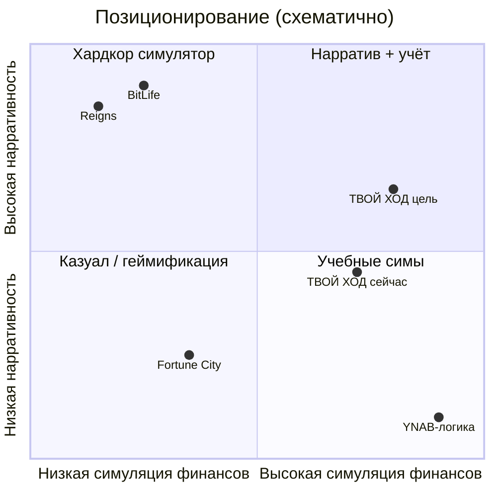

# ТВОЙ ХОД — геймдизайн, сравнение с рынком и roadmap 2026

Синтез для продуктовых решений: **оценка относительно современных пошаговых и finance/life sim**, **идеи улучшения текущих механик**, **дорожная карта 12–18 мес.** с привязкой к эпикам [`PRODUCT_BACKLOG.md`](../backlog/PRODUCT_BACKLOG.md).

**Не канон реализации.** При конфликте: код + тесты → spec фичи → [`SPEC_PRODUCT.md`](../foundation/SPEC_PRODUCT.md) → этот документ.

**Связанные источники:**

| Документ | Роль |
|----------|------|
| [`foundation/SPEC_PRODUCT.md`](../foundation/SPEC_PRODUCT.md) | Что в prod сейчас |
| [`foundation/TARGET_PLAYER_AND_SESSION.md`](../foundation/TARGET_PLAYER_AND_SESSION.md) | ЦА, темп, 40–60 периодов |
| [`ideas/tvoy-hod-evolution-after-mvp.md`](ideas/tvoy-hod-evolution-after-mvp.md) §II | Game/Plan, Q&A, план по слоям |
| [`ideas/game-balance-thresholds-and-constraints.md`](ideas/game-balance-thresholds-and-constraints.md) | Пороги и пакеты баланса |
| [`backlog/PRODUCT_BACKLOG.md`](../backlog/PRODUCT_BACKLOG.md) | Операционный бэклог и эпики |

---

## 1. Снимок продукта (якорь)

| Слой | Суть |
|------|------|
| **Жанр** | Пошаговый симулятор личного бюджета (1 период = месяц), **TB1** без real-time давления |
| **Платформа** | Telegram Mini App + PWA; целевой темп опытного игрока **1–3 мин/период** |
| **Core loop** | Действия в открытом месяце → **«Закрыть месяц»** → автоматическая экономика → **2** события → прогресс к целям |
| **Глубина** | Cash + подушка, активы/долги, инвестиции, страховки (claim), события, **Z-NEEDS**, Victory v2 (chain / parallel) |
| **Мета** | Шаблоны старта, `mechanics_unlock`, достижения (BE есть, UI на паузе), Run Finale, Admin/Ops |
| **ЦА** | **30+**, «умная игра», педагогика через последствия; без казино/микрозаймов ([`TARGET_PLAYER`](../foundation/TARGET_PLAYER_AND_SESSION.md) §3) |

---

## 2. Сравнение с современными играми

### 2.1. Ближайшие аналоги

| Игра / продукт | Сильная сторона | Где ТВОЙ ХОД |
|----------------|-----------------|--------------|
| **Reigns** (narrative choice) | 1 решение = 1 экран, мгновенная драма, статы на виду | Сильнее **экономика**; слабее **плотность истории** за сессию |
| **BitLife** (life sim) | Длинная биография, хаос, viral | Честнее **финансы**; меньше «рандом ради мема» |
| **Fortune City** (habit budget) | Привычка, короткие сессии, награды | Глубже **механики** (долг, инвест, страховка); слабее **daily habit** вне партии |
| **Football Manager** (turn mgmt) | Один ход — много последствий, долгая кампания | Близкий ритм TB1; меньше **mid-campaign вех** |
| **Frostpunk** (survival mgmt) | Давление ресурсов, моральный выбор | Z-NEEDS + neg cash — зачаток; **просрочка MVP** смягчает драму |
| **Duolingo** (XP meta) | Streak, микро-награды | Character XP **снят** — нужен заменитель меты (достижения, шаблоны, finale) |

### 2.2. Позиционирование (схема)

**Целевая ниша:** «**финансовый менеджер месяца**» — между Reigns (мало цифр) и YNAB (много рутины): **2–4 осмысленных решения + честный closing месяца**.

### 2.3. Сильные стороны относительно рынка

1. Педагогика **в правилах**, не в стене туториала (сгоревшая зарплата, подушка, просрочка, chain-цели).
2. **TB1** — уважение к TMA и паузам (PW1 resync).
3. **Victory v2 + mechanics_unlock** — учебная лестница, как в хороших strategy tutorials.
4. **Game / Plan** — честное разделение «игра» vs «инструмент» (Plan — MVP 2.0).
5. **Контент через данные** (YAML, шаблоны, `victory_config`) — масштаб без переписывания ядра.
6. **Ops/Watchtower** — зрелость live-ops для indie finance games.

### 2.4. Разрывы (где проигрываем «ощущению игры»)

| Разрыв | Симптом для игрока |
|--------|-------------------|
| Нарративная плотность | «Месяц = 2 карточки + кнопки» — мало истории |
| Ставки просрочки | Просрочка копится без эскалации — после обучения нет страха |
| Скрытый burn жизни | E1 не в UI — непонятно, откуда «обязательства» для подушки |
| Длина кампании | 40–60 периодов при 2 событиях — риск «пустой середины» |
| Мета на паузе | M12 UI отложен — мало причин после победы кроме нового шаблона |
| Страховка ↔ события | Страховка как «ещё одно списание», не защита |
| Честность долга | Тело не тает — падает доверие продвинутых |

---

## 3. Оценка текущих механик

| Механика | 1–5 | Комментарий |
|----------|-----|-------------|
| TB1 «Закрыть месяц» | **5** | Ядро; не менять |
| Зарплата (сгорание) | **4** | Сильный teachable moment; опция **late claim** по шаблону |
| Подушка (2 кошелька) | **4** | Нужна метрика **«X месяцев расходов»** в UI |
| Долги / просрочка | **3** | Мало давления; нереалистичное тело |
| События (2/период) | **3→4** | Скачок — **EVT1** (слоты, informational, global) |
| Victory chain | **4** | Критично **V2-BAL** (темп vs копирайт) |
| Инвестиции | **3** | Мало связи с событиями/макро |
| Страховки | **3→4** | I1 технически; нужен контентный контур |
| Z-NEEDS | **3** | Ядро в prod; polish после CN1-001 |
| Аналитика | **4** | Нужно **разложение cashflow** |
| Шаблоны | **3** | Мало для «исследователя» без новых режимов |
| Plan Mode | **N/A** | Дифференциация во 2-м акте |

---

## 4. Идеи улучшения текущих механик

Идентификаторы **GD-xxx** — для трассировки в планах; реализация через эпики бэклога.

### 4.1. Быстрые wins (1–2 спринта)

| ID | Идея | Эпик / зона |
|----|------|-------------|
| GD-01 | **Предпросмотр месяца** перед «Закрыть» (обслуживание, долги, страховки, риск neg cash, незабранная зарплата) | UX, period end |
| GD-02 | **Подушка в месяцах burn** («3.2 мес. расходов») | overview, E1-adjacent |
| GD-03 | **Копирайт chain** под фактический темп (не «к 7-му периоду», если математика ~25-й) | **V2-BAL** |
| GD-04 | **Informational-события** как «новости рынка» | **EVT1-050** |
| GD-05 | **Страховка в тексте события** до выбора | I1 + events |
| GD-06 | **Mid-chain milestones** (тост / light finale на 3-й, 5-й цели) | **GE1**, victory |
| GD-07 | Локализация `kind` активов | TMA flows |

### 4.2. Средний слой (эпики в бэклоге)

| ID | Идея | Эпик |
|----|------|------|
| GD-08 | Мульти-слот событий (choice + info + needs_risk + macro) | **EVT1** |
| GD-09 | Видимые статьи расходов | **E1** |
| GD-10 | Мягкий штраф просрочки (флаг шаблона) | Экономика давления |
| GD-11 | Предикаты событий (нет страховки + есть авто) | **EVT1-031** |
| GD-12 | Цепочки с памятью выбора | **EVT1-090** |
| GD-13 | Разложение cashflow в аналитике | SPEC §12.5 |
| GD-14 | Обязательные события смешанного типа | evolution §II Q5 |
| GD-15 | Баланс 🟢🔴🟡 от фин. здоровья | **EVT1-110** |

### 4.3. Глубина симуляции (после α, по 1 правилу за релиз)

| ID | Идея | Примечание |
|----|------|------------|
| GD-16 | Аннуитет **или** честный «interest-only» в копирайте | **DL1** волна D · SPEC_PRODUCT §12.1 |
| GD-17 | Late salary / событие «задержка выплаты» | Смягчение бинарности |
| GD-18 | DTI / лимит нового долга | **DL1** backlog DL1-200 · анти-эксплойт после secured |
| GD-19 | Restructuring вместо мгновенного game over | 3 neg cash |
| GD-20 | `economy_patch` от global macro | **EVT1-130** |
| GD-21 | Decimal / копейки | SPEC §12.4 |

---

## 5. Стратегические точки роста

1. **Финансовый менеджер месяца** — 2–4 решения + честный closинг.
2. **Кампания + исследователь** — два крючка удержания ([`TARGET_PLAYER`](../foundation/TARGET_PLAYER_AND_SESSION.md) §6).
3. **Контент как сезоны** — global macro + event packs (live-ops без смены ядра).
4. **Wide web (WD1)** — канал для 30+ «вечер за ноутбуком»; TMA — холодный трафик.
5. **Доказуемая польза** — аналитика + Run Finale → B2B/образование (без advisor CTA в Pre-Alpha).

---

## 6. Roadmap по фазам (12–18 мес.)

Согласовано с решениями продукта **2026-05-30** ([`PRODUCT_BACKLOG`](../backlog/PRODUCT_BACKLOG.md) §«Решения»): Plan отложен, E1 ждёт spec, M12 на idea-refine, α — PA-W1.

### Фаза 0 — Closed Alpha стабильность (~0–2 мес.)

**Цель:** сессия 30–45 мин без блокеров; метрики Pre-Alpha.

| Трек | Deliverables | Эпики |
|------|--------------|-------|
| Метрики и баланс | PA-W1, KPI, V2-BAL | **α**, **V2** |
| События P0 | Approve spec, мульти-слот, informational UI, 2–3 info | **EVT1** P0 |
| Потребности | Gate SPEC one-pager | **CN1** CN1-001 |
| Страховки | auto/housing ↔ claim | **I1** |
| UX | GD-01, GD-02, пустые состояния капитала | FE backlog |
| Завершение партии | Finale + feedback | **GE1** |

**Не делать:** Plan Mode, E1 миграции, M12 экран, advisor CTA.

### Фаза 1 — Глубина сессии (~2–4 мес.)

**Цель:** ощущение «narrative mgmt» при сохранении TB1.

| Трек | Deliverables | Эпики |
|------|--------------|-------|
| События P1 | needs_risk, global macro, 3+ цепочки, demo coverage | **EVT1** P1 |
| Расходы | E1-R go → волна A → B UI | **E1** |
| Давление | GD-10, предупреждение 2-й neg cash | Экономика |
| Мета | idea-refine M12 → лёгкий UI / тосты | **M12** |
| Контент | 20–25 событий/tier; rebalance §10/11 | EVT1-105 |
| Баланс | `/balance-playtest` 30–40 периодов | balance-playtest |

**KPI:** ≥5 периодов/сессия (новичок ≥3); ≥70% понимают причину поражения (опрос).

### Фаза 2 — Удержание и вариативность (~4–8 мес.)

**Цель:** 2–3-я партия без выгорания chain.

| Трек | Deliverables | Эпики |
|------|--------------|-------|
| Шаблоны | 5-й шаблон, разные `victory_config` | G1 / контент |
| Победа | parallel M из N на сложных шаблонах | **V2** |
| Сезоны | 1–2 event packs + macro rotation | EVT1, контент |
| Канал | Wide web CA 50–100 | **WD1** |
| Notify | player bot (без FOMO-таймера) | **TG1** |
| Admin | C1 редактирование каталогов | **A0** |
| Долг | GD-16, GD-18 | **DL1** |
| Аналитика | radar фин. здоровья (если spec) | FE |

### Фаза 3 — Plan Mode и взрослый сим (~8–14 мес.)

| Трек | Deliverables | Эпики |
|------|--------------|-------|
| Plan MVP 2.0 | Мастер, статьи, префилл | Plan, evolution §II |
| E1 Plan | Редактор расходов | **E1** волна D |
| Налоги | Упрощённый слой (1 правило) | Экономика |
| Ручная оплата | Только Plan или hard-флаг | evolution |
| Аккаунты | TG ↔ email | **AC1** |

### Фаза 4 — Платформа контента (~14–18+ мес.)

| Направление | Примеры |
|-------------|---------|
| Draft/publish событий | Admin Phase 2 |
| Кампании | «Кризис 2026» — 12 периодов, общий macro |
| B2B | Кастомные шаблоны |
| Монетизация | Косметика / шаблоны / лицензии (не pay-to-win) |

---

## 7. Приоритизация при активной разработке

| Брать в первую очередь | Отложить |
|------------------------|----------|
| EVT1 P0 + informational + 1–2 цепочки | Полный налоговый сим |
| V2-BAL + GD-01 (предпросмотр месяца) | Plan Mode |
| E1-R → видимый burn (после go) | Возврат character XP |
| Страховка в событиях (GD-05) | M12 полноэкран до idea-refine |
| GD-06 mid-milestones / GE1 | «Быстрый период» для ветеранов |
| α: ≥5 периодов/сессия | Advisor CTA в игре |

---

## 8. Риски

| Риск | Митигация |
|------|-----------|
| Перегруз решениями (EVT1 → 5 слотов) | Лимит **активных** choice: 2; остальное info/risk |
| E1 ломает победу | E1-R снимок; пересчёт `victory_config` |
| 40–60 периодов = скука | parallel на 2+ шаблонах; мини-кампании ~15 периодов |
| TMA + wide — два UX | WD1 после стабильного narrow |
| Слабая мета без M12 | GE1 + шаблоны + тосты достижений |

---

## 9. Резюме

**ТВОЙ ХОД** ближе к **серьёзному turn-based finance sim**, чем к типичным TMA-квизам: выигрывает у Reigns/BitLife **честностью системы и аналитикой**, проигрывает в **плотности истории за сессию**. Главные рычаги при текущей скорости разработки: **EVT1 + видимый burn (E1) + V2-BAL + связка страховки с событиями + mid-campaign вехи**; Plan и wide web — второй акт после доказанной α.

---

## История

| Дата | Изменение |
|------|-----------|
| 2026-06-01 | Первая версия (сессия геймдизайн-анализа) |
| 2026-06-01 | Эпик **DL1** (долг/актив/страховка); GD-16/GD-18 привязаны к DL1 |
