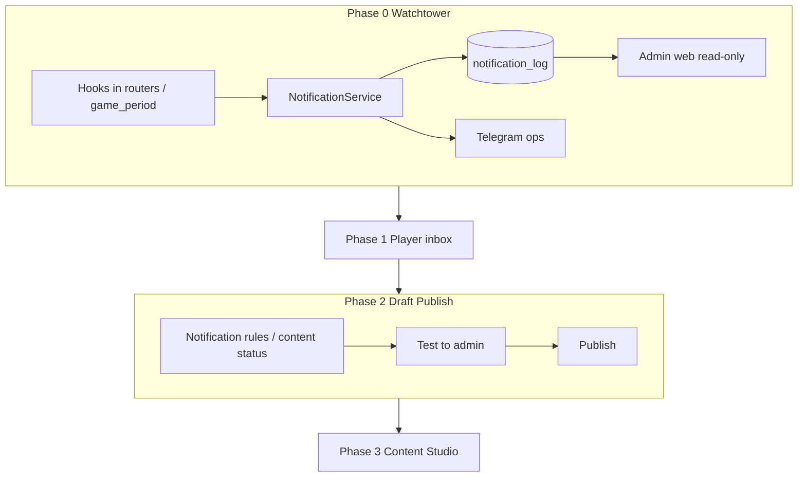

# Админка и уведомления (игрок + ops)

Сессия **idea-refine** с опорой на текущий стек: FastAPI, TMA (`frontend-react`), тосты [`notifications.js`](../../../frontend-react/src/components/notifications.js), контент в БД (миграции/сиды), модель [`User`](../../../backend/app/models.py) / [`EventDefinition`](../../../backend/app/models.py).

**Контекст использования сейчас:** почти нет DAU, критично **детально видеть каждого игрока**; админ — **solo-dev**; доставка ops — **Telegram-канал**; игроку push **пока не нужен**, только in-app (позже).

---

## Problem Statement

Как дать одному разработчику **наблюдаемость за каждым живым игроком** и **безопасное управление контентом** (сначала протестировать уведомление на себе, потом включить всем), не строя тяжёлую CMS и не смешивая мгновенные тосты с историей состояния игры?

---

## Решения из обсуждения (зафиксировано)

| Вопрос | Решение |
|--------|---------|
| Draft / publish для контента | **Да.** Draft → тест уведомления на себе → publish для всех. Не «сохранил = live» для игровых рассылок и шаблонов уведомлений. |
| Digest в Telegram | **Не нужен** на текущем этапе (мало игроков; каждое событие — отдельное сообщение в ops-канал). |
| Предвестники событий | **Данные** — в `EventDefinition.metadata_json`; **доставка игроку** — отдельный `kind=narrative` только когда движок реально «выстрелил» предвестник (см. § Предвестники). |
| Игрок: push вне TMA | Отложить; Phase 1+ — in-app inbox. |
| Ops: куда слать | Telegram ops-канал + минимальная вебка (read-first). |

---

## Recommended Direction

### Принцип: North Star → tracer bullet → расширение

Не начинать с «админки как CMS». На низком DAU ценность даёт **Watchtower** (видеть регистрации, старты партий, победы, поражения, застревания), а контент-студия — **после**, когда больно править SQL/миграции.

**Единый слой уведомлений** с двумя аудиториями:

```
Триггер (доменное событие)
    → NotificationService.emit(audience, kind, payload, dedupe_key?)
        → audience=admin  → Telegram ops (+ запись в notification_log)
        → audience=player → player_notifications (in-app inbox; позже)
```

**Тосты** остаются для ответа на HTTP-действие («полис оформлен»). **Inbox** — для состояния мира («до конца периода 2 мин», «победа», предвестник). Не дублировать одно и то же в обоих каналах.

### North Star (к чему прийти, 6–12 месяцев)

| Область | Целевое состояние |
|---------|-------------------|
| **Ops** | Telegram: мгновенные алерты по ключевым событиям + ссылка в веб; опционально digest только при росте DAU. |
| **Веб-админка** | Отдельный entry (`admin.html`), allowlist (`ADMIN_USER_IDS` / `ADMIN_TELEGRAM_IDS`), модули: Dashboard, Player inspector, Content Studio (draft/publish), Notification rules (шаблон + тест + publish). |
| **Игрок** | Inbox в TMA (колокольчик), deep link на таб/событие; без push до отдельного решения. |
| **Контент** | События, шаблоны старта, активы/долги, страховки, achievements — редактирование с валидацией JSON-схемы, preview карточки, audit log. |
| **Правила уведомлений** | Сущность «правило» (или запись в каталоге): `status: draft \| published`, `test_recipient: admin_only`, при publish — подписка всех активных профилей / триггер по событию. |
| **Безопасность** | `/api/admin/*` всегда 403 для не-allowlist; dev-действия (сброс периода, +cash) за feature flag. |

### Рекомендация: предвестники

**Не заводить отдельный `kind` в каталоге событий** и не отдельную таблицу на MVP.

1. **Хранение:** ключ в `metadata_json`, например:

   ```json
   {
     "precursor": {
       "periods_before": 2,
       "title": "Слухи о проверке",
       "body": "Коллеги говорят, что в конце месяца…"
     }
   }
   ```

2. **Исполнение (позже):** при `process_period_end` или отдельном tick — если до события `periods_before` периодов, `emit(player, kind=narrative, …)` с `dedupe_key=precursor:{event_key}:{profile_id}`.

3. **Админка (поздний этап):** в Content Studio — блок «Предвестник» (число периодов + текст), без отдельного раздела «Narrative».

Так примитивная админка не раздувается, а контракт уже заложен в существующем поле `metadata_json`.

---

## Admin alerts — MVP-набор (solo-dev, мало игроков)

Каждое сообщение в ops-канал — **одно событие**, формат:

```
🟢 player_registered
user_id=42 username=… telegram_id=…
→ /admin/users/42

🏁 game_won
profile_id=7 name=… template=starter_easy period=12
→ /admin/profiles/7
```

| `kind` (admin) | Когда emit | Зачем на этапе «никто не играет» |
|----------------|------------|----------------------------------|
| `user_registered` | `POST /api/register` | Видеть каждого нового аккаунта |
| `profile_created` | `POST /api/game/profiles` | Новое сохранение / имя |
| `game_started` | `POST /api/game/start` (первая активация партии) | Старт с шаблоном, длительность периода |
| `game_won` | `win_reached` впервые true (finance / period) | Главная продуктовая метрика |
| `game_lost` | `is_active=0` по поражению (3× минус cash) | Понимать отвал |
| `period_milestone` | опционально: `period_index` ∈ {1, 3, 7} | Воронка «дошёл до N» |
| `player_stuck` | опционально: нет действий N реальных часов при активном play | Редкие игроки — ручной разбор |

**Не в первом tracer bullet:** digest, 5xx spike, пустой пул событий, аномалии баланса — добавить, когда контент начнёт меняться через админку, а не только SQL.

**Точки в коде (ориентир):**

- [`backend/app/routers/auth.py`](../../../backend/app/routers/auth.py) — register
- [`backend/app/routers/game.py`](../../../backend/app/routers/game.py) — create profile, start
- [`backend/app/game/period.py`](../../../backend/app/game/period.py) — defeat; при победе — там же или [`finance.py`](../../../backend/app/routers/finance.py) при первом `win_reached`

---

## Player notifications — отложенные этапы

| Phase | In-app inbox |
|-------|----------------|
| 0 | Нет (только admin TG) |
| 1 | 4–6 `kind`: period, economy, achievement, system; колокольчик на главной |
| 2 | + `narrative` (предвестники из движка) |
| 3 | Правила из админки (draft → test → publish) |

---

## Поэтапная дорожная карта

### Phase 0 — Watchtower (сделать первым)

**Цель:** «хоть что-то видно» + TG при каждом важном действии игрока.

- Env: `OPS_TELEGRAM_BOT_TOKEN`, `OPS_TELEGRAM_CHAT_ID`, `ADMIN_TELEGRAM_IDS`.
- Backend: `app/admin/notify.py` — `emit_admin_alert(kind, payload)`; таблица `notification_log` (audience, kind, payload_json, created_at) — для истории и отладки.
- Подключить 5–6 hooks (таблица выше).
- Веб: одна страница **read-only** — последние пользователи и профили (можно без отдельного UI-фреймворка: таблица + ссылка `profile_id`). Auth: allowlist по JWT user id.
- **Не делать:** CRUD контента, player inbox, draft/publish.

**Критерий готовности:** зарегистрировался тестовый пользователь → сообщение в канале за &lt; 5 с; открыл `/admin` — видишь того же user в списке.

### Phase 1 — Player inbox lite

- `player_notifications` + API list/read.
- Emit из `game_period` (предупреждение о минусе, конец периода), победа/поражение.
- UI: badge на [`GameScreen`](../../../frontend-react/src/components/GameScreen.jsx).

### Phase 2 — Draft / publish + «отправить себе»

- Для **правил уведомлений** и/или **шаблонов рассылок**: `status`, `published_at`, `created_by`.
- Действия админки: **Save draft** → **Send test to me** (только `ADMIN_*`) → **Publish** (включает триггер для всех / для условия).
- Для **контента каталога** (`EventDefinition`, …): `status: draft | published`; в игре участвуют только `published` + `is_active=1`.
- Валидация JSON при save (схема effects, metadata).

### Phase 3 — Content Studio

- Формы поверх таблиц, preview карточки события, Player inspector с экономикой и pending events.
- Алерты: пустой пул событий для tier, ошибка валидации при publish.

### Phase 4 — Narrative engine

- Чтение `metadata_json.precursor`, emit `kind=narrative`.
- UI предвестника в студии.

---

## Как лучше прийти к результату (метод)

1. **Сначала зафиксировать North Star** (этот документ) — не путать с Phase 0.
2. **Tracer bullet end-to-end:** один hook (`user_registered`) → log в БД → TG → строка в веб-списке. Повторить паттерн для остальных kinds за 1–2 итерации.
3. **Не параллелить CMS и Watchtower** — иначе месяц без ops-ценности.
4. **Capability map в backlog** — каждая фича админки = строка с Phase; при появлении spec — `SPEC_admin-and-notifications.md` без раздувания idea.
5. **Контент пока в SQL** — Phase 0–1 не блокируются отсутствием Studio; draft/publish нужен, когда появятся **настраиваемые** player/admin rules, а не при правке сидов вручную.
6. **Ревью после Phase 0:** список kinds в TG достаточен? Только тогда Phase 1.



---

## Key Assumptions to Validate

- [ ] **TG ops достаточно** для ежедневной работы solo-dev — не захочется ли inbox в вебе уже через неделю (добавить ленту `notification_log` на Phase 0).
- [ ] **5–6 алертов не шумят** при 1–3 игроках — при росте отключать `period_milestone` или понизить приоритет.
- [ ] **Draft/publish** окупается в Phase 2, а не раньше — если контент только в миграциях, Phase 0–1 можно без статусов в БД.
- [ ] **Предвестники в metadata** не усложнят редактор — проверить на 2–3 тестовых событиях в Phase 4.

---

## MVP Scope (ближайшая поставка = Phase 0)

**In:**

- `emit_admin_alert` + `notification_log`
- Hooks: register, profile create, game start, win, loss (+ по желанию period 1/7)
- Telegram delivery
- Read-only admin page: users + profiles
- Allowlist auth

**Out (явно):**

- Player inbox, push, digest
- Content Studio, draft/publish контента
- Narrative engine, RBAC, audit UI
- Маркетинговые рассылки

---

## Not Doing (and Why)

- **Digest в TG** — нет смысла при единицах игроков; вернуть при 50+ DAU.
- **Push игроку через бота** — отвлекает от TMA; отдельное решение после inbox.
- **Полноценная CMS (Strapi и т.п.)** — дублирование моделей, overkill для solo-dev.
- **Админка внутри TMA** — риск утечки в прод для игроков.
- **Отдельная таблица предвестников** — дублирует `EventDefinition`; достаточно `metadata_json` + `kind=narrative` при emit.

---

## Open Questions

- [ ] Регистрация в проде: только `POST /register` или ещё Telegram-auth flow — от этого зависит hook `user_registered`.
- [ ] `game_started`: только `/start` или также активация чернового профиля после `GameTemplatePickScreen`?
- [ ] Нужен ли в Phase 0 **player_stuck** (heuristic по `updated_at` профиля) или хватит ручного просмотра списка?
- [ ] После Phase 0 — вынос в [`SPEC_admin-and-notifications.md`](../../specs/features/SPEC_admin-and-notifications.md) с контрактами API и env.

---

## Связанные документы

- [`SPEC_PRODUCT.md`](../../foundation/SPEC_PRODUCT.md) — продукт и цикл
- [`TMA_USER_FLOWS.md`](../../foundation/TMA_USER_FLOWS.md) — короткие сессии, приоритет in-app
- [`PRODUCT_BACKLOG.md`](../../backlog/PRODUCT_BACKLOG.md) — завести эпик Admin/Ops после Phase 0
- [`QUESTIONNAIRE.md`](../../../QUESTIONNAIRE.md) — предвестники за 1–2 месяца (продуктовая идея → metadata + narrative)

---

*Обновление: 2026-05-19 — idea-refine, ответы на draft/publish, digest, предвестники, фокус Watchtower для низкого DAU.*
