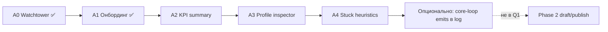

# Admin Ops — квартальный фокус (2026 Q2)

Сессия **idea-refine** (2026-05-25): оператор / solo-dev, горизонт **квартал**, Telegram **минимальный шум**, после сводки KPI — **inspector профиля** и **эвристики «застрял»**.

**Контекст:** A0 Watchtower и A1 воронка онбординга уже в прод-коде. North Star и Phase 0–4 — в [`admin-and-notifications.md`](admin-and-notifications.md). Детальный план срезов — [`PLAN_admin-analytics-ops.md`](../../plans/PLAN_admin-analytics-ops.md).

---

## Problem Statement

Как дать одному оператору за квартал **ответ за 30 секунд** по любому игроку — кто застрял, где в онбординге, чем закончилась партия — **без BI, CMS и шума в Telegram**, опираясь на `notification_log` и профили в БД?

---

## Recommended Direction

**Q1–Q2:** довести **Ops cockpit** вертикалями **A2 → A3 → A4**.

- **Telegram** — канал «что случилось»: `user_registered`, `profile_created`, `game_won`, `game_lost` (и при необходимости старт партии). **Шаги coach и воронка — только в `#/admin`**, не в TG.
- **A2:** `GET /api/admin/metrics/summary` + KPI-карточки сверху Watchtower — «пульс за неделю» без прокрутки 50 строк.
- **A3:** inspector профиля — снимок экономики, pending events, последние admin-события из лога; переход из строки таблицы.
- **A4:** 2–3 эвристики «застрял» + фильтр/бейдж в UI; **без** дублирования каждого шага в TG.

**Q3 (если останется ёмкость):** точечные emits core loop (`first_salary_claimed`, `first_safety_fund`) **только в `notification_log`**, не в Telegram.

**Не в этом квартале:** player inbox, Content Studio, draft/publish контента, digest, отдельный DWH.

---

## Key Assumptions to Validate

- [ ] **A2 KPI** отвечают на «как дела за неделю» без открытия полных таблиц — проверить на 3 реальных сессиях.
- [ ] **Inspector** сокращает разбор с ~5 мин (SQL) до &lt;1 мин — замерить на одном «застрявшем» профиле.
- [ ] **Stuck-эвристики** дают &lt;1 ложного срабатывания в неделю при текущем DAU — иначе ужесточить пороги.
- [ ] **`notification_log`** + колонки профиля хватает до ~50 DAU; отдельная `player_events` не нужна в Q1.
- [ ] **TG minimal** достаточен: в сообщении есть ссылка `→ #/admin` / profile id, детали — в вебе.

---

## MVP Scope (ближайшие 2–3 спринта)

**In:**

| Срез | Содержание |
|------|------------|
| **A2** | `GET /api/admin/metrics/summary`; карточки: users, profiles, draft onboarding, brief_done (7d), wins, avg period |
| **A3** | `GET /api/admin/profiles/{id}` — overview-подобный снимок, pending events, последние admin kinds |
| **A3 UI** | Экран или drawer inspector, back в Watchtower |
| **A4** | `onboarding_stuck`, `player_stuck`, опционально `salary_missed_period`; фильтр «застрял» |
| **Ops** | Smoke: `ADMIN_USER_IDS`, `#/admin`, TG при register/win |

**Out (явно на квартал):**

- Когорты / D7 retention, Metabase, export pipeline
- Player inbox, push, narrative engine
- Content Studio, draft/publish
- Digest в TG, 5xx spike dashboards
- Отдельный `admin.html` (достаточно `#/admin` + allowlist; **desktop layout** — `AdminWebShell`, `data-mq-layout=admin`)

---

## Not Doing (and Why)

| Не делаем | Почему |
|-----------|--------|
| Шаги онбординга в TG | Шум; решение сессии — `tg_minimal` |
| Player inbox | Другая аудитория; Phase 1 из parent idea |
| Content Studio в Q1 | Контент в сидах/миграциях; Studio — когда больно без draft/publish |
| DWH / BI | SQL + summary endpoint хватает при низком DAU |
| Публичный admin без allowlist | Риск утечки в TMA |

---

## Open Questions

- [ ] Порог **player_stuck**: 24h или 48h без действий при активном play?
- [ ] **Inspector:** отдельный route или drawer поверх Watchtower?
- [ ] Нужен **export CSV** для отчёта — или скрин Watchtower достаточен?
- [ ] После A3 — обновить только plan или вынести контракты в `SPEC_admin-and-notifications.md`?

---

## Дорожная карта (квартал)

---

## Варианты, отклонённые на сходимости

| Вариант | Почему не выбран |
|---------|------------------|
| Только TG-бот | Нет воронки и контекста экономики в одном месте |
| Inspector без A2 | Нет «пульса» сверху; дольше ручной обзор |
| Automation-first (stuck до inspector) | Алерты без контекста профиля |
| Слияние с игровой «Аналитикой» | Дублирование [`SPEC_ANALYTICS.md`](../../specs/SPEC_ANALYTICS.md) |
| Cohort BI / DWH | Overkill при единицах DAU |

---

## Связанные документы

- [`admin-and-notifications.md`](admin-and-notifications.md) — North Star, Phase 0–4
- [`PLAN_admin-analytics-ops.md`](../../plans/PLAN_admin-analytics-ops.md) — задачи A1–A6, каталог метрик
- [`PRODUCT_BACKLOG.md`](../../backlog/PRODUCT_BACKLOG.md) — эпик Admin Watchtower
- [`DEPLOY.md`](../../ops/DEPLOY.md) — `ADMIN_USER_IDS`, ops Telegram

---

*Создано: idea-refine 2026-05-25. Решения сессии: аудитория operator, TG minimal, приоритет A3 + A4 после A2.*
