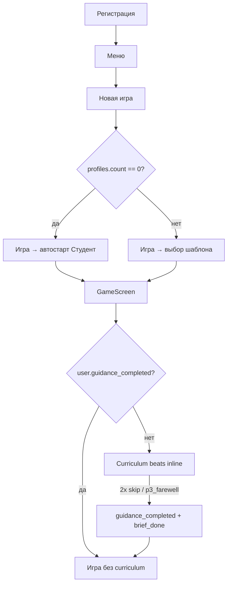

# O2 — Progressive Guidance (inline Монетка, скрытый track)

## Problem Statement

**How Might We:** за **первые 2–3 периода** дать игроку **понимание цикла TB1 и глубины экономики** (списания в конце месяца, события как решения, шкалы потребностей) **без** spotlight-coach, который **прыгает и ломает UI**, и **без** лишних виджетов на дашборде — с **Монеткой** как ведущей, **скрытым планом шагов** (галочки по действиям) и **inline** реактивными подсказками при повторных ошибках?

---

## Recommended Direction

**Заменить O1** на **Progressive Guidance** — normative: [`SPEC_onboarding-o2.md`](../../specs/features/SPEC_onboarding-o2.md).

- **`MqxGuidanceStrip`** — bottom slide-up над tab bar; **без PNG** Монетки; голос и стилистика approved blocks.
- **× icon-only** (без фона); 2× skip = exit all.
- **«N из M»** + ‹ ›; вперёд только до last completed; gate → ✓ → auto-advance.
- Скрытый curriculum 3 периода; adaptive nudge в том же strip.
- User once; auto Студент; backfill.

**Почему не O1:** spotlight ломает layout (α-FB-17); 5 шагов одного периода не дают глубину.

---

## Продуктовые решения (зафиксировано 2026-06-01)

| Тема | Решение |
|------|---------|
| UI | **`MqxGuidanceStrip`** — bottom, slide-up |
| PNG Монетки | **Нет** в guidance/nudge |
| Close | **×** icon-only, no background |
| Nav | **N из M** + стрелки; forward до last completed only |
| После gate | ✓ + auto-advance |
| Видимый track на dash | **Нет** |
| Горизонт curriculum | **Периоды 1–3** |
| Skip | **1-е** beat; **2-е** весь guidance |
| Реактивные nudge | Тот же strip |
| Голос | **Монетка** (текст), без изображения |
| Повтор guidance | **User-level once**; replay — позже |
| Первый профиль | **Авто** `mq_game_basic_v1` |
| Backfill | **Да** для `brief_done` profiles |

---

## Скрытый план подсказок (черновик curriculum)

Каждая строка — beat с `id`, `period_index`, `gate` (действие / read / skip), `completed: bool` в `guidance_progress_json`.

### Период 1 — TB1 и деньги

| id | Триггер показа | Текст (суть) | Gate → completed |
|----|----------------|--------------|------------------|
| `p1_intro_period` | `period_index==1`, первый вход | Период = месяц; «Закрыть месяц» завершает ход | Read / Skip |
| `p1_salary` | после intro | Зарплата только по кнопке; не забрал — не повторится | `salary_claimed` |
| `p1_cushion` | после salary | Подушка — запас; пополни хоть немного | `safety_contribution > 0` |
| `p1_close_preview` | после cushion | **Расходы спишутся в конце месяца**; preview суммы (α-FB-15) | Read / Skip |
| `p1_close_action` | после preview | Найди «Закрыть месяц» | `period closed` (period_index→2) |
| `p1_close_debrief` | после первого close | Разбор отчёта: что списалось (α-FB-18) | Read / Skip |

### Период 2 — события

| id | Триггер | Текст (суть) | Gate |
|----|---------|--------------|------|
| `p2_events_intro` | первые pending events | События — **решения** (кнопки), не только листание (α-FB-04) | `event chosen` ×1 |
| `p2_events_second` | 2-е событие в периоде | Краткий follow-up (опционально) | `event chosen` ×2 или Skip |

### Период 3 — шкалы

| id | Триггер | Текст (суть) | Gate |
|----|---------|--------------|------|
| `p3_needs_intro` | needs enabled, первый показ dash | 4 шкалы — баланс жизни; «?» / treat-self (α-FB-13) | Read / Skip или treat-self once |
| `p3_farewell` | curriculum almost done | Прощание Монетки → `guidance_completed` user + `brief_done` profile | CTA «Понятно» |

*Точный копирайт — в design-lab после утверждения track.*

---

## Адаптивные inline-nudge (не curriculum)

Отдельные счётчики (profile или user), **не блокируют** игру.

| id | Условие | Студент (`mq_game_basic_v1`) | Прочие шаблоны |
|----|---------|------------------------------|----------------|
| `nudge_salary_miss` | период закрыт без `salary_claimed` | Inline **каждый** такой период | После **2** подряд |
| `nudge_negative_close` | `cash < 0` после close | Мягко с **1-го** | После **2** подряд |

Пример текста (зарплата): *«Похоже, зарплату за этот месяц не забрали. За прошлые периоды её не вернуть — нажми «Зарплата», пока месяц открыт.»*

Пороги можно читать из `blueprint.player_support` (у Студента уже `proactive_hints: true` в seeds).

---

## User flow (старт + guidance)

---

## Key Assumptions to Validate

- [ ] Inline Monetka **не раздражает** сильнее старого coach — **Q1/Q7** на PA-W1.
- [ ] Игроки **доходят до period 3** с guidance — **PA-T1 ≥5**.
- [ ] **User-level** «один раз» совпадает с ожиданием («новая игра = без обучения») — опрос / модерация.
- [ ] Автостарт Студента **не** снижает желание вернуться к другим шаблонам — метрика 2-й партии.
- [ ] Inline nudge **после 2 ошибок** достаточен для non-student — Q5.

---

## MVP Scope (O2)

**In:**

- Удалить / отключить `GameOnboardingLayer` spotlight (O1).
- `GuidanceEngine` (FE) + конфиг curriculum YAML/JSON.
- BE: `users.guidance_completed` (bool) + `users.guidance_progress_json` или нормализованная таблица; при `POST /game/start` — если user completed → profile `onboarding_state=brief_done`.
- BE: счётчики `salary_miss_streak`, `negative_close_streak` (или в progress JSON).
- FE: inline Monetka beats + adaptive nudge components (без новых слотов на dash).
- FE: первый профиль — bypass `GameTemplatePickScreen`, `template_key=mq_game_basic_v1`.
- α-FB-15/18: preview + debrief в beats `p1_close_preview` / `p1_close_debrief`.

**Out (Not Doing):**

- Видимый mission track / чеклист на UI.
- Replay guidance из меню (зарезервировать API `POST …/guidance/replay`).
- Plan Mode onboarding.
- Spotlight / scrim / practice timer.
- Полная переделка «Финансы» (α-FB-06).

---

## Not Doing (and Why)

| Item | Reason |
|------|--------|
| Mission Track widget | Явный запрос: без когнитивной нагрузки на dash |
| Sheet для nudge | Выбран **inline** для реактивных подсказок |
| Guidance на каждый профиль | Только **user once**; иначе раздражение на 2-й игре |
| Выбор шаблона на 1-й игре | Студент = канон первого опыта; spec O1 уже хотел autostart |
| State ladder событий | α-FB-03, отдельный эпик |

---

## Open Questions

- [x] Размещение UI → **bottom strip** (`MqxGuidanceStrip`)
- [x] Debrief / nav → **галочка + auto-advance**; «N из M» + стрелки
- [x] Backfill → **да**

---

## Verdict

**APPROVED** (2026-06-01) → [`SPEC_onboarding-o2.md`](../../specs/features/SPEC_onboarding-o2.md) · [`PLAN_onboarding-o2.md`](../../plans/PLAN_onboarding-o2.md)
